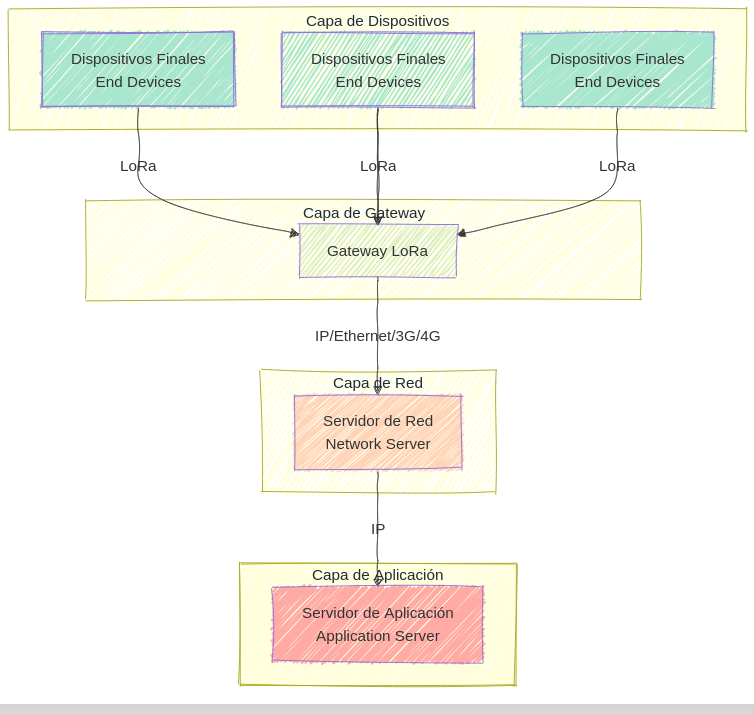
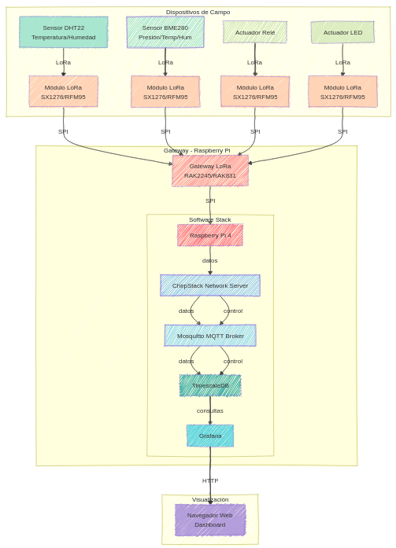
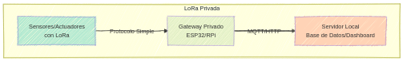
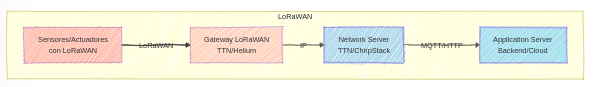
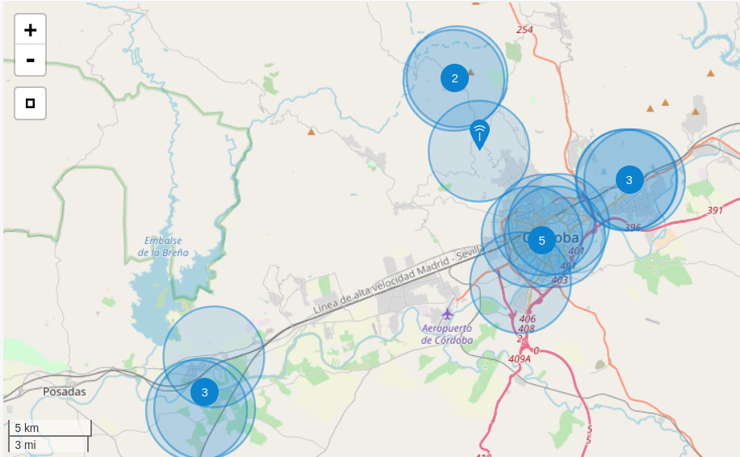

## Lora

LoRa se ha convertido en una de las tecnologías más populares para aplicaciones IoT debido a su combinación única de alcance, bajo consumo de energía y facilidad de implementación.

Algunas características importantes de esta arquitectura:
- Comunicación bidireccional
- Largo alcance (hasta varios kilómetros)
- Bajo consumo de energía
- Topología en estrella de estrellas

### **Componentes Clave**

1. **Dispositivos/Nodos LoRa**:
   - Son dispositivos IoT equipados con módulos LoRa.
   - Tienen sensores y/o actuadores para recolectar datos o realizar acciones.
   - Ejemplos: medidores de agua, sensores de temperatura, rastreadores GPS.

2. **Gateways LoRa**:
   - Actúan como intermediarios entre los nodos LoRa y el servidor de red.
   - Reciben datos de múltiples dispositivos y los envían al servidor central a través de internet o una red local.

3. **Servidor de Red LoRaWAN**:
   - Gestiona los datos recibidos de los gateways.
   - Realiza tareas como autenticación, enrutamiento de mensajes y almacenamiento temporal.
   - Proporciona una API para que las aplicaciones accedan a los datos.

4. **Aplicaciones de Usuario**:
   - Consumen los datos procesados del servidor de red.
   - Pueden incluir dashboards para visualización, alertas en tiempo real, o sistemas de control remoto.

### Arquitectura

### Arquitectura privada

### LoraWAN

## Lora en Córdoba

Dada la [cobertura de LoraWan en Córdoba](https://www.thethingsnetwork.org/community/cordoba-es/), en principio no necesitamos añadir gateways y lo dejamos para un curso posterior

### **¿Qué es Python?**

Python es un lenguaje de programación interpretado, de alto nivel y propósito general, creado por **Guido van Rossum** y lanzado por primera vez en 1991. Diseñado para ser fácil de leer y escribir, Python combina una sintaxis clara con una filosofía que enfatiza la simplicidad y la productividad, resumida en "The Zen of Python".

Python es **multiplataforma**, lo que significa que puede ejecutarse en distintos sistemas operativos (Windows, macOS, Linux, entre otros). Es utilizado en una amplia variedad de áreas, como desarrollo web, análisis de datos, inteligencia artificial, automatización, ciencia, finanzas y más.

---

### **¿Por qué programar en Python?**
Python se ha convertido en uno de los lenguajes más populares del mundo por varias razones:

1. **Fácil de aprender y usar**:
   - La sintaxis de Python es sencilla y se asemeja al lenguaje humano, lo que lo hace ideal para principiantes.

2. **Comunidad activa y recursos abundantes**:
   - Python cuenta con una comunidad global enorme, lo que significa que hay documentación, tutoriales, bibliotecas y soporte fácilmente accesibles.

3. **Versatilidad**:
   - Python se adapta a múltiples aplicaciones, desde desarrollo web y creación de scripts hasta inteligencia artificial y análisis de datos.

4. **Gran ecosistema de bibliotecas**:
   - Tiene una vasta colección de bibliotecas y frameworks (como NumPy, Pandas, TensorFlow, Flask, Django), que facilitan el desarrollo en casi cualquier dominio.

5. **Multiplataforma**:
   - Los programas escritos en Python pueden ejecutarse en diferentes sistemas operativos con pocas modificaciones.

---

### **Ventajas de Python frente a otros lenguajes**

#### **1. Facilidad de uso (en comparación con C, C++ o Java):**
- La sintaxis de Python es más simple y directa. Por ejemplo, no es necesario declarar tipos de variables, ni preocuparse por la gestión manual de memoria.
- Mientras que en Java o C++ necesitas escribir varias líneas de código para tareas simples, en Python se pueden lograr con una o dos líneas.

#### **2. Velocidad de desarrollo (vs. Java, C++):**
- En Python, las soluciones se desarrollan más rápido debido a su sintaxis limpia y la disponibilidad de bibliotecas preconstruidas, lo que lo hace ideal para prototipos y proyectos de inicio rápido.

#### **3. Flexibilidad (vs. lenguajes como R o MATLAB):**
- Python no está limitado a un dominio específico. Mientras que R y MATLAB son potentes en estadísticas y matemáticas, Python sobresale en esas áreas y también en desarrollo web, juegos, aplicaciones de escritorio y más.

#### **4. Comunidad y ecosistema (vs. Ruby, PHP):**
- Aunque Ruby y PHP son lenguajes populares en desarrollo web, Python tiene un alcance más amplio y es ampliamente usado en inteligencia artificial, aprendizaje automático y análisis de datos, lo que lo posiciona como una opción más universal.

#### **5. Legibilidad (vs. Perl, C++):**
- Python evita el uso excesivo de caracteres especiales y estructuras complejas, lo que lo hace más legible y mantenible que lenguajes como Perl o incluso C++.

---

### **Ventajas específicas de Python**

1. **Código limpio y mantenible**:
   - Diseñado para que el código sea legible, lo que facilita el trabajo en equipo y el mantenimiento a largo plazo.

2. **Multitarea y multithreading**:
   - Aunque no es el lenguaje más rápido en ejecución (por ser interpretado), con bibliotecas como `asyncio` y `threading` permite manejar múltiples tareas de forma eficiente.

3. **Integración con otros lenguajes**:
   - Python puede interactuar con C, C++, Java y otros lenguajes, lo que permite extender su funcionalidad cuando sea necesario.

4. **Potencia en inteligencia artificial y ciencia de datos**:
   - Herramientas como TensorFlow, Scikit-learn, PyTorch y Pandas hacen de Python el líder indiscutible en IA y análisis de datos.

5. **Gran soporte para scripting y automatización**:
   - Ideal para crear scripts que automatizan tareas repetitivas en servidores, sistemas operativos o aplicaciones.

---

### **Conclusión**
Python es una excelente elección tanto para principiantes como para profesionales experimentados debido a su simplicidad, versatilidad y fuerte respaldo de la comunidad. Su capacidad de adaptarse a múltiples casos de uso y su vasto ecosistema lo posicionan como un lenguaje imprescindible en el desarrollo moderno.