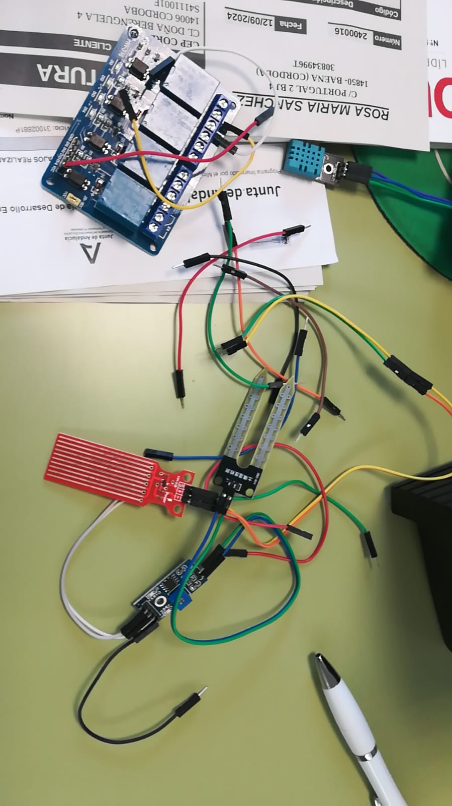
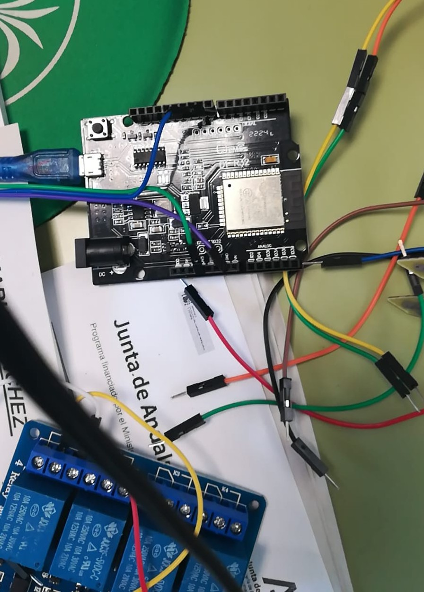
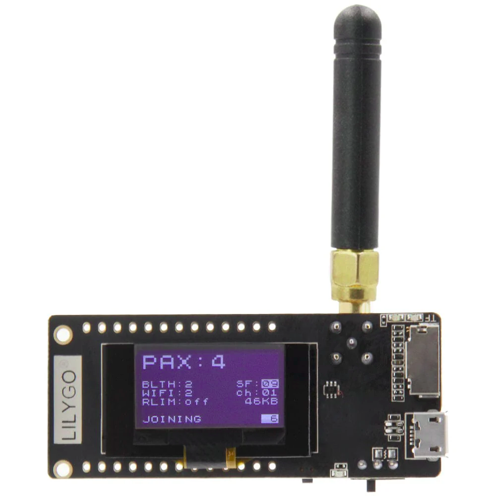
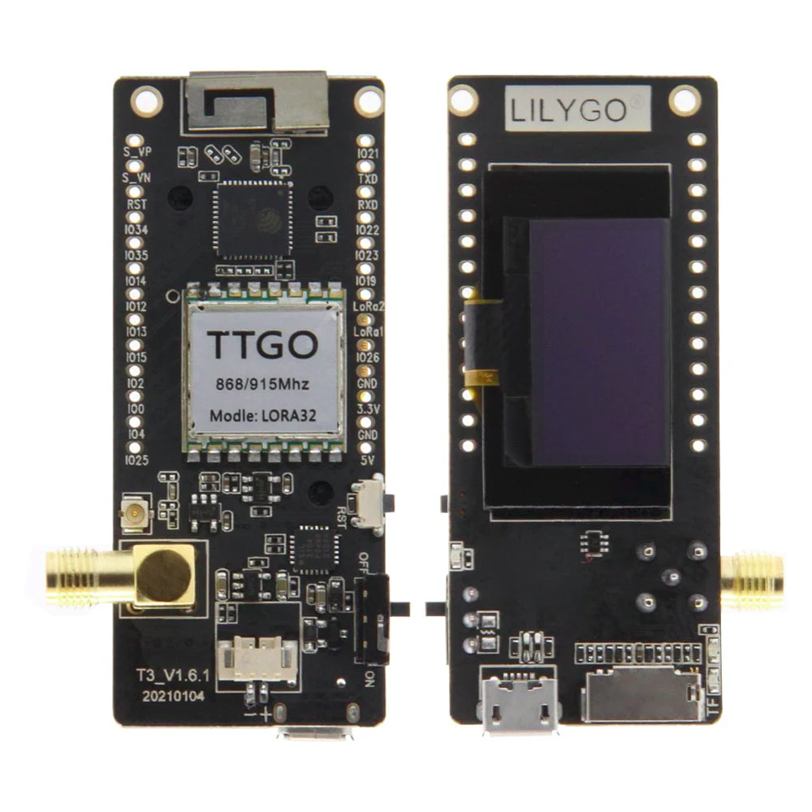
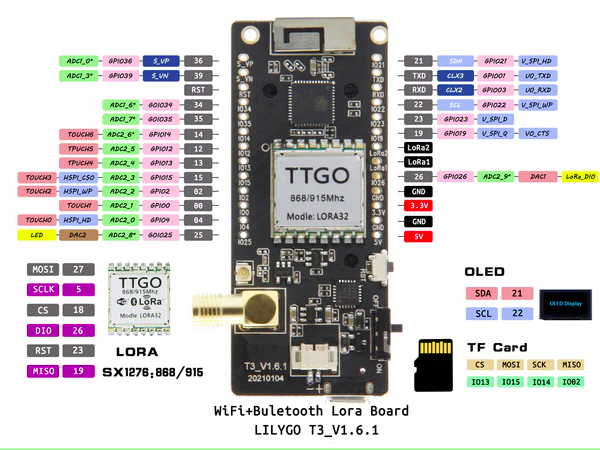

## Raspberry pi 5

* Raspberry pi 5
* SD de 32Gb
* Alimentación
## Material disponible 

* Sensor de humedad
* Sensor de nivel de agua
* Sensor de temperatura y humedad
* Pantalla OLED
* Relés

## TTGO  T3 v1.6

| Name        | V1.0 | V1.2(T-Fox) | V1.6 | V2.0 |
| ----------- | ---- | ----------- | ---- | ---- |
| OLED RST    | 16   | N/A         | N/A  | N/A  |
| OLED SDA    | 4    | 21          | 21   | 21   |
| OLED SCL    | 15   | 22          | 22   | 22   |
| SDCard CS   | N/A  | N/A         | 13   | 13   |
| SDCard MOSI | N/A  | N/A         | 15   | 15   |
| SDCard MISO | N/A  | N/A         | 2    | 2    |
| SDCard SCLK | N/A  | N/A         | 14   | 14   |
| DS3231 SDA  | N/A  | 21          | N/A  | N/A  |
| DS3231 SCL  | N/A  | 22          | N/A  | N/A  |
| LORA MOSI   | 27   | 27          | 27   | 27   |
| LORA MISO   | 19   | 19          | 19   | 19   |
| LORA SCLK   | 5    | 5           | 5    | 5    |
| LORA CS     | 18   | 18          | 18   | 18   |
| LORA RST    | 14   | 23          | 23   | 23   |
| LORA DIO0   | 26   | 26          | 26   | 26   |

