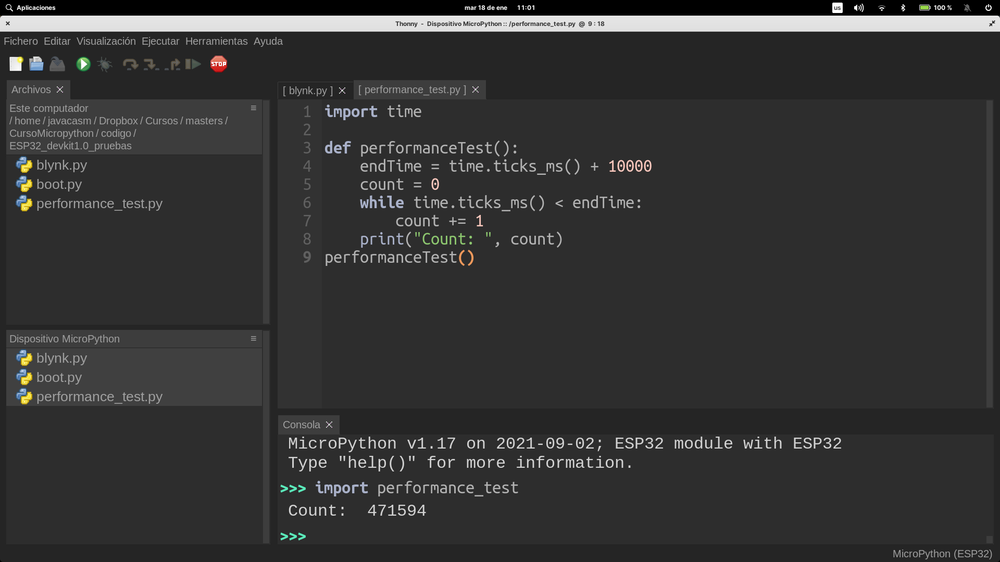
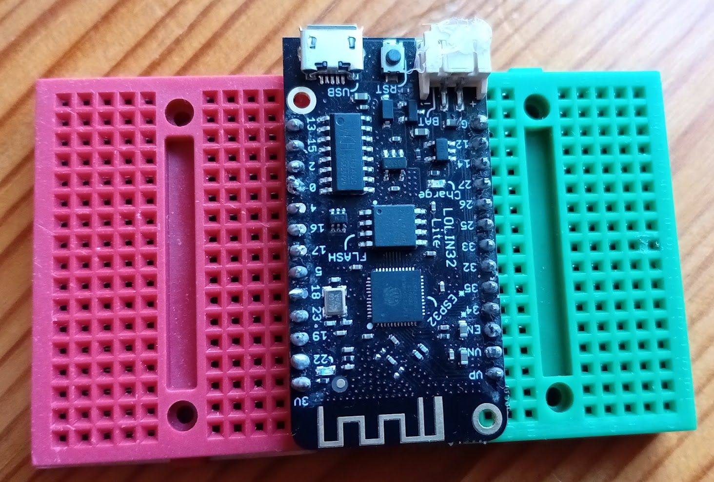
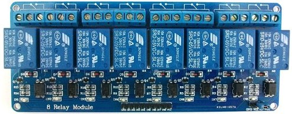
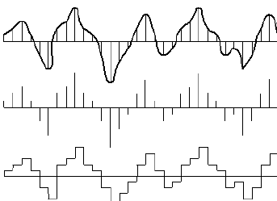
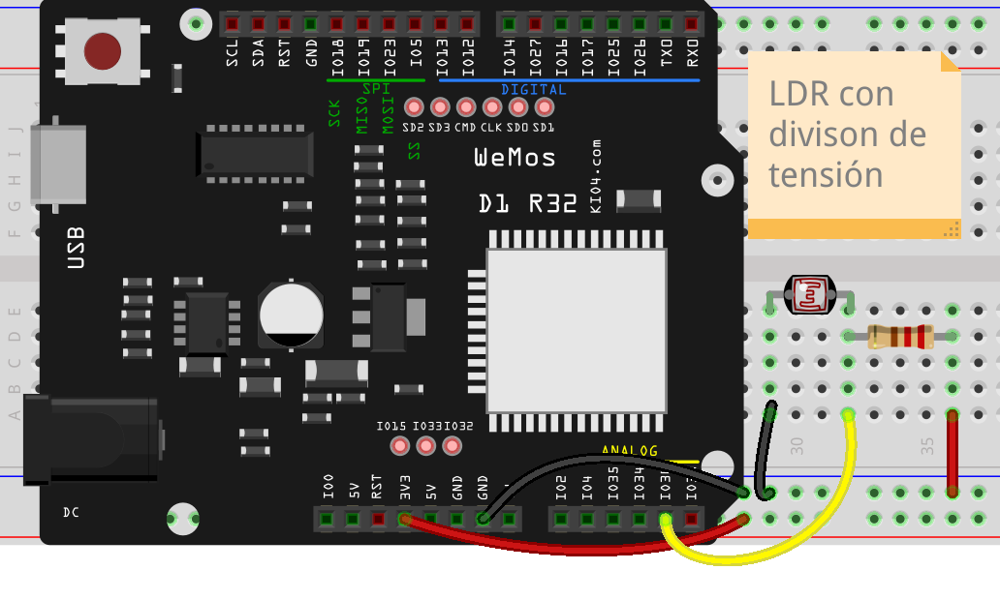
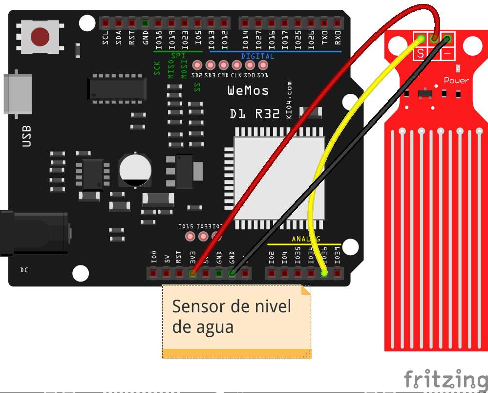
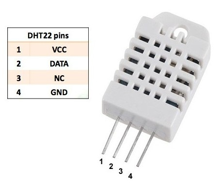
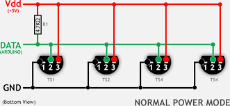

## ¿Qué es Micropython?

Micropython es una versión reducida del conocido intérprete del lenguaje Python adaptada para funcionar en dispositivos de menor capacidad que un ordenador personal.

Para reducir la necesidad de procesamiento y de memoria se han simplificado alguna de las posibilidades y eliminando gran parte de los módulos o librería y se incluyen por defecto.

También se han desarrollado versiones reducidas de estas librerías y módulos que podemos incluir ahora de manera opcional.

Nació en 2013,  cuando el físico y programador australiano **[Damien P. George](https://dpgeorge.net/)** creó una exitosa [campaña de crowdfunding en kickstarter](https://www.kickstarter.com/projects/214379695/micro-python-python-for-microcontrollers?lang=es) (tenía un objetivo de 15000£ y consiguió casi 100000£), dónde se desarrolló tanto el entorno de programación como una placa que fuera capaz de ejecutarlo la pyboard.

Los microcontroladores de aquella época básicamente Arduino y similares no eran capaces de desarrollar el procesamiento necesario para trabajar un intérprete de Python por eso fue necesario crear una nueva placa.

La placa además de un procesador STM32 suficientemente potente incluía algunos periféricos integrados que no facilitaban el hacer unas primeras pruebas de funcionamiento.

Podemos encontrar toda la documentación del proyecto en [su página](https://micropython.org/) y por supuesto en la [página del proyecto en github](https://github.com/micropython/micropython)

Una prueba del éxito del proyecto Micropython, es que en su página de github se han creado miles de versiones (se han hecho más de 4000 forks), de las empresas han derivado la versión para su propias placas. También se puede ver en el repositorio que son más 300 los desarrolladores que han contribuido al mismo y si miramos las actualizaciones podemos ver que hay cambios cada día.

A día de hoy son muchísimas las plataformas, además de la original [pyboard](http://micropython.org/download/pybv1), que permiten usar Micropython como lenguaje de programación como por ejemplo las [ESP](http://micropython.org/download/esp8266) y [ESP32](http://micropython.org/download/esp32) de Expressif, las de [m5Stack](https://github.com/m5stack/M5Stack_MicroPython), en las [STM32](http://micropython.org/download/stm32), en la famosísima [micro:bit](https://microbit.org/get-started/user-guide/python/) e incluso en la [Raspberry Pi](https://github.com/boochow/micropython-raspberrypi). De hecho uno de los entornos de programación [recomendados para la nueva Raspberry Pi Pico es micropython](http://micropython.org/download/rp2-pico).

Otras marcas, como Adafruit, han optado por crear una versión derivada, pero algo distinta, más optimizada para sus placas llamada [CircuitPython](https://learn.adafruit.com/bienvenido-a-circuitpython-2/que-es-circuitpython) y que puede funcionar en dispositivos aún más pequeños y limitados.

Una de las grandes ventajas que tiene el programar nuestro microcontroladores (vamos a llamarlos así aunque realmente sean un sistema más complejo) con Micropython, es que podemos trabajar interactivamente con ellos, es decir, **no necesitamos reprogramarlo** cada vez que queremos cambiar el programa con el que estamos trabajando sino que simplemente subimos al sistema ficheros con el código que se interpretaba.

Además este firmware base con el que trabajamos incluye de base muchas de las herramientas que usaremos en nuestros programas, como la gestión de ficheros, la conectividad de redes vía wifi, el manejo de la entrada salida y por supuesto el intérprete Python con toda la funcionalidad de alto nivel (gestión dinámica de memoria, colecciones, manejo de cadenas, ...)

Python es un lenguaje interpretado, es decir, no necesitamos compilar nuestro código para que funcione, sino que el intérprete lo va ejecutando línea a línea.

Desde el entorno de Micropython vamos a poder ejecutar órdenes de manera interactiva y también subir archivos que contiene el código de nuestros programas que podemos utilizar como lo hacemos en entornos más avanzados. También podemos usar estos ficheros como módulos o  librerías que usaremos desde nuestro código.

Micropython es un entorno que se va actualizando constantemente, con una gran cantidad de usuarios que lo usan. A día de hoy (Junio de 2022) se trabaja con la versión 1.19.

Todo el desarrollo es completamente Open Source y tenemos disponible todo lo necesario para recopilar lo de ahí que algunos fabricantes como Adafruit hayan creado versiones específicas para sus placas. La versión de Adafruit, se llama Circuitpython y funciona en las placas más potentes de la marca. Al tratarse de un desarrollo específico para sus propias placas en algún aspecto tiene mayor capacidad que los desarrollos más genéricos.


MicroPython es:

* Una implementación completa de Python
* Diseñado para ser eficiente con los recursos
* Diseñado para ejecutarse nativamente sobre el hardware (sin sistema operativo de por medio). 


Incluye

* Un compilador, entorno de ejecución y un REPL.
    * Gestión de memoria
    * Sistema de archivos
    * Control del hardware
* Librerías y módulos básicos (normalmente empiezan con 'u' por micro)
* Módulos extra para controlar determinado hardware

En esta presentación de Damien George sobre Micropython podemos ver estos detalles


[](https://drive.google.com/file/d/12GklMQ_kHhmaNFoXg7iAVYlvCgptHA_4/view?usp=sharing)

[Vídeo: 0.1 Presentación de micropython](https://drive.google.com/file/d/12GklMQ_kHhmaNFoXg7iAVYlvCgptHA_4/view?usp=sharing)


# Hardware compatible con micropython

Cada vez son más las placas que pueden usar Micropython, vamos a ver algunas de ellas, aprovechado para mostrar algunos de los detalles que usaremos más adelante.

Para poder ejecutar micropython necesitamos:

* 256k de espacio de almacenamiento para el firmware
* 16k de RAM
* Se recomienda un mínimo de 80 MHz
* Soporta las arquitectura de los procesadores: x86, x86-64, ARM, ARM Thumb, Xtensa


[](https://drive.google.com/file/d/1NnQLQKjA91vvCVVEq0fFnuUqCEhDqgMq/view?usp=sharing)

[Vídeo: Hardware soportado por Micropython](https://drive.google.com/file/d/1NnQLQKjA91vvCVVEq0fFnuUqCEhDqgMq/view?usp=sharing)

## ESP32

El módulo ESP32 del fabricante Espressif se ha convertido en un auténtico estándar del mundo maker


* Procesador Xtensa LX6 de 32 bits con doble core a 160 Mhz 
* RAM de 520Kb
* Flash de hasta 16Mb
* Wifi 802.11b/g/n
* Bluetooth (Classic y BLE v4.2)
* 32 pines GPIO
* 18 canales ADC de 12 bits
* 2 DAC de 9 bits
* 16 salidas PWM (10 bits)
* Protocolos:
    * I2C
    * SPI
    * I2S (sonido digital)
    * CAN (protocolo de automoción)

Este módulo es lo que se conoce como un System on Chip, un módulo que incluye todo lo necesario para operar el sistema (CPU, RAM, flash,....)


Muchos fabricantes han creado diferentes placas a partir de este módulo. Vamos a ver algunos de ellos.

## TT-GO T-DISPLAY ESP32 LCD

Se trata de una placa basada en ESP32 que añade una pantalla gráfica OLED a color. Además tiene un formato bastante compacto y cómodo de usar con placas de prototipo estándar.


Estos son los detalles de la placa:


* 4 MB de memoria Flash
* 520Kb de RAM

Pantalla 1.14" OLED-color IPS ST7789V 1.14 pulgadas de 135 x 240 pixels. Conexión SPI:

* MOSI: 19
* SCLK: 18
* CS: 5
* DC: 16
* RST: 23
* Back Light: 4

Circuito de carga (500mA) y alimentación (1A) desde batería lipo que podemos conectar:

* Lectura del voltaje de la alimentación en pin 34
* Lectura de voltaje de la batería en pin 14

Dispone de 2 pulsadores que podemos usar libremente y de un pulsador de reset

* Botón 1: 35
* Botón 2: 0

## Instalación de micropython

Para utilizar micropython en otra placa lo primero que tenemos que hacer es instalar el intérprete en forma de firmware.

## Thonny



Thonny es un editor Open Source ([en este repositorio](https://github.com/thonny/thonny) está su código) pensado para trabajar con Python y está disponible para los principales sistemas operativos de PC o similares: Linux, MacOS, Windows, Raspberry,...

Nos permite trabajar con el lenguaje Python en diferentes tipos de entornos. Por ejemplo podemos hacer programas para nuestro PC (juegos, páginas web,...) y también podemos programar para distintos dispositivos como por ejemplo microcontroladores o sistemas más complejos y soportan este lenguaje.

Cómo curiosidad decir que Thonny está escrito en Python y podemos ejecutar y depurar su propio código utilizando el mismo editor

Además incluye las herramientas necesarias para poder transferir el firmware de micropython a nuestro dispositivo para trabajar con él.

También nos permite organizar nuestro código en ficheros que podemos transferir entre la placa con micropython y el PC al que esté conectada.


### Instalación de Thonny

Para instalarlo, descargamos desde [su web](https://thonny.org) el instalador y lo ejecutamos.


Según nuestro sistema operativo y según las características de éste, usaremos un instalado u otro.

Si nuestro sistema operativo es de la familia **Windows**, y dependiendo de que usemos un sistema de 32 o de 64 bits y también de que queremos hacer una instalación en el sistema o sólo copiar los ficheros necesarios en un directorio (instalación portable), que también nos serviría para tenerlo disponible desde un pendrive USB, usaremos una u otra versión.
Como nos avisan, al instalarlo, el sistema nos puede avisar de que el certificado con el que está firmado todavía no está reconocido por Microsoft y debemos aceptar seleccionando “Mantener”

](https://drive.google.com/file/d/1MzPOHE7vCj482CQhV7m7ZcZ99B-jWzUN/view?usp=sharing)

[Vídeo: Instalación del editor thonny para trabajar con micropython](https://drive.google.com/file/d/1MzPOHE7vCj482CQhV7m7ZcZ99B-jWzUN/view?usp=sharing)


### Idioma y aspecto

Podemos modificar el idioma desde la ventana de opciones (Menú Herramientas -> Opciones), 


en el desplegable Idioma de la pestaña General


También podemos modificar el aspecto seleccionando dentro de la pestaña "Temas y Fuentes" el aspecto y el color de la sintaxis entre los diferentes temas:


[](https://drive.google.com/file/d/1Cm3jT0t02wbxcsdSlMpNwhWpcaQ02BM-/view?usp=sharing)

[Vídeo: Cambiando el  idioma y el aspecto de Thonny](https://drive.google.com/file/d/1Cm3jT0t02wbxcsdSlMpNwhWpcaQ02BM-/view?usp=sharing)

## Thonny


Thonny es un editor Open Source ([en este repositorio](https://github.com/thonny/thonny) está su código) pensado para trabajar con Python y está disponible para los principales sistemas operativos de PC o similares: Linux, MacOS, Windows, Raspberry,...

Nos permite trabajar con el lenguaje Python en diferentes tipos de entornos. Por ejemplo podemos hacer programas para nuestro PC (juegos, páginas web,...) y también podemos programar para distintos dispositivos como por ejemplo microcontroladores o sistemas más complejos y soportan este lenguaje.

Cómo curiosidad decir que Thonny está escrito en Python y podemos ejecutar y depurar su propio código utilizando el mismo editor

Además incluye las herramientas necesarias para poder transferir el firmware de micropython a nuestro dispositivo para trabajar con él.

También nos permite organizar nuestro código en ficheros que podemos transferir entre la placa con micropython y el PC al que esté conectada.


### Instalación de Thonny

Para instalarlo, descargamos desde [su web](https://thonny.org) el instalador y lo ejecutamos.


Según nuestro sistema operativo y según las características de éste, usaremos un instalado u otro.

Si nuestro sistema operativo es de la familia **Windows**, y dependiendo de que usemos un sistema de 32 o de 64 bits y también de que queremos hacer una instalación en el sistema o sólo copiar los ficheros necesarios en un directorio (instalación portable), que también nos serviría para tenerlo disponible desde un pendrive USB, usaremos una u otra versión.
Como nos avisan, al instalarlo, el sistema nos puede avisar de que el certificado con el que está firmado todavía no está reconocido por Microsoft y debemos aceptar seleccionando “Mantener”

](https://drive.google.com/file/d/1MzPOHE7vCj482CQhV7m7ZcZ99B-jWzUN/view?usp=sharing)

[Vídeo: Instalación del editor thonny para trabajar con micropython](https://drive.google.com/file/d/1MzPOHE7vCj482CQhV7m7ZcZ99B-jWzUN/view?usp=sharing)


### Idioma y aspecto

Podemos modificar el idioma desde la ventana de opciones (Menú Herramientas -> Opciones), 


en el desplegable Idioma de la pestaña General


También podemos modificar el aspecto seleccionando dentro de la pestaña "Temas y Fuentes" el aspecto y el color de la sintaxis entre los diferentes temas:


[](https://drive.google.com/file/d/1Cm3jT0t02wbxcsdSlMpNwhWpcaQ02BM-/view?usp=sharing)

[Vídeo: Cambiando el  idioma y el aspecto de Thonny](https://drive.google.com/file/d/1Cm3jT0t02wbxcsdSlMpNwhWpcaQ02BM-/view?usp=sharing)

## Instalación del firmware de micropython

Antes de trabajar con micropython en nuestra placa tenemos que instalarle el firmware adecuado. Podemos pensar que es un proceso similar a formatear un ordenador nuevo e instalarle el sistema operativo, lo haremos sólo una vez y al principio antes de usarlo.

Para los que usáis estas placas para trabajar con  Arduino, deciros que en cualquier momento podemos instalar un programa desde el IDE de Arduino y trabajaremos como antes, eso sí, perderemos los ficheros que le hayamos instalado. En realidad cuando le pasamos un programa arduino le estamos pasando un firmware + nuestro código (también para las placas arduino "normales" pero ese firmware es minúsculo).

También lo volveremos a hacer en caso de querer actualizarlo a una versión posterior. En ese caso tenemos que asegurarnos de hacer copia de los ficheros que hayamos instalado posteriormente a su instalación.

Desde la [página de descargas de Micropython](https://micropython.org/download/) descargamos el firmware para nuestra placa. Suele ser un archivo con extensión **bin** o **uf2**, según el dispositivo.

A veces podemos ver que una misma placa tiene varias opciones, dependiendo de sus características. Por ejemplo para las placas esp8266 tenemos versión para placas con 512Kb, 1M o más de memoria flash.

Una vez descargado, vamos a enviarlo a la placa que habremos conectado al USB del PC desde el editor Thonny.


Desde el menú Ejecutar pulsamos la opción "Elegir Intérprete"


Que nos abrirá una ventana donde seleccionamos el intérprete adecuado para nuestra placa:

En nuestro caso ESP32


Ahora pulsamos la opción de "Instalar o actualizar el firmware


Seleccionamos el puerto al que está conectada la placa y el fichero del firmware que hemos descargado. Algunas placas necesitan opciones diferentes a las por defecto (eso lo comentaremos más adelante para cada placa). Sí que nos debemos asegurar de que esté marcada la opción de borrar previamente la memoria flash (Erase flash before installing).

Pulsamos el botón instalar y se grabará el firmware en la placa y se verificará la escritura.


El proceso lleva unos minutos.

En algunos caso puede ocurrir que nos falta la herramienta de grabación (esptool) o alguna de las que depende, obteniendo un error:


Podemos solucionarlo desde el menú Herramientas -> Administrar plugins (complementos)


Escribimos el que nos falta (normalmente esptools)


Lo instalamos


Ya podemos instalar el firmware en nuestra placa

[](https://drive.google.com/file/d/13jT3f-Rpg0B3hGgYMIPP_kP-4qlEFC0n/view?usp=sharing)


[Vídeo: Instalación del  firmware de micropython desde Thonny](https://drive.google.com/file/d/13jT3f-Rpg0B3hGgYMIPP_kP-4qlEFC0n/view?usp=sharing)

## Problemas en placas ESP32 antiguas

Para grabar el firmware en las placas ESP32 (y en muchas otras), es necesario que la patilla 0 esté conectada a GND. En las placas actuales, cuando vamos a grabar el firmware, el chip que se encarga de las comunicaciones USB lo hace automáticamente.

En placas antiguas puede que esto no funcione y en ese caso tendríamos que hacerlo manualmente. 


Si la placa tiene botón BOOT tendremos que pulsarlo para ponerla en modo __reescritura de firmware__ y si no lo tiene, tendremos que hacerlo manualmente (como en la ESP32-CAM o en el ESP01).

[](https://drive.google.com/file/d/1HHStVAFa3jCs8Swwp4uwmCaLqRHq5JmA/view?usp=sharing)

[Vídeo: Problemas de instalación del firmware en placas ESP32 antiguas](https://drive.google.com/file/d/1HHStVAFa3jCs8Swwp4uwmCaLqRHq5JmA/view?usp=sharing)

### Uso de Thonny


El entorno Thonny tiene diferentes apartados dentro de su ventana principal, cada uno con diferente uso.

En todo momento podemos cerrar estas ventanas, pudiéndose volver a abrir desde el menú **Visualización**


Cuando trabajamos con micropython usando Thonny (hemos seleccionado el intérprete adecuado) y tenemos conectada nuestra placa, veremos abajo lo que denominamos la **consola** (o terminal).


Es una parte del editor que nos permite trabajar interactivamente con nuestra placa. Esta característica se denomina REPL, Read-Evaluate-Print Loop o bucle de lectura, evaluación e impresión. En este modo el intérprete nos devolverá por pantalla el resultado de la expresión que hayamos introducido. Es un modo interactivo, pensado para ir creando o probando nuestro código.

Personalmente es una de las características que más me gustan de micropython, que me permite desarrollar rápidamente prototipos que evolucionan con facilidad a proyectos más acabado y complejos.


En la parte de la derecha veremos los ficheros, arriba los que están en el ordenador y abajo los que están en nuestra placa. Thonny nos va a mostrar todos los ficheros, aunque sólo puede editar los de código.

El poder usar un sistema de archivo en nuestra placa es una característica muy avanzada que nos va a permitir trabajar con micropython casi como en un sistema de alto nivel.

Si pulsamos sobre cualquiera de ellos se abrirán en el editor central, mostrando el nombre entre corchetes "[...]" si el fichero está en la placa o sin ellos si está en el PC.

Al crear un fichero nuevo, seleccionamos si se crea en el PC o en la placa


Podemos transferir ficheros entre la placa y el PC pulsando sobre ellos con el botón derecho del ratón y eligiendo la opción de enviar al otro 


### Uso de la consola

En la consola podemos ejecutar órdenes de manera interactiva. Al conectar la placa veremos el símbolo del intérprete (Prompt) 

```python
>>>
```
Que nos dice que está dispuesto a ejecutar nuestras instrucciones. 


Vamos a empezar haciendo el habitual "Hola mucho", que nosotros podemos adaptar a "Hola Python!!", en la consola.

Para ello escribiremos 

```python
print('Hola Python!!')
```

Y al pulsar "Enter", tendremos el resultado:

```python
  Hola Python!!
```


También podemos hacer todo tipo de operaciones matemáticas:

```python
>>> 2+5
  7
```


O incluso operaciones mucho más complicadas


[](https://drive.google.com/file/d/1EY7so0zaGoWa8lE_LkfqSC4pnDkX7mdg/view?usp=sharing)

[Vídeo: Uso de Thonny, ficheros y primeras pruebas con  la consola interactiva](https://drive.google.com/file/d/1EY7so0zaGoWa8lE_LkfqSC4pnDkX7mdg/view?usp=sharing)

### Reseteando la placa

A veces ocurre que necesitamos resetear nuestra placa, bien porque hay un problema de conexión o bien porque nuestro código tiene algún fallo. En ese caso podemos  resetear nuestra placa pulsando el botón de reset, si lo tienen. También podemos hacerlo pulsando desde la consola "Ctrl + D", con lo que se mostrará el mensaje de bienvenida de nuestra placa (Banner).

También podemos resetear tanto la placa como la conexión con Thonny pulsando el botón rojo de Thonny

[](https://drive.google.com/file/d/1xa1M2I1YBvTQPHda-ZxlKq8ppkFAN7JB/view?usp=sharing)

[Vídeo: Reseteando nuestra placa con Ctrl+D](https://drive.google.com/file/d/1xa1M2I1YBvTQPHda-ZxlKq8ppkFAN7JB/view?usp=sharing)


### Histórico de comandos

Una característica muy cómoda de la consola es que podemos recuperar cualquier comando que hemos usado antes sin más que pulsar la tecla hacia arriba del cursor. Es lo que se conoce como el **Histórico de comandos**. 

Podemos desplazarnos hacia atrás o hacia adelante con las flechas arriba y abajo del cursor.


### Autocompletado

Una características muy interesante, y útil, de Thonny, y de la mayoría de 
los entornos de programación profesionales, es el **autocompletado**, que 
consiste en que el sistema nos propone a medida que vamos escribiendo el 
código nos propone posibles variables o funciones según lo que escribimos.

Para ello tenemos que tenemos que tener activadas las siguientes opciones 
de la configuración de Editores de Thonny


Hay que tener en cuenta que esta funcionalidad depende bastante de la 
capacidad del ordenador que usamos, con lo que puede ser que tarden en 
mostrarse las opciones, por eso vienen desactivado por defecto.

 
# Proyectos electrónicos con microcontoladores ... o similares

Como ya dijimos, la mayoría de las placas que usaremos en este curso son sistemas más complejos que los microcontroladores usuales, pero por sencillez usaremos este término.

En este tema 3 vamos a empezar a crear proyectos sencillos y aprender a programar nuestras placas para que puedan controlar los dispositivos que le conectaremos. 

Para ello necesitamos conectar los dispositivos a nuestra placa e introducirle un programa para lea y controle los dispositivos. Por el simple hecho de conectar un dispositivo este no se accionará ni podremos usarlo.

Todo proyecto tendrá una parte física a la que llamaremos **hardware** y otra que será el programa o código y que denominamos **software**.

## Uso de entrada salida

En esta imagen hemos puesto algunos de los dispositivos más usuales con los que trabajaremos:


De unos leeremos datos, los llamaremos **sensores** y puede que leamos datos **digitales** (que sólo dan valores discretos) o datos **analógicos** (que se mueven en un rango discreto). Decimos que actúan como **entradas** o **input** para nuestro sistema. 

De los sensores digitales diremos que medimos su **estado**  que será activo (On) o apagado (Off). De los analógicos mediremos su **valor**.

Un buen ejemplo del primer tipo puede ser un pulsador o un interruptor (como los que tenemos en casa para encender/apagar la luz). Decimos que es digital porque o lo encendemos o apagamos. 

Un ejemplo del segundo tipo, analógico, puede ser el mando giratorio que controla el volumen en un aparato de audio o un sensor de temperatura que puede variar de manera continua.

Nuestra placa también controlará otros componentes, como luces (leds), motores, pantallas, altavoces.... decimos que estos actúan como **salidas** o **output**.

Cada placa tiene un "mapa" de las características que puede usar cada patilla o pin. Es lo que se suele llamar **pinout**. A veces una patilla puede leer datos digitales o sólo activarlos. También hay otras que pueden leer datos analógicos.

Para conectar los dispositivos tendremos que ver qué pines de la placa que usamos pueden trabajar y/o controlar las entradas y salidas que necesitamos.


Primero, aprenderemos a controlar 1 led, luego varios, en formato **digital** encendiéndolo y apagándolo. Finalmente, veremos cómo controlar de manera **continua** su brillo. Para ello introduciremos el concepto de **colección** en Python.

Al mismo tiempo aprenderemos también a trabajar con **ficheros de código** en micropython y a agrupar nuestro código en **funciones**, para facilitar su reutilización y hacer más clara y entendible su estructura.

Veremos también cómo detectar las **pulsaciones** de botones, de forma manual y de manera automática utilizando **interrupciones**.

Aplicaremos todo esto al manejo de motores, servos y leds RGB.

## Encendiendo y apagando LEDs

Nada hay más emocionante que el momento en el que encendemos un led por primera vez en una nueva placa o con un nuevo lenguaje. Es lo que solemos llamar un programa "Hello Led!" (por analogía con el típico programa "Hello world")

Vamos a ello... pero antes vamos a aprovechar para aprender un poco sobre los módulos de Python en general y de micropython en particular.

### Usando módulos

Python en general y micropython en particular con aún más interés, puesto que los equipos en los que se utilizan suelen ser más limitados, intentan ahorrar el máximo de memoria ocupada. Para eso intenta tener en memoria la mínima cantidad posible de código. 

Para acceder a los distintos componentes, sistemas o funcionalidades, el firmware utiliza distintos **módulos** (librerías en otros contextos) que necesitamos "cargar" antes de usar. Estos módulos están agrupados por funcionalidades y contienen los diferentes sistemas, agrupados en lo que llamaremos **clases** sobre los que ejecutaremos acciones usando sus **funciones** o **métodos**.

Algunos módulos son:

* **machine**: que contiene todo lo relacionado con la placa con la que estamos trabajando: acceso a sus patillas, a sus sistema de comunicaciones,...
* **network**: contiene todo lo relacionado con las comunicaciones de red: wifi,...
* **os**: nos permite manejar ficheros y otros temas relacionados con lo que llamaríamos el Sistema Operativo.

Casi todas las placas tienen un  módulo específico, con sus particularidades de cada una, como por ejemplo **esp** para las ESP32 o **microbit** para la placa micro:bit.

Para placas más pequeñas, como la micro:bit se han concentrado la mayoría de la funcionalidad en uno de estos módulos de manera que ahorremos memoria y el firmware sea más pequeño.

Además de los módulos que ya trae el firmware de micropython, nosotros podemos añadir nuevos que necesitaremos para poder acceder a otros dispositivos o funcionalidades.

Para cargarlas, usamos la palabra reservada **import** seguida por el nombre del módulo a cargar en memoria. Al hacerlo el módulo se inicializa y ya lo tenemos disponible, pudiendo acceder a sus componentes.

Para acceder a los distintos componentes usaremos el nombre del módulo seguido por el del componente.

Por ejemplo si quisiéramos cargar el módulo "moduloSistema" para acceder al componente "componente1" y ejecutar su función "start" haríamos:

```python
import moduloSistema

moduloSistema.componente1.start()
```

Una vez importado un módulo podemos pedir ayuda sobre el mismo para la documentación haciendo

```python
help(moduloSistema)
```

También puede solicitar la ayuda de un componente (clase) en concreto:

```python
help(moduloSistema.componente)
```

También podemos omitir el nombre del módulo si cambiamos la forma de hacer el import. Como hemos visto si hacemos el import de esta manera:

```python
import machine
```

Tenemos que poner el nombre del módulo antes del componente que vamos a usar

```python
led = machine.Pin(5,machine.Pin.OUT)
```

En cambio, si hacemos el import de esta otra manera:

```python
from machine import Pin
```

Podemos omitir el nombre del módulo

```python
led = Pin(5,Pin.OUT)
```

Si vamos a usar más clases del módulo podemos hacerlo de esta manera:

```python
from machine import *
```

Y así tendremos acceso a todas las clases sin necesidad de anteponer la palabra machine.

Yo suelo usar el primer formato porque me parece importante, al menos al principio, conocer en qué paquete/módulo está cada clase.


Como habrás observado:

* Es necesario escribir respetando exactamente las mayúsculas/minúsculas. 
* No hace falta que pongamos ningún carácter para terminar las líneas (como el conocido ";" del C/C++)
* Python intenta ser muy ordenado, organizando y estructurando nuestro código todo lo posible. Decimos que los sistemas, objetos y funciones están **jerarquizadas**, es decir tienen una estructura de árbol donde unos componentes cuelgan de otros.
* Python incluye documentación sobre sus módulos y como usarlos

### Vamos con los LEDs 

Todo lo relacionado con la placa está en el módulo **machine** que cargamos con:

```python
import machine
```

Si ahora escribimos "machine." y pulsamos la tecla TAB (tabulador) aparecerá un listado con los posibles componentes (clases) que tiene este módulo.

Como lo que queremos hacer es activar/desactivar una salida para encender un led, tendremos que usar  la clase **Pin**, que es la indicada para acceder a una patilla, a la que tendremos que indicarle:

* El número de la patilla que queremos usar
* Si queremos usar la patilla como OUT (salida) para que genere un cierto voltaje o como IN (entrada) para que lea el voltaje que se aplica.

En nuestro caso vamos a usar el led incluído en la placa (Bluitin Led), que según la documentación de la Wemos D1 R32 es el 2. Por ello haremos:

```python
>>> import machine
>>> machine.Pin(2, machine.Pin.OUT)
Pin(2)
```

Para saber ahora cómo activar o desactivar una patilla, podemos usar la ayuda con:

```python
import machine
>>> help(machine.Pin)
>>> help(machine.Pin)
object <class 'Pin'> is of type type
  init -- <function>
  value -- <function>
  off -- <function>
  on -- <function>
  irq -- <function>
  IN -- 1
  OUT -- 3
  OPEN_DRAIN -- 7
  PULL_UP -- 2
  PULL_DOWN -- 1
  PULL_HOLD -- 4
  IRQ_RISING -- 1
  IRQ_FALLING -- 2
  WAKE_LOW -- 4
  WAKE_HIGH -- 5
```

Donde vemos que existen funciones **on** y **off**

Ya hemos dicho que en Python se intenta ser muy ordenado, por ello, para actuar sobre este pin lo más sencillo es que declaremos una variable __led__, asignamos el pin 2, que es el pin de la placa Wemos D1 R32 (abajo están los pines para otras placas) y así trabajemos más fácil.

(Recuerda que puedes recuperar las sentencias anteriores, pulsando la tecla Flecha Arriba, si no quieres escribir otra vez)

```python
>>> import machine
>>> led = machine.Pin(2, machine.Pin.OUT) # Para Wemos D1 R32
>>> led.on() # Lo encendemos
>>> led.off()  # Lo apagamos
```

Donde ves que hemos incluído un **comentario** o explicación para que nuestro código quede más claro. Sólo tenemos que incluir el carácter **#** y a partir de él todo se ignorará hasta el final de la línea.

También se puede hacer **led.value(1)** ó **led.value(0)** o usar **led.value()** para conocer el valor actual.

Si usamos otra placa tendremos que cambiar el número del pin del led, que podemos obtener de la documentación de cada placa:

* Si usamos la TTGO, podemos usar el pin 4 que es la luz de la pantalla y aunque no brilla mucho, sí que se aprecia cuando está encendido o apagado

 

* Para la Adafruit Feather, el led de la placa está conectado al pin 13.
* Para la pyBoard 1.1 los leds están conectados a P2, P3, P4 y P5
* Para la ESP-CAM es el pin 4
* Para la mayoría de las placas es 2 o 4.
* Para trabajar con la placa micro:bit veremos un poco más adelante cómo hacerlo.

[](https://drive.google.com/file/d/1ilOQgYBpthieuNtHMCdaJRuw3WpiQD0m/view?usp=sharing)

[Vídeo: Controlando un led con micropython](https://drive.google.com/file/d/1ilOQgYBpthieuNtHMCdaJRuw3WpiQD0m/view?usp=sharing)


# Pines digitales disponibles en ESP32

Según vemos en el esquema, no todos los pines del módulo ESP32 están disponibles para su uso. Algunos pines no están conectados a patillas exteriores, se usan internamente para manejar los periféricos. Siempre debemos consultar el esquema de la placa.


En concreto los pines 20, 24 y el 28 al 31 no están disponibles para el usuario y los pines entre el 6 y el 11 se usan para controlar la conexión con la memoria Flash, por eso no podemos usarlos.


GPIO|Entrada|Salida|Notas
---|---|---|---
0|pull up|OK| PWM al arrancar
1|TX pin|OK| Información de depuración al arrancar
2|OK|OK|conectado al led de la placa
3|OK|RX pin|HIGH al arrancar
4|OK|OK|
5|OK|OK| PWM al arrancar
6 - 11 |X|X|conectados por SPI a la memoria flash
12|OK|OK|Error al arrancar si está en estado HIGH
13-19|OK|OK|
20|X|X|No conectado
21-23|OK|OK|
24|X|X|No conectado
25-27|OK|OK|
28-31|X|X|No conectados
32-33|OK|OK|
34-36|OK|X|
37-38|X|X|No conectados
39|OK|X|Solo entrada
### Retardos

Ya que tenemos el código en el fichero vamos a modificarlo introduciendo un retardo que nos permita apreciarlo. 

Para ello importamos el módulo **utime** que contiene métodos relacionados con el tiempo. Es una versión reducida del clásico módulo **time** de Python. En micropython algunos módulos llevan una "u" (por la letra griega μ/micro) delante del nombre para indicar que son versiones reducidas.

Lo importamos y usaremos la función **sleep** indicando la duración del retardo en segundos. 

* Editamos el fichero para dejarlo así para ESP32:

```python
import machine
import utime # o time

led = machine.Pin(2, machine.Pin.OUT) # Pin 2 para Wemos D1 R32
led.on() # Lo encendemos
time.sleep(1) # esperamos 1 segundo
led.off()  # lo apagamos
```

Para micro:bit

```python
from microbit import *
import utime

display.set_pixel(0,0,9)
utime.sleep(1)
display.set_pixel(0,0,0)
```

* Nos aseguramos de que hemos guardado el fichero en la placa (muchas veces cambiamos el fichero en el PC y no hay sincronización automática entre ambos)
* Reseteamos nuestra placa, para que se borre el módulo de la memoria
* Volvemos a importar nuestro fichero y ahora sí que se producirá la espera y podremos apreciar el parpadeo.


También puede ser un número decimal si queremos esperar menos de un segundo. En python los números decimales usan el punto "." como separador decimal. Si la espera que queremos realizar es bastante más pequeña que 1 segundo podemos usar otra función pensada para esperar milisegundos. Así, **sleep(0.01)**  sería igual a **sleep_ms(10)**.

## Bucles

Ahora vamos a hacer que se repita el parpadeo para lo que haremos un bucle.

La forma más sencilla de hacerlo es la que se conoce como bucle **while**. La sintaxis es:

```python
while CONDICION
    linea 1
    linea 2 # está dentro del bucle
    ...
#está fuera del bucle
```

Donde:

* Condición que nos dice qué tiene que ocurrir para que se repita.
* El signo "**:**" que declara el comienzo del bloque.
* Un bloque de código que está formado por líneas que están tabuladas 4 espacios hacia la derecha.

La forma en la python delimita los bloques es con la tabulación, por eso es fundamental el formateo de nuestro código, y el carácter "**:**" que define dónde empieza el bloque de código.

Ahora mismo no nos vamos a complicar con la condición y haremos que se cumpla siempre, expresado con el valor lógico **True**. Diremos que es un bucle infinito.

```python
import machine # Todo lo relacionado con el acceso al hardware
import utime   # utilidades relacionadas con el tiempo

# Creamos un objeto led conectado al pin 2 y como salida
led = machine.Pin(2, machine.Pin.OUT)

while True: # se repite para siempre
    led.on()          # encendemos
    utime.sleep(0.5)  # esperamos medio segundo
    led.off()         # apagamos  
    utime.sleep(0.5)  # esperamos medio segundo
print('fuera del bucle')
```

Para la micro:bit sería:

```python
from microbit import * # Todo lo relacionado con el acceso al hardware
import utime   # utilidades relacionadas con el tiempo


while True: # se repite para siempre
    display.set_pixel(0,0,9)          # encendemos
    utime.sleep(0.5)  # esperamos medio segundo
    display.set_pixel(0,0,0)         # apagamos  
    utime.sleep(0.5)  # esperamos medio segundo
print('fuera del bucle')
```

Como el bucle no termina nunca, la línea "print" no se ejecutará nunca.

Reseteamos la placa y si ahora importamos el fichero de nuevo para ejecutarlo veremos que ya no para de parpadear. Tampoco veremos el signo de la consola, pues está ocupada ejecutando nuestro fichero.

Podemos parar la ejecución pulsando **Ctrl + C** y el programa se detendrá.

### Estructura de un programa

Un program típico (en micropython o en la mayoría de lenguajes) tendrá las siguiente partes (aunque a veces no estarán ordenadas de esta manera):

* **Inicialización:** la placa controladora debe saber dónde hemos conectado cada componente. Esta parte se suele ejecutar sólo una vez
* **Bucle de control:** donde el programa se pasa todo el tiempo y que se repite de manera indefinida o hasta que termine. Podemos dividirla en varias fases:
    * **Lectura** de entradas para medir los valores y estados de los sensores
    * **Decisión** en donde a partir del estado y valores de las entradas decidimos el cómo debemos activar las salidas
    * **Escritura** de las salidas, donde se establecen los valores de las salidas.


### Versiones

Vemos que vamos modificando muchas veces los ficheros, conviene que hagamos copia en el PC de vez en cuando para evitar problemas.
Puede ocurrir que no sepamos si cual de los ficheros es más reciente. Por ello suele incluir una sencilla forma de identificar las versiones en los ficheros. Para ello declaro una variable v en todos los ficheros que es un número decimal que voy aumentando al hacer nuevas versiones.

```python
v = 0.3
```

Así puedo saber si un fichero es anterior o no a su copia del PC.

También puede saber el valor de la versión de módulo que estoy ejecutando haciendo:

```python
>>> import fichero
>>> fichero.v
0.5
```

Ahora podemos ver una ventaja de la organización jerárquica de los módulos: si ahora tengo otro fichero:

```python
>>> import fichero2
>>> fichero2.v
0.3
```

Las variables v de cada fichero son distintas y las puedo identificar perfectamente

[](https://drive.google.com/file/d/1Y9YflawCGSA5x_geFnqu7utkpKzvgoKo/view?usp=sharing)

[Vídeo: Código en ficheros, retardos y bucles](https://drive.google.com/file/d/1Y9YflawCGSA5x_geFnqu7utkpKzvgoKo/view?usp=sharing)

## Usando un led externo

Vamos a modificar el fichero blink.py para utilizar un led externo que conectaremos al pin 26 (puede ser cualquier otro). 

El montaje es como siempre: un led en serie con una resistencia para evitar que se sobrecargue el led y lo dañemos. La resistencia suele ser de 220 Ohmios. Si no tienes de ese valor y pones una mayor el led brillará menos.

Los leds tienen polaridad, es decir hay que conectar cada led al lado positivo o negativo. El terminal negativo del led  suele ser más corto y  se representa en el esquema como recto lo conectamos hasta el lateral negativo.

Conectamos la resistencia a la misma fila del pin positivo del led (el más largo y por eso se muestra doblado) y en la parte central de la protoboard.

En el otro lateral conectamos un cable que llevamos hasta el pin 26 de la placa.


En el ejemplo hemos usado la placa Wemos D1 R32 que tiene conectores de tipo hembra y por tanto se conecta con cables a la protoboard.

El cambio en el código es también muy sencillo y le vamos a añadir un par de líneas para que se imprima 'On' y 'Off' por pantalla a la vez que se cambia el estado de led:

```python
import machine # Todo lo relacionado con el acceso al hardware
import utime   # utilidades relacionadas con el tiempo

# Creamos un objeto led conectado al pin 26 y como salida
led = machine.Pin(26, machine.Pin.OUT)

while True: # se repite para siempre
    led.on()          # encendemos
    print('On')
    utime.sleep(0.5)  # esperamos medio segundo
    led.off()         # apagamos  
    print('Off')
    utime.sleep(0.5)  # esperamos medio segundo
print('fuera del bucle')
```


En el caso de que tengamos una placa tan ancha como la protoboard, podemos usar 2 protoboard, una para cada hilera de la placa:




Otra opción es usar cables para conectar las líneas de debajo de la placa. Los cables internos de los cables red/ethernet son ideales para esto:


[](https://drive.google.com/file/d/10ZJyflnQROowDhB3bbCjvBDCdjPPDw_v/view?usp=sharing)

[Vídeo: Haciendo que parpadee un led externo](https://drive.google.com/file/d/10ZJyflnQROowDhB3bbCjvBDCdjPPDw_v/view?usp=sharing)


## Aplicación de colecciones: manejando varios relés


1. ¿Qué es un **relé**? un relé es un interruptor eléctrico que podemos accionar electrónicamente con una pequeña corriente y que funciona casi siempre electromecánicamente (un electroimán que atrae un contacto eléctrico) de ahí el 'clic-clic' que hacen al funcionar. 

1. Uso: los usaremos para controlar dispositivos que necesitan más potencia  que nuestra placa y/o que funcionan a mayores voltajes.
1. Control: para activar/desactivar los relés sólo tenemos que activar/desactivar el pin de nuestra placa al que está conectado
1. Alimentación y Consumo: el control de varios relés requiere de una mayor potencia de la que puede suministrar el puerto USB, por lo que usaremos un alimentación más potente si es posible.
1. Puesto que las señales de control de las placas son de 3.3V pudiera ser que algunos relés no se activen correctamente, aunque la mayoría sí. Lo que es importante es que alimentemos el relé (patilla V o Vcc) con 5V.

## Controlando relés

Una aplicación directa de lo que hemos visto activando leds, puede ser controlar un módulo con varios relés al mismo tiempo.



Como hemos dicho, un relé es un dispositivo que nos permite controlar un dispositivo conectado a la corriente con una salida de nuestro dispositivo y sus modestos 5 voltios. Es decir, el relé actúa como un interruptor electrónico y al activar la patilla que lo controla se cierra el contacto que deja pasar la corriente al dispositivo


En el montaje del ejemplo vemos como el relé 1 actúa como interruptor del circuito de alimentación de la bombilla. Al activar la salida 18, que controla el relé 1 (por estar conectada a IN1) cerrará la salida del relé y la alimentación llegará a la bombilla. Podemos poner la alimentación desde un enchufe o desde cualquier otra fuente de alimentación. Los relés funcionan como un interruptor eléctrico.

Los dos circuitos eléctricos, de alta potencia (la bombilla) y el de baja potencia (la placa) están aislados entre sí. No obstante **hay que tener cuidado al manejar la parte de alto voltaje/potencia**


```python
import machine

pin_reles = (18,19,23,5)
reles = []
for pin in pin_reles:
    rele = machine.Pin(pin,machine.Pin.OUT)
    reles.append(rele)

reles[0].on() # Encendemos la bombilla

reles[0].off() # Apagamos la bombilla


reles[2].on() # Encendemos el relé 2
```
Y con esto ya estamos abriendo la puerta a la domótica...

Hay que comentar que algunos relés tienen lógica invertida, es decir, cuando activamos la correspondiente entrada Inx se desactiva el relé y al revés. Suelen indicarse como "Relés de activación de nivel (trigger) bajo".

### Lectura de valores analógicos con ADC

El sistema que se encarga de hacer la medida de señales analógicas se denomina ADC: Analog to Digital Converter. Es un sistema capaz de convertir el voltaje que detecta en la entrada que estamos midiendo y nos da un número entero, traducido a una escala digital proporcional al valor máximo que puede medir.



Como vemos en la imagen, a partir de la medida la reconstrucción de la señal no siempre es aproximada.

Veamos algunas de las características de los ADC:

* Tienen un **rango de medida**, un voltaje máximo que pueden medir. No conviene sobrepasarlo, pues podríamos dañar la placa. La mayoría de las placas hoy en día funcionan a 3,3 voltios lo que quiere decir que ese es el valor máximo que podemos medir.
* Alguna, como el esp32, permiten adaptar los niveles máximos según lo que se conoce como **atenuación** pudiendo restringir los valores de voltaje para así conseguir una mayor precisión en la medida.
* También tiene lo que se llama **resolución** que es el rango de valores al que podemos convertir: a mayor rango, mayor resolución pues esta sería el valor del cociente entre el rango de medida y el rango de valores. Se suele expresar en número de bits, siendo el número de valores posibles 2^(número bits). Por ejemplo para un sistema que tenga un rango de medida de 3.3V y 10 bits, el valor de la resolución sería de 3.3V/1024 = 3 mV (milivoltios).
* La **precisión** es la calidad y repetibilidad en la medida. Es decir, que dos señales iguales dan igual medida. Aquí la calidad de los ADCs de los equipos habituales quedan un poco en evidencia, como era de esperar pues no son equipos profesionales.

A medida que vamos trabajando con los ADCs de estos sistemas nos damos cuenta que tiene una calidad aceptable pero no profesional. Si queremos trabajar con buena medida de calidad necesitaremos comprar un hardware externo. 

Como veremos en el tema siguiente, estas placas admiten que le conectemos complementos o periféricos, con los que se comunican y a los que pueden delegar tareas.  Unos de ellos pueden ser los ADCs de más precisión,o más rápidos o simplemente más canales para poder tomar más muestras a la vez. Por ejemplo [este conversor de 24 bits](https://www.amazon.es/ILS-ADS1220-Converter-m%C3%B3dulo-Sensor/dp/B07ZP152XF) tiene una sensibilidad y precisión de millonésimas de voltio y lo podríamos usar con nuestros ESP32.

Otra opción que siempre tenemos es hacer muchas medidas y realizar un tratamiento estadístico con los valores que vamos leyendo. De esta forma conseguiremos promediando tener una medida de mayor calidad y una estimación del error de este valor.


Si necesitáramos medir más allá del límite, tendríamos que usar un divisor de tensión:


## Sensores Analogicos

Existen multitud de sensores con los que podemos medir diferentes medidas físicas. Por ejemplo:temperatura, luz, humedad,... Leeremos el voltaje del sensor con el ADC y posteriormente debemos convertir estos valores a los valores de la magnitud física.

Este proceso se conoce como **calibración** consiste en establecer qué valores numéricos qué obtenemos de nuestro ADC se corresponden con los valores reales de la magnitud física medida.

Los sensores analógicos calibrados que podemos encontrar en el mercado son mucho más caros que los que solemos utilizar con estos dispositivos. El proceso de calibración es un proceso costoso y muy dependiente del dispositivo y sobre todo prácticamente manual.

A veces no necesitamos un proceso de calibración complejo sino simplemente establecer unos ciertos niveles o umbrales que serán aquellos en los que nuestros programas tengan que actuar. Por ejemplo, en un sistema de riego no necesitamos conocer con exactitud la cantidad de agua del suelo si el valor a partir del cual nosotros queremos consideramos que en el suelo está seco y tenemos que regarlo

Tenemos que distinguir entre magnitudes analógicas (casi todas) y que el sensor proporcione una señal analógica. También existen sensores que miden magnitudes analógicas pero que nos proporcionan la medida en un formato digital, por medio de un protocolo. En el próximo tema hablaremos de los segundos, ahora nos vamos a centrar en los primeros.

En estos primeros ejemplos no podemos calcular un valor absoluto de la magnitud que miden, nos conformamos con establecer unos umbrales para decidir si hay que actuar.

### Potenciómetro

Un **potenciómetro** es una resistencia variable cuyo valor podemos controlar con un cursor que gira. Se suele utilizar para poder controlar valores o ajustes.


### Resistencia sensible a la luz o LDR

Se trata de una resistencia cuyo valor cambia dependiendo de la cantidad de luz que reciba o **LDR**, se la suele llamar también célula fotoeléctrica y se usa en multitud de lugares, como sensores de paso, activación de luces automática,...



El montaje requiere de un divisor de tensión, que es una resistencia que equilibra el valor de la LDR para facilitar la medida en el punto medio. La resistencia debe tener un valor similar al del LDR.

Para determinar su rango o el umbral deberemos medir los valores que obtenemos en las condiciones reales.

### Sensor de humedad de suelo


Este sensor mide la conductividad del suelo, lo que suele ser proporcional a la humedad de este.

Mediremos los valores del suelo seco y con el nivel de humedad que deseamos para determinar el umbral.

### Sensor de nivel de agua



Es un típico sensor que nos permite medir el nivel de agua de un depósito.

### Micrófono


Este sensor nos permite medir el volumen del sonido en un momento dado.

### Sensores de temperatura analógicos: TMP36


El sensor TMP36, es un sensor de temperatura analógico, que sí viene calibrado por el fabricante, que nos proporciona una fórmula para convertir la lectura del sensor en un valor concreto de temperatura. Este sería el [código](https://raw.githubusercontent.com/javacasm/CursoMicropython/master/codigo/4.3.0.TMP36.py)


```python
import machine

adc36 = machine.ADC(machine.Pin(36), atten = machine.ADC.ATTN_11DB)
adc36.width(machine.ADC.WIDTH_9BIT)
valor = adc36.read() # entre 0 y 512

volts = 3.3 * valor / 512 # normalizamos a voltios
temperatura = (volts - 0.5) * 100  # calculamos la temperatura

print('Temperatura: ',temperatura)
```

 # Módulos en Python (y en Micropython)

Como hemos visto dentro de Python los diferentes módulos o librerías, cómo llamaríamos en otro lenguaje, están muy estructurados y vamos a usar unos u otros según nuestras necesidades y el montaje que estemos haciendo.

En este tema vamos a hablar sobre diferentes módulos que nos dan acceso a componentes hardware, pero son muchísimos los que existen. Si echas alguno en falta no dudes en preguntar por él, y si encuentras alguno interesante no dudes en comentarlo.

## Formato en cadenas

Hay veces que nos interesa generar una salida por print en la que se mezclan diferentes tipos de variables, como hemos hecho antes con la temperatura y la humedad

A medida que ha ido evolucionando Python, han ido apareciendo diferentes formas, pero a día de hoy la más utilizada es la que se conoce como **f-string** (desde Python 3.6). Indicamos que vamos a usarla anteponiendo una **f** a la comilla inicial, y definimos el hueco en el que se pondrá la variable insertando la variable rodeada de unas llaves **{variable}**. No es necesario que hagamos conversión de la variable a cadena.

```python
nombre = 'Pepe'
edad = 20

print(f'{nombre} tiene {edad} años')
```

Dentro de las f-string se pueden incluir expresiones, que pueden incluir funciones:

```python
print(f'{nombre} tiene {edad} años, naciste en {2021-edad}')
```

También podemos alinear decimales y números de la siguiente manera: 

* Usaremos ":" después de la variable indicando el formato
* número de cifras totales (enteras + decimales) y tras un punto "." el número de decimales.
* Terminaremos la expresión con una "f"

```python
valor1 = 1.45
valor2 = 45.45
print(f'{valor1:6.3f}')
print(f'{valor2:6.3f}')
```

```
 1.450
45.450
```

Por si los encuentras en el código, otros formatos más antiguos pero que dan el mismo resultado son:

```python
print("{} tiene {} años".format(nombre,edad))
print("%s tiene %d años"%(nombre,edad)) # %s indica que nombre es cadena y %d que edad es entero
```

Con esto podemos hacer modificar y simplificar la manera en la que mostramos los valores de temperatura y humedad con el siguiente formato:

```python
print(f'Temperatura: {dht22.temperature()}º C Humedad:{dht22.humidity()}%')
```

## Sensores DHT

La familia de sensores DHT está formada por sensores de **temperatura** y **humedad** de bajo coste y que se usan en multitud de dispositivos. Tienen un característico encapsulado de plástico, de diferente color según los modelos. Los diferentes sensores de la familia tienen diferente  precisión a la hora de medir.

Todos tienen en común que para comunicarse utilizan un protocolo digital (un lenguaje digital de 1 y 0, organizados de una manera concreta en el tiempo.), y requieren de un único pin digital. 

Para comunicarnos con ellos necesitaremos un módulo que implemente este protocolo de comunicaciones.

También es algo característico que tiene 4 patillas pero que sólo usaremos 3 de ellas: Vcc, GND y Data.

Podemos alimentarlos entre 3 y 5V.

No podemos medir demasiado rápido con ellos, recomendándose que se deje al menos 1 segundo entre medidas.



El DHT22 (también llamado AM2302) tiene una resolución aproximada de 0.5º al medir temperatura y del 2% en la humedad, como podemos ver en su [hoja de datos](https://www.sparkfun.com/datasheets/Sensors/Temperature/DHT22.pdf) (datasheet)


El DHT11 tiene una resolución aproximada de 2º para la temperatura y 5% en la humedad, como podemos ver en su [hoja de datos](https://www.mouser.com/datasheet/2/758/DHT11-Technical-Data-Sheet-Translated-Version-1143054.pdf)

Los podemos encontrar en formato módulo donde el fabricante suele incorporar una resistencia que mejora la calidad de la comunicación, sólo añade 3 terminales externos y añade los nombre de las patillas:


Cuando los compremos debemos asegurarnos de conocer cual es cada patilla, puesto que distintos fabricantes no respetan la misma disposición de los terminales. 

Si no respetamos la polaridad en la alimentación no sólo no funcionan, sino que se queman y quedan inservibles.

Vamos a hacer un sencillo montaje


Y ahora importamos el módulo DHT y declaramos un objeto dht del tipo correspondiente (DHT22 en mi caso) y le pasamos un objeto pin al que está conectado. Para leer llamamos a los método **measure()** y recuperamos el valor de la temperatura y la humedad con los métodos **temperature()** y **humidity()**

```python

>>> import dht
>>> import machine
>>> dht22 = dht.DHT22(machine.Pin(27))
>>> dht22.measure()
>>> dht22.temperature()
22.4
>>> dht22.humidity()
44.2
```

Vamos a empaquetarlo ahora en un fichero donde usaremos un bucle para tomar una medida cada segundo


```python
import dht
import machine
import time

v = 0.1

dht22 = dht.DHT22(machine.Pin(27))

while True:
    dht22.measure()
    print('Temperatura: ',dht22.temperature(),'º C Humedad:',dht22.humidity(),'%')
    time.sleep(1)

```

[](https://drive.google.com/file/d/1vD_YS2aPuW1wdRUmI0XrEllX7eWjO0uw/view?usp=sharing)

[Vídeo: Midiendo humedad y temperatura con un sensor DHT22 en micropython](https://drive.google.com/file/d/1vD_YS2aPuW1wdRUmI0XrEllX7eWjO0uw/view?usp=sharing)


Vamos a darle un poco más de formato:


```python
# Test dht
import dht
import machine
import time

v = 0.2

PIN_DHT = 27


dht22 = dht.DHT22(machine.Pin(PIN_DHT))

while True:
    dht22.measure()
    # Con más formato ...
    print(f'Temp: {dht22.temperature():2.1f} C ')
    print(f'Hum: {dht22.humidity():2.2f} % ')
    time.sleep(1)

```    
Donde hemos usado lo que se conoce como f-string: una mezcla de cadena y formato, donde se pueden evaluar expresiones poniéndolas dentro de unas llaves **{}**.

A medida que vayamos usando montajes más complejos y nuestro código vaya creciendo, nos vamos a encontrar con que se producen errores de ejecución que detienen nuestro código. Son lo que se llaman excepciones y vamos a hablar de ellas.

Si se produce un error de comunicación con el sensor, nuestro código producirá una excepción. Por eso es conveniente que estemos prevenidos.

## Excepciones

A veces nos podemos encontrar con errores de ejecución en nuestro código y debemos de estar prevenidos. Pueden ser debidos a errores del código y como programadores los iremos corrigiendo, mejorando así la calidad del código.  

También hay errores que se pueden producir por circunstancias externas, como por ejemplo cuando no podemos acceder a un archivo, o cuando hay un problema de acceso a la red que no está disponible. Son lo que se conoce como **errores de tiempo de ejecución** (**Runtime errors** en inglés) y un buen programa siempre tiene que estar protegido contra ellos.

También es necesario proteger nuestros programas contra  el mal uso de los usuarios, que pueden ser mal intencionados o por despiste.

No hay que confundir estos errores con los errores de sintaxis por código mal formado. Existe un mecanismo para tratar estos errores en tiempo de ejecución, cuando nuestro programa se está ejecutando.

Cuando se produce un error de estos decimos que se genera una **excepción**, y cuando se produce una nuestro programa se detiene en esa línea y se para.

Podemos hacer que nuestro código capture estas excepciones y así evitar que nuestro programa finalice. Para ello usaremos la estructura **try: ... except :**, que se divide en 2 partes, a las que llamaremos bloques:

* Ponemos **try:** antes de la parte inicial donde pensamos que se puede producir la excepción. 
* Ponemos **except:** para indicar el código que queremos que se ejecute si se produce la excepción.


Se pueden producir excepciones por ejemplo al hacer operaciones aritméticas, y en este ejemplo vamos a ver cómo podemos reconducir ese error:


```python

try:
    print(1/0)
    # a esta línea nunca se llega....
except:
    print('Se ha producido un error')
# ya fuera    
```

Este programa genera una excepción de tipo **ZeroDivisionError**. Existen muchos tipos diferentes de excepciones.

También se pueden producir errores en la lectura de los sensores, que podemos reconducir. Si no lo hiciéramos el programa se pararía.

Vamos a añadir al programa anterior de lectura del DHT22 tratamiento de excepciones:

```python
import dht
import machine
import time

v = 0.2

dht22 = dht.DHT22(machine.Pin(27))

while True:
    try:
        dht22.measure()
        print('Temperatura: ',dht22.temperature(),'º C  Humedad:',dht22.humidity(),'%')
    except :
        print('Error leyendo el sensor')
    time.sleep()

```

También podemos obtener información del tipo de excepción del siguiente modo:

```python

    try:
        ....
    except Exception as e: # creamos un objeto e con información del error
        print(f'Error: {e}')
```

## Componentes I2C

**I2C** es un protocolo de comunicación entre dispositivos, muy usado en el mundo de la electrónica. Al ser un bus, podemos conectar varios dispositivos I2C simultáneamente y además no necesitamos pines independientes para cada uno, sino que usaremos para todos los mismos pines llamados SDA(3) y SCL(5), teniendo cada uno de ellos una dirección (address) en el bus I2C, lo que nos permite dirigirnos a él.

En algunas placas se utiliza otra denominación para los pines, como SCK para SCL, SDI para SDA o Vdd para alimentación.

Este protocolo I2C funciona en un modo llamado Master/Slave, donde generalmente nuestro microcontrolador hace el papel de Master, llevando la iniciativa en todas las comunicaciones, mientras que los otros dispositivos responden a sus peticiones.

La gran ventaja de usar I2C es que conectamos todos los dispositivos en los mismos 2 pines, con ahorro de patillas.

Son muchos los dispositivos que usan el protocolo I2C:

* Pantalla LCDs
* Sensores de todo tipo
* ADCs externos
* Pantallas gráficas
* ...

En micropython el protocolo de comunicaciones I2C está en el módulo machine, que necesitamos para comunicarnos con el dispositivos, que utilizaremos para enviar comandos y recuperar datos de ellos.

Para facilitar nuestra programación, usaremos otro módulo específico de cada componente con su propio código que nos permitirá trabajar a alto nivel y enviará esos comandos por nosotros.

### Detectando componentes

Cuando conectamos un dispositivo I2C, lo primero que debemos hacer es comprobar que tenemos comunicación con él. Eso lo haremos creando un componente **SoftI2C** que nos permite usar dintintos pines, aunque en el ESP32 se suelen utilizar el 21 como SDA y el 22 como SCL:

```python
import machine

i2c = machine.SoftI2C(scl=machine.Pin(22), sda=machine.Pin(21))
```

Una vez que lo hemos creado llamamos al método **scan()** que nos devolverá una lista con las direcciones que encuentre:

```python
>>> import machine
>>> i2c = machine.SoftI2C(scl=machine.Pin(22), sda=machine.Pin(21))
>>> dispositivos_i2c = i2c.scan()
>>> print(dispositivos_i2c)
[100,25,11]
>>> if len(dispositivos_i2c) < 1:
        print('No se han encontrado dispositivos I2C')

```

Donde también hemos comprobado si ha encontrado algún dispositivo.

El fabricante nos dirá la dirección de cada modelo de dispositivo y también podemos comprobar si está la lista de los encontrados de la siguiente manera:

```python
if 0x37 in dispositivos_i2c:
    print('El dispositivo se ha encontrado')
else:
    print('No se ha detectado el dispositivo')

```

Normalmente los fabricantes nos dan las direcciones en hexadecimal (base 16), con lo que se mostrarán con el prefijo "0x". Nosotros también podemos usar números en formato hex anteponiéndoles el prefijo "0x".

Cambiamos nuestro programa para se muestre así con la función **hex(valor_decimal)**:

```python
import machine

v = 0.2

i2c = machine.SoftI2C(scl=machine.Pin(22), sda=machine.Pin(21))

dispositivos_i2c = i2c.scan()

if len(dispositivos_i2c) < 1:
    print('No se han encontrado dispositivos I2C')
else:
    print('Dispositivos I2C: )
    for disp in dispositivos_i2c:
        print(hex(disp), end =' ') # un espacio para separar
   
if 0x37 in dispositivos_i2c:
    print('El dispositivo se ha encontrado')
else:
    print('No se ha detectado el dispositivo')

```

[](https://drive.google.com/file/d/1oPnlk9ooau4wNHKiuuwoGGymZ9kr-kw8/view?usp=sharing)

[Vídeo: Escaneando los dispositivos I2C conectados con micropython](https://drive.google.com/file/d/1oPnlk9ooau4wNHKiuuwoGGymZ9kr-kw8/view?usp=sharing)

Ahora tenemos que añadir los ficheros con los módulos de aquellos componentes que no estén incluidos por defecto en nuestro firmware.

## Sensores atmosféricos

## Sensor atmosférico BMP180

Sensor I2C atmosférico BMP180

Subimos el fichero bmp180.py de https://github.com/micropython-IMU/micropython-bmp180


```python
import machine
import bmp180
import Wemos

i2c = machine.I2C(sda = machine.Pin(Wemos.D2),scl = machine.Pin(Wemos.D1))
i2c.scan() # [119] o 0x77

bmp = bmp180.BMP180(i2c)

bmp.temperature
bmp.pressure

bmp.baseline = 101234## Presion a nivel del mar
bmp.altitude

```

## Sensor de temperatura ds18x20 (onewire)

Una de las ventajas de usar OneWire es que puesto que cada sensor tiene una dirección propia podemos conectar varios sensores a un mismo pin y podremos leer su valor usando su dirección rom. 

Por esto lo primero que hacemos es escanear la red oneWire para saber los sensores conectados. Para ello usamaremos el método **scan** que nos devolverá las direcciones de cada sensor, a lo que suele llamar "rom"

Veamos la conexión de varios sensores de temperatura ds18x20 con conexión onewire conectado al mismo pin



Conectamos los pines iguales de todos los sensores (GND,Vdd y Data). El fabricante recomienda que  pongamos una resistencia de 4.7KOhmios entre Vcc y Data.

Para leer sensores de temperatura haremos:

* Primero definimos la red onewire asociada al pin al que hemos conectado los sensores.

```python
ds = ds18x20.DS18X20(onewire.OneWire(machine.Pin(pinOneWire)))
```
* Escanemos la red para obtener las direcciones rom de los sensores llamando al método **scan** que nos devuelve una colección con las direcciones encontradas:

```python
roms = ds.scan()
```
* Llamamos al método **convert_temp** para hacer que los sensores midan la temperatura
* Iteramos por las rom

El código completo puede ser este

```python
import onewire, ds18x20 
ds = ds18x20.DS18X20(onewire.OneWire(machine.Pin(Wemos.D2)))
roms = ds.scan() # escaneamos las direcciones de los sensores
ds.convert_temp() # iniciamos la medida
for rom in roms:
    print(f'{rom} {ds.read_temp(rom)}') # leemos el valor del sensor de id 'rom'

```

Algunos sensores también permiten conexión en alimentación parásita, es decir, toman la alimentación del pin de datos.


# from https://docs.micropython.org/en/latest/esp8266/tutorial/onewire.html
# https://docs.micropython.org/en/latest/esp32/quickref.html?highlight=onewire
# https://github.com/micropython/micropython/blob/master/drivers/onewire/ds18x20.py


## Sensor de temperatura y humedad DHT12 (I2C)

Sensor de temperatura y humedad DHT12 vía I2C con los pines D1 y D2


[Módulo y ejemplo](https://github.com/mcauser/micropython-dht12)


```python
import dht12
from machine import I2C, Pin
i2c = I2C(scl=Pin(5), sda=Pin(4))
sensor = dht12.DHT12(i2c)
sensor.measure()
print(sensor.temperature())
print(sensor.humidity())
```

From [Temperature Sensor](https://docs.micropython.org/en/latest/esp8266/tutorial/dht.html#temperature-and-humidity) in esp8266 micropython tutorial
```
Sensor without I2C in 1-wire mode (eg. DHT11, DHT22, AM2301, AM2302):

1=VDD, 2=Data, 3=NC, 4=GND
Sensor with I2C in 1-wire mode (eg. DHT12, AM2320, AM2321, AM2322):

1=VDD, 2=Data, 3=GND, 4=GND
Sensor with I2C in I2C mode (eg. DHT12, AM2320, AM2321, AM2322):

1=VDD, 2=SDA, 3=GND, 4=SCL
You should use pull-up resistors for the Data, SDA and SCL pins.

To make newer I2C sensors work in backwards compatible 1-wire mode, you must connect both pins 3 and 4 to GND. This disables the I2C interface.
```

## SHT30

[Instalacion via PyPi](
https://pypi.org/project/micropython-sht30/)

[Módulo](
https://github.com/rsc1975/micropython-sht30)

https://github.com/rsc1975/micropython-sht30/blob/master/sht30.py


```python
from sht30 import SHT30

sensor = SHT30()

try:
    t, h = sensor.measure()
except SHT30Error as ex:
    print('Error:', ex)
```


## Configuración del Wifi

Una de las características más útiles y que durante bastante tiempo ha sido distintiva de los dispositivos ESP ha sido la conectividad Wifi.

Conviene recordar que para usar el wifi necesitamos usar los pines del bloque ADC 1, con lo que no podremos usarlos para lecturas analógicas. Si intentamos hacerlo obtendremos una excepción de "ValueError: invalid Pin for ADC"


### Conectando a una red wifi ya existente

Configuramos la conexión para conectarnos a una red wifi ya existente, es lo que se conoce como **Station Interface**. Podemos usar este código sustituyendo "SSID" por el nombre de nuestro wifi y "CLAVE_SSID" por la clave de nuestro wifi:

```python
>>> import network
>>> wl = network.WLAN(network.STA_IF) # configuramos modo Station
>>> wl.active(True)     # activamos el interface wifi
>>> wl.connect("SSID","CLAVE_SSID")
>>> wl.ifconfig()  # Nos da la configuración de red: (ip,mask,gateway,dns server)
 ('192.168.1.55', '255.255.255.0', '192.168.1.1', '192.168.1.1') 

```
De esta forma el router nos asignará una dirección ip automáticamente.

Podemos saber si la interface wifi está activa con el método __active()__ sin parámetros

Para saber si se está conectada usamos __isconnected()__

El método __scan()__ nos devuelve una lista de las redes disponibles, con los datos organizados en tuplas que contienen (ssid, bssid, channel, RSSI, authmode, hidden)

En un momento dado podemos saber la red a la que estamos conectada con 

```python
wl.config('essid')
```
O el canal con 

```python
wl.config('channel')
```

Más parámetros en la [documentación](https://docs.micropython.org/en/latest/library/network.WLAN.html#network.WLAN.config)

También podemos ver los valores de determinados parámetros de la conexión actual con el método **status**

```python
wl.status('rssi') # Para ver la intensidad de la señal wifi
```

Podemos ver si nuestro wifi está activo llamando al método **active()** sin argumentos y nos devoverá el estado.

También podemos comprobar si estamos conectados a alguna red con **isconnected()**

Con esto podemos hacer [un código](https://raw.githubusercontent.com/javacasm/CursoMicropython/master/codigo/init_wifi.py) que verifique el estado del módulo y de la conexión y lo active y conecte si es necesario.

```python
import network
import time
import machine

SSID = 'miWifi'  # Aqui ponemos el nombre de la wifi a la que queremos conectarnos
WIFI_PASSWD = 'miPassword'  # Esta es la clave del wifi al que nos conectaremos

try:
    w = network.WLAN(network.STA_IF)
    if not w.active():  # Si no está activa la activamos
        w.active(True)
    if not w.isconnected(): # si no está conectada nos conectamos
        print(f'wifi:{SSID} passwd: {WIFI_PASSWD}')
        w.connect(SSID, WIFI_PASSWD)

        while not w.isconnected() : # mientras conecta ...
            time.sleep(1)
            print('.', end = '')    # imprimimos "." en la consola
        
    print(f'IP: {w.ifconfig()[0]}')
    

except Exception as e:
    print(f'Error {e}')
```

### Creando un punto de acceso

Si no existe un wifi o queremos crear uno propio podemos hacerlo sin más que creando el objeto WLAN con el parámetro  __network.AP_IF__  Es lo que se conoce como modo __Punto de Acceso__.

La configuración será esta:


```python
>>> import network
>>> wl = network.WLAN(network.AP_IF)
>>> wl.active(True)
>>> wl.config(ssid = 'miwifi','mipasswd')
```

Obviamente cuando hacemos esto, nuestra red no tiene acceso a internet, puesto que estamos haciendo una red interna o privada.

### Configuración de ip estática

Si queremos establecer nuestros valores de conexión a red podemos hacerlo con el método __ipconfig((ip,mask,router,dnsserver))__

```python
>>> w.ifconfig()
('192.168.1.138', '255.255.255.0', '192.168.1.1', '192.168.1.1')
>>> w.ifconfig(('192.168.1.166','255.255.255.0', '192.168.1.1', '192.168.1.1'))
>>> w.ifconfig()
('192.168.1.166', '255.255.255.0', '192.168.1.1', '192.168.1.1')
```
### Configuración del wifi en el arranque

Para que se conecte al iniciar podemos poner la conexión en el fichero boot.py:

```python
import network
import os
import time

print(f'm5Stack Core {os.uname()}')

iw = network.WLAN(network.STA_IF)
iw.active(True)
if not iw.isconnected(): # Comprobamos si ya está conectada
    iw.connect('miWifi','miPasswd')
    while not iw.isconnected():
        print('.', end='')
        time.sleep(1)
print(f'IP:{iw.ifconfig()[0]}')
```

Hay que tener en cuenta que cuando hacemos un soft reset, no se desactiva el wifi, pero sí que se ejecuta el fichero boot.py. Por eso comprobamos si ya está conectado.

[](https://drive.google.com/file/d/1hgANRO5-cUGRYTPxzkmd3dPB9pipn4o6/view?usp=sharing)

[Vídeo: 6.0 Configuración de la conexión Wifi a una red existen con micropython](https://drive.google.com/file/d/1hgANRO5-cUGRYTPxzkmd3dPB9pipn4o6/view?usp=sharing)


## Protocolo NTP

Ya que tenemos acceso a internet vía Wifi, vamos a usar el protocolo **ntp** para actualizar la hora. Este protocolo usa servidores muy precisos y nos permite consultar el tiempo para sincronizarnos con sus relojes.

Podemos añadir estas líneas a nuestro fichero boot.py para garantizar que cuando arrancamos y estamos conectados a internet, tendremos una hora precisa


```python

>>> import ntptime
>>> ntptime.settime() 
>>> rtc.datetime()  
(2022, 2, 20, 6, 1, 58, 0, 339519)
```

Si nuestro sistema no está conectado a internet podemos ajustar la hora manualmente pasándole al método __rtc.datetime((año,mes,.....))__ una tupla con la hora actual.


