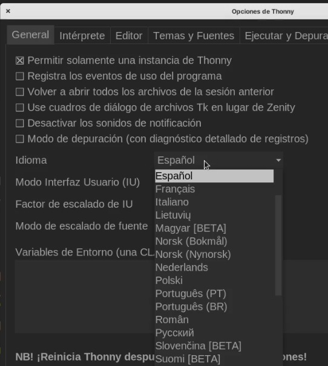
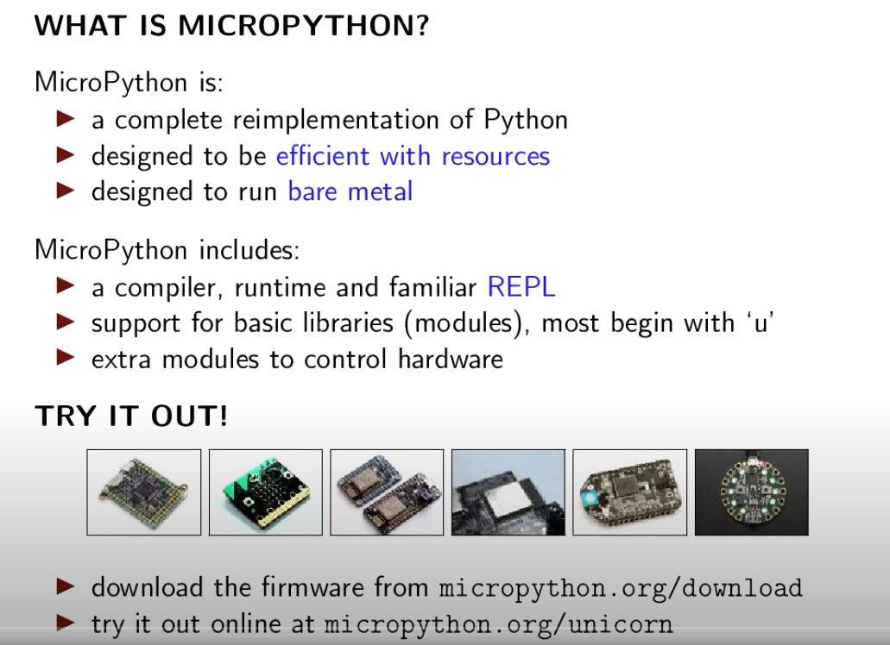
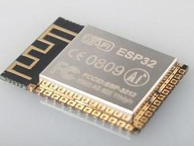
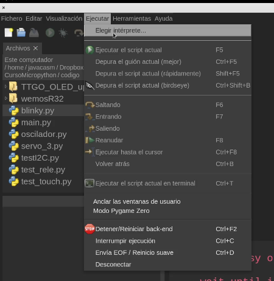
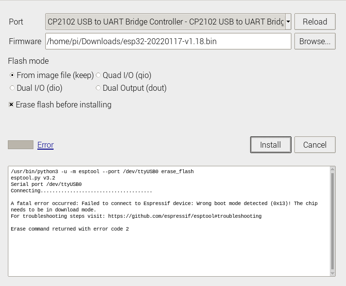
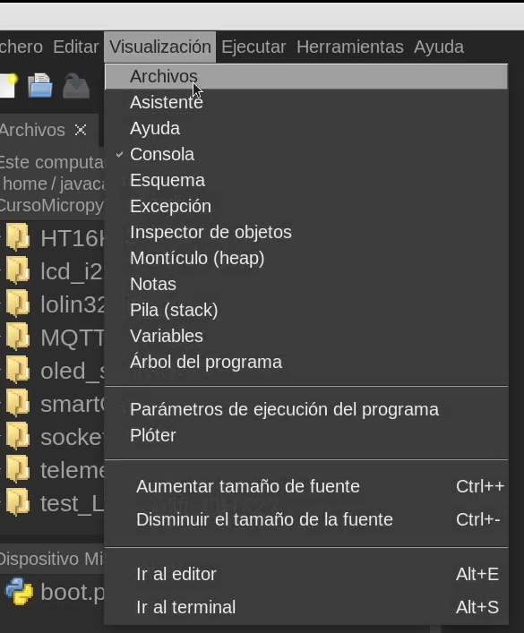
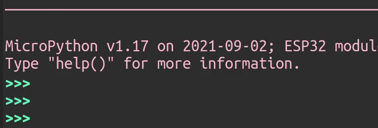
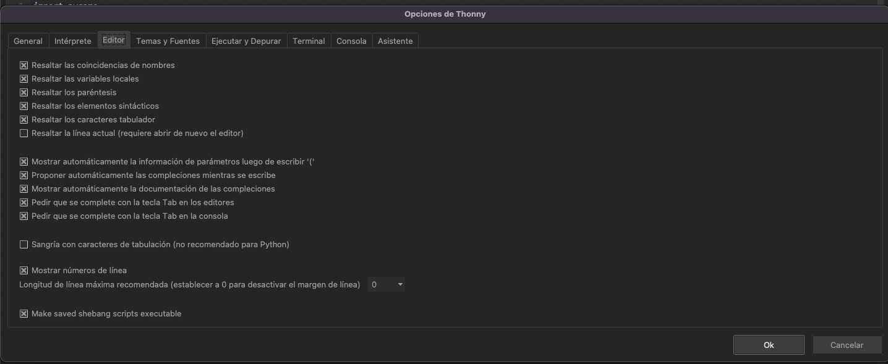
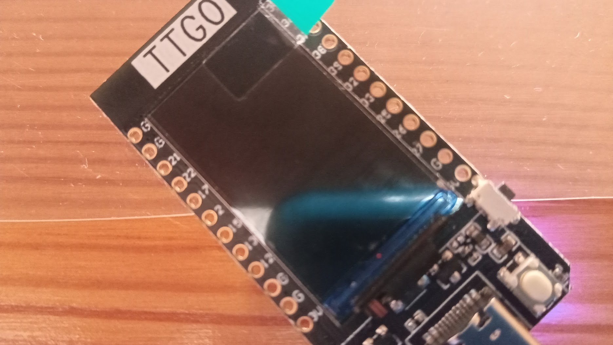
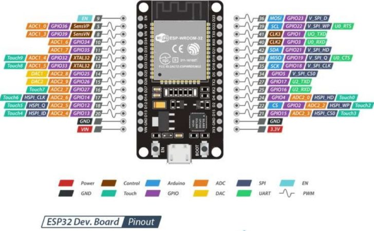

# Python


Python fue creado a finales de los 80 por [Guido Van Rossum](https://es.wikipedia.org/wiki/Guido_van_Rossum)  (@gvanrossum en twitter) y desde entonces se ha ido mejorando y  desarrollando por una enorme comunidad de usuarios. Si quieres saber más sobre su historia, puedes encontrar más detalles en la [página sobre la historia de Python en la wikipedia](https://es.wikipedia.org/wiki/Historia_de_Python).

## Algunas características de Python

* [Debe su nombre al grupo Monty Python](https://docs.Python.org/3/faq/general.html#id19), del que su creador Guido es un gran fan (no sé porqué he puesto este dato en primer lugar...).

* Python es open source, lo que quiere decir que se puede usar en todos los sistemas operativos y por supuesto totalmente gratuito. En [este repositorio de github, llamado cPython (código C de Python)](https://github.com/Python/cPython) puedes encontrar su código fuente, al que han contribuido casi 1500 desarrolladores. 

* En su [página web](https://www.Python.org/) podemos encontrar documentación y tutoriales de todos los niveles. También podemos descargar [desde su página](https://www.Python.org/downloads/) todas las versiones y para casi todos los sistemas operativos.

* La versión actual a día de hoy es la 3.10, estando en desarrollo la 3.11. Sobre la rama 3.8 y 3.9 se arreglan errores, sobre 3.7 y 3.6 sólo se arreglan temas de seguridad y la versión 2.7, presentada en 2010, se considera que ya llegó al fin de su vida útil en 2020.

* Existe la [Python Software Foundation (PSF)](https://www.Python.org/psf-landing/) que ayuda a la creación de eventos globales y locales. En 2019 entregó más de 300.000$ en becas y ayudas en 60 países. 

* ¿Para qué sirve Python?  Es un lenguaje de propósito general, es decir podemos usarlo para hacer casi cualquier tipo de programa o aplicación. Por ejemplo:
    * Aplicaciones web: de hecho existen varios framework (entornos de desarrollo) como django, especializados en la creación de páginas web
    * Aplicaciones de escritorio en cualquier plataforma
    * Scripts (ficheros de lotes) para automatizar tareas repetitivas.
    * Creación de juegos, tenemos multitud de módulos que nos facilitan enormemente la creación de videojuegos.

* Es multiplataforma, es decir podemos usar nuestro código en cualquier plataforma (siempre que todos los módulos que usemos estén disponibles): Windows, MacOS, Linux, Unix,... De hecho viene instalado en los sistemas operativos Linux y MacOS, puesto que parte de los programas incluídos en estos lo usan. 

    Cuando decimos que es multiplataforma también nos referimos a que existe una versión de Python adaptada para ejecutarse en dispositivos embebidos y microcontroladores llamada [microPython](http://microPython.org/) que funciona en equipos con reducidas prestaciones.

* Usa una sintaxis muy sencilla y fácil de comprender, lo que nos ayuda a aprender a programar leyendo otros programas. De hecho en su creación se puso un gran énfasis en conseguir un código muy legible.

* La estructura del código es más legible a simple vista.

* Es muy didáctico y uno de los lenguajes más adecuados para quien no ha programado nunca, y actualmente muchas universidades lo utilizan como lenguaje de entrada al mundo de la programación

* La curva de aprendizaje tiene una pendiente muy alta, pero un escalón inicial muy bajo, lo que nos permite empezar muy rápido a hacer cosas interesantes, casi desde el primer momento.

* Cuenta con multitud de librerías y módulos, lo que nos facilita mucho la tarea de programar, sólo tenemos que buscar si ya existe un módulo que nos sirva y adaptar algún ejemplo. Además estos módulos suelen ser también open source. 

    Algunos de estos módulos están programados completamente en Python y otros son recubrimientos de Python que internamente usan librerías escritas en C para optimizar el rendimiento

    Podemos encontrar módulos para procesamiento de imágenes o para Data Mining (procesamiento masivo de datos) o para trabajar en IA (inteligencia artificial). 

* Por todo esto se ha convertido en un estándar de hecho en el mundo de la ciencia, en todo lo relacionado con la investigación de IA, visión artificial, bioinformática, genética y en la investigación científica.

* Casi todas las grandes empresas del mundo del software utilizan Python, con Google a la cabeza, seguida por Facebook, Industrial Light & Magic (la de efectos especiales), Instagram, Spotify, Netflix, Dropbox,... hasta la mismísima NASA. En [esta página](https://www.Python.org/success-stories/) puedes ver casos de éxito de desarrollos en Python.

* También son muchos los programas/aplicaciones/webs que usamos cada día y que no funcionarían sin Python, como por ejemplo Youtube, Google, Instagram, Reddit, Blender, Dropbox, BitTorrent, OpenShot, 


## Thonny


Thonny es un editor Open Source ([en este repositorio](https://github.com/thonny/thonny) está su código) pensado para trabajar con Python y está disponible para los principales sistemas operativos de PC o similares: Linux, MacOS, Windows, Raspberry,...

Nos permite trabajar con el lenguaje Python en diferentes tipos de entornos. Por ejemplo podemos hacer programas para nuestro PC (juegos, páginas web,...) y también podemos programar para distintos dispositivos como por ejemplo microcontroladores o sistemas más complejos y soportan este lenguaje.

Cómo curiosidad decir que Thonny está escrito en Python y podemos ejecutar y depurar su propio código utilizando el mismo editor

Además incluye las herramientas necesarias para poder transferir el firmware de micropython a nuestro dispositivo para trabajar con él.

También nos permite organizar nuestro código en ficheros que podemos transferir entre la placa con micropython y el PC al que esté conectada.


### Instalación de Thonny

Para instalarlo, descargamos desde [su web](https://thonny.org) el instalador y lo ejecutamos.


Según nuestro sistema operativo y según las características de éste, usaremos un instalado u otro.

Si nuestro sistema operativo es de la familia **Windows**, y dependiendo de que usemos un sistema de 32 o de 64 bits y también de que queremos hacer una instalación en el sistema o sólo copiar los ficheros necesarios en un directorio (instalación portable), que también nos serviría para tenerlo disponible desde un pendrive USB, usaremos una u otra versión.
Como nos avisan, al instalarlo, el sistema nos puede avisar de que el certificado con el que está firmado todavía no está reconocido por Microsoft y debemos aceptar seleccionando “Mantener”


Si usamos un ordenador con sistema operativo de la familia **macOS** descargaremos “pkg” el paquete y lo instalaremos añadiéndolo a la carpeta de aplicaciones:


Para el caso de que usemos un ordenador con sistema operativo de tipo **Linux** podemos o bien descargar e instalar el instalador o usa los paquetes que se han creado para las distintas distribuciones:


También tenemos la opción, si estamos familiarizados con el lenguaje Python y lo tenemos instalado en nuestro ordenador de instalarlo también con **pip**

```sh
pip3 install thonny
```

[](https://drive.google.com/file/d/1MzPOHE7vCj482CQhV7m7ZcZ99B-jWzUN/view?usp=sharing)

[Vídeo: Instalación del editor thonny para trabajar con micropython](https://drive.google.com/file/d/1MzPOHE7vCj482CQhV7m7ZcZ99B-jWzUN/view?usp=sharing)


### Idioma y aspecto

Podemos modificar el idioma desde la ventana de opciones (Menú Herramientas -> Opciones), 


en el desplegable Idioma de la pestaña General



También podemos modificar el aspecto seleccionando dentro de la pestaña "Temas y Fuentes" el aspecto y el color de la sintaxis entre los diferentes temas:


[](https://drive.google.com/file/d/1Cm3jT0t02wbxcsdSlMpNwhWpcaQ02BM-/view?usp=sharing)

[Vídeo: Cambiando el  idioma y el aspecto de Thonny](https://drive.google.com/file/d/1Cm3jT0t02wbxcsdSlMpNwhWpcaQ02BM-/view?usp=sharing)

El IDE Thonny incluye todo lo necesario para editar y ejecutar nuestros programas, puesto que además de editor incluye el entorno de ejecución de Python. 

Por ello y por su facilidad de uso es la elección para quien empieza.

Thonny incluye las características esenciales para desarrollar en Python:

* **Edición de ficheros**: Podemos editar nuestros ficheros de código. También nos permite gestionar archivos con un explorador de ficheros.

    

* Como vemos **resalta la sintaxis**, lo que nos facilita la lectura.

* También nos ayuda **autocompletando código**, con variables y funciones. Esto nos agiliza la escritura del código y además  evita errores.

    

Podemos activar el autocompletado automáticamente o sólo cuando pulsemos Ctrl+Espacio o Tab. Lo configuramos desde la pestaña "Editor" de las preferencias de Thonny.


* En la parte de abajo de la ventana vemos una **consola** que se conoce como **REPL** (Read-Eval–Print Loop) que nos permite trabajar interactivamente con Python

    

* **Depuración**: Podemos ejecutar nuestro programa de forma normal o en modo depuración donde podremos ejecutar línea a línea.

    

* **Visualización de variables y sus valores**: Mientras depuramos también podemos abrir la vista de variables que nos va a permitir seguir el valor que tienen las variables en cada momento.

    

* **Instalación de paquetes y complementos** Desde el propio IDE podemos gestionar e instalar paquetes y complementos, necesarios para nuestros programas.

    

## Primer programa: ¡Hola Python!

Vamos a empezar usando la consola REPL (a veces diré consola, otras REPL). Su propio nombre indica REPL (Read-Eval–Print Loop): es un bucle que lee nuestro código, lo evalúa y muestra el resultado continuamente. Cuando trabajamos así estamos usando el intérprete de Python en modo interactivo.

Nos va a permitir probar y ejecutar nuestro código de un modo interactivo. Yo lo uso para probar fragmentos de código que luego voy a introducir como parte de un programa.

Cuando nos referimos a un programa python, estamos hablando de un fichero, normalmente con extensión **.py**, donde hemos incluido órdenes para que se ejecuten de manera consecutiva. Cuando Python ejecuta uno de estos ficheros no funciona en modo interactivo, sino que ejecuta todas las órdenes del fichero hasta terminarlas todas.

### Usando la consola

Todo lo que vamos a hacer en la consola de Thonny podríamos hacerlo en una consola de python cualquiera. La ventaja de Thonny es que ya nos da todo integrado y facilita enormemente el arrancar. En los sistemas que tienen Python integrado, como por ejemplo Linux, si escribimos en cualquier shell "python3", accedemos a la REPL de Python.

Entramos en la consola de Thonny (recuerda comprobar que tenemos al menos una versión 3.9, si no es así entra ejecutando python3)
 
y ponemos tras el prompt "**>>>**"

```python

print("¡Hola Python!")

```

Al pulsar la tecla Enter veremos que aparece en pantalla el texto

```
¡Hola Python!
```
 


En la imagen vemos que nos resalta la sintaxis, indicando con colores distintos cada parte del código.

También vemos en la imagen que aparece la versión del intérprete de Python que estamos usando.

También podemos hacer que se impriman números pero en  este caso no son necesarias las comillas. 

```python
print(314)
print(3.14)
```

Podemos usar números enteros o decimales, usando el punto decimal "**.**" como separador.

Incluso podemos poner operaciones ...

```python
print(314 + 50)
```

Podemos hacer cálculos con muchas cifras y Python se porta realmente bien, incluso podemos usar notación científica:


 
¿Qué ocurre si ponemos?

```python
print("314 + 50")
```

La diferencia está en que al poner las comillas estamos diciéndole que muestre ese contenido literalmente, si no ponemos las comillas intenta evaluar la expresión. 

[](https://drive.google.com/file/d/13VjltH1BAoCRiJyfUBpAWsmAu2FRjrvD/view?usp=sharing)

[Vídeo: Nuestro primer código Python "Hola Python"](https://drive.google.com/file/d/13VjltH1BAoCRiJyfUBpAWsmAu2FRjrvD/view?usp=sharing)

### Ejercicio Propuesto

1. Modifica este código para que imprima otro texto diferente

## Uso de la Consola o REPL

Ya hemos trabajado un poco con la consola, y hemos visto que podemos ejecutar pequeños programas. 

Vamos a resumir ahora algunas posibilidades que tiene:

* Podemos recuperar las últimas instrucciones usando las teclas "Flecha Arriba" ⬆️ y "Flecha abajo" ⬇️ del cursor del teclado

* Ctrl + L borra todo el contenido de la consola, pero seguimos pudiendo recuperar los comandos anteriores. Nos muestra el prompt de Python "**>>>**" 

* Ctrl + D Reinicia la consola, reiniciando el intérprete. Nos mostrará la versión del intérprete que estamos usando. 

* Ctrl + C Detiene el código que se esté ejecutando en ese momento.

* Podemos acceder a la documentación incluída en el intérprete de python con la función **help()**. Al ejecutar esta función entramos directamente en modo de ayuda interactivo y nos dará la documentación sobre las funciones cuyo nombre hemos indicado. Saldremos de la ayuda interactiva con "**quit**"

* También podemos usar la ayuda directamente dándole el nombre del que queremos obtenerla usando **help(función)**, como por ejemplo

    ```python
    help(print)
    ```

### Errores de sintaxis

Vamos a ver con un poco más de detalle: Hemos usado la función (más adelante veremos qué es una función, pero me gusta ir adelantando términos para que se vayan fijando) **print()** con  comillas simples **'..'**  el texto que queremos que aparezca. También podemos usar comillas dobles **".."**.  ¿Por qué esta variedad?, creo que por motivos históricos pero ahora nos permite hacer cosas como estas:

```python
print('Hola "Python"')
print("Hola 'Python'")
```

Siempre tenemos que tener cuidado de que las comillas funcionan como los paréntesis en matemáticas: El último en abrir el primero que tengo que cerrar. Por tanto no podemos alternar los tipos.

¿Y qué ocurre si no hacemos? Pues que se genera un error de sintaxis, también si nos olvidamos de poner alguna, o no cerramos los paréntesis....

Afortunadamente Thonny nos ayuda resaltando nuestro código y si nos olvidamos de cerrar una cadena, nos lo indica marcando toda la línea en blanco con un color distinto. También ocurre algo similar si nos olvidamos de cerrar los paréntesis.

También se producen errores cuando ponemos alguna operación matemática incompleta.

[](https://drive.google.com/file/d/1X43O8_Nac6XUy8GKyggYGkE8_AZAxe3b/view?usp=sharing)


[Vídeo: Errores de sintaxis usando la consola en Python](https://drive.google.com/file/d/1X43O8_Nac6XUy8GKyggYGkE8_AZAxe3b/view?usp=sharing)


### Usando Ficheros para guardar nuestro código

Desde la consola podemos ejecutar cualquier cosa pero las órdenes que usemos se perderán al salir

Por ello vamos a ver cómo podemos trabajar con ficheros donde incluiremos todas nuestras órdenes

Desde Thonny podemos crear carpetas y si somos ordenados crearemos una llamada "Hello World" para poner dentro el fichero correspondiente. Creamos un nuevo fichero que guardaremos en esa carpeta como  **HolaMundo.py** con el siguiente contenido

```python
print("¡Hola mundo!")
```

Se suele utilizar la extensión **.py** para indicar que el fichero contiene código python

Vemos que el editor resalta la sintaxis indicándonos las distintas partes. Esto nos puede ayudar si hemos cometido un error. Por ejemplo  el editor Thonny nos resalta la línea si nos hemos olvidado de cerrar unas comillas


Desde el editor Thonny  también podemos ejecutar nuestro programa pulsando el botón **Ejecutar**


Veremos en la parte de la consola el resultado y después el prompt esperando un nuevo comando

Los programas en Python siempre se ejecutan desde la primera línea hasta la última y al llegar a esta terminan, no ocurre como en otros entornos (Arduino por ejemplo) donde el código se repite automáticamente. Si queremos que algo se repita se lo tendremos que decir explícitamente. 


[](https://drive.google.com/file/d/1mmwEpd1N-mtZXN6H-E8KdPW_lXof2aGx/view?usp=sharing)

[Vídeo: Trabajando con ficheros de código Python en Thonny](https://drive.google.com/file/d/1mmwEpd1N-mtZXN6H-E8KdPW_lXof2aGx/view?usp=sharing)


## ¿Qué es Micropython?


Micropython es una versión reducida del conocido intérprete del lenguaje Python adaptada para funcionar en dispositivos de menor capacidad que un ordenador personal.

Para reducir la necesidad de procesamiento y de memoria se han simplificado alguna de las posibilidades y eliminando gran parte de los módulos o librería y se incluyen por defecto.

También se han desarrollado versiones reducidas de estas librerías y módulos que podemos incluir ahora de manera opcional.

Nació en 2013,  cuando el físico y programador australiano **[Damien P. George](https://dpgeorge.net/)** creó una exitosa [campaña de crowdfunding en kickstarter](https://www.kickstarter.com/projects/214379695/micro-python-python-for-microcontrollers?lang=es) (tenía un objetivo de 15000£ y consiguió casi 100000£), dónde se desarrolló tanto el entorno de programación como una placa que fuera capaz de ejecutarlo la pyboard.

Los microcontroladores de aquella época básicamente Arduino y similares no eran capaces de desarrollar el procesamiento necesario para trabajar un intérprete de Python por eso fue necesario crear una nueva placa.

La placa además de un procesador STM32 suficientemente potente incluía algunos periféricos integrados que no facilitaban el hacer unas primeras pruebas de funcionamiento.

Podemos encontrar toda la documentación del proyecto en [su página](https://micropython.org/) y por supuesto en la [página del proyecto en github](https://github.com/micropython/micropython)

Una prueba del éxito del proyecto Micropython, es que en su página de github se han creado miles de versiones (se han hecho más de 4000 forks), de las empresas han derivado la versión para su propias placas. También se puede ver en el repositorio que son más 300 los desarrolladores que han contribuido al mismo y si miramos las actualizaciones podemos ver que hay cambios cada día.

A día de hoy son muchísimas las plataformas, además de la original [pyboard](http://micropython.org/download/pybv1), que permiten usar Micropython como lenguaje de programación como por ejemplo las [ESP](http://micropython.org/download/esp8266) y [ESP32](http://micropython.org/download/esp32) de Expressif, las de [m5Stack](https://github.com/m5stack/M5Stack_MicroPython), en las [STM32](http://micropython.org/download/stm32), en la famosísima [micro:bit](https://microbit.org/get-started/user-guide/python/) e incluso en la [Raspberry Pi](https://github.com/boochow/micropython-raspberrypi). De hecho uno de los entornos de programación [recomendados para la nueva Raspberry Pi Pico es micropython](http://micropython.org/download/rp2-pico).

Otras marcas, como Adafruit, han optado por crear una versión derivada, pero algo distinta, más optimizada para sus placas llamada [CircuitPython](https://learn.adafruit.com/bienvenido-a-circuitpython-2/que-es-circuitpython) y que puede funcionar en dispositivos aún más pequeños y limitados.

Una de las grandes ventajas que tiene el programar nuestro microcontroladores (vamos a llamarlos así aunque realmente sean un sistema más complejo) con Micropython, es que podemos trabajar interactivamente con ellos, es decir, **no necesitamos reprogramarlo** cada vez que queremos cambiar el programa con el que estamos trabajando sino que simplemente subimos al sistema ficheros con el código que se interpretaba.

Además este firmware base con el que trabajamos incluye de base muchas de las herramientas que usaremos en nuestros programas, como la gestión de ficheros, la conectividad de redes vía wifi, el manejo de la entrada salida y por supuesto el intérprete Python con toda la funcionalidad de alto nivel (gestión dinámica de memoria, colecciones, manejo de cadenas, ...)

Python es un lenguaje interpretado, es decir, no necesitamos compilar nuestro código para que funcione, sino que el intérprete lo va ejecutando línea a línea.

Desde el entorno de Micropython vamos a poder ejecutar órdenes de manera interactiva y también subir archivos que contiene el código de nuestros programas que podemos utilizar como lo hacemos en entornos más avanzados. También podemos usar estos ficheros como módulos o  librerías que usaremos desde nuestro código.

Micropython es un entorno que se va actualizando constantemente, con una gran cantidad de usuarios que lo usan. A día de hoy (Junio de 2022) se trabaja con la versión 1.19.

Todo el desarrollo es completamente Open Source y tenemos disponible todo lo necesario para recopilar lo de ahí que algunos fabricantes como Adafruit hayan creado versiones específicas para sus placas. La versión de Adafruit, se llama Circuitpython y funciona en las placas más potentes de la marca. Al tratarse de un desarrollo específico para sus propias placas en algún aspecto tiene mayor capacidad que los desarrollos más genéricos.


MicroPython es:

* Una implementación completa de Python
* Diseñado para ser eficiente con los recursos
* Diseñado para ejecutarse nativamente sobre el hardware (sin sistema operativo de por medio). 


Incluye

* Un compilador, entorno de ejecución y un REPL.
    * Gestión de memoria
    * Sistema de archivos
    * Control del hardware
* Librerías y módulos básicos (normalmente empiezan con 'u' por micro)
* Módulos extra para controlar determinado hardware

En esta presentación de Damien George sobre Micropython podemos ver estos detalles


[](https://drive.google.com/file/d/12GklMQ_kHhmaNFoXg7iAVYlvCgptHA_4/view?usp=sharing)

[Vídeo: 0.1 Presentación de micropython](https://drive.google.com/file/d/12GklMQ_kHhmaNFoXg7iAVYlvCgptHA_4/view?usp=sharing)


# Hardware compatible con micropython

Cada vez son más las placas que pueden usar Micropython, vamos a ver algunas de ellas, aprovechado para mostrar algunos de los detalles que usaremos más adelante.

Para poder ejecutar micropython necesitamos:

* 256k de espacio de almacenamiento para el firmware
* 16k de RAM
* Se recomienda un mínimo de 80 MHz
* Soporta las arquitectura de los procesadores: x86, x86-64, ARM, ARM Thumb, Xtensa


[](https://drive.google.com/file/d/1NnQLQKjA91vvCVVEq0fFnuUqCEhDqgMq/view?usp=sharing)

[Vídeo: Hardware soportado por Micropython](https://drive.google.com/file/d/1NnQLQKjA91vvCVVEq0fFnuUqCEhDqgMq/view?usp=sharing)

## ESP32

El módulo ESP32 del fabricante Espressif se ha convertido en un auténtico estándar del mundo maker



* Procesador Xtensa LX6 de 32 bits con doble core a 160 Mhz 
* RAM de 520Kb
* Flash de hasta 16Mb
* Wifi 802.11b/g/n
* Bluetooth (Classic y BLE v4.2)
* 32 pines GPIO
* 18 canales ADC de 12 bits
* 2 DAC de 9 bits
* 16 salidas PWM (10 bits)
* Protocolos:
    * I2C
    * SPI
    * I2S (sonido digital)
    * CAN (protocolo de automoción)

Este módulo es lo que se conoce como un System on Chip, un módulo que incluye todo lo necesario para operar el sistema (CPU, RAM, flash,....)


Muchos fabricantes han creado diferentes placas a partir de este módulo. Vamos a ver algunos de ellos.


## Instalación del firmware de micropython

Antes de trabajar con micropython en nuestra placa tenemos que instalarle el firmware adecuado. Podemos pensar que es un proceso similar a formatear un ordenador nuevo e instalarle el sistema operativo, lo haremos sólo una vez y al principio antes de usarlo.

Para los que usáis estas placas para trabajar con  Arduino, deciros que en cualquier momento podemos instalar un programa desde el IDE de Arduino y trabajaremos como antes, eso sí, perderemos los ficheros que le hayamos instalado. En realidad cuando le pasamos un programa arduino le estamos pasando un firmware + nuestro código (también para las placas arduino "normales" pero ese firmware es minúsculo).

También lo volveremos a hacer en caso de querer actualizarlo a una versión posterior. En ese caso tenemos que asegurarnos de hacer copia de los ficheros que hayamos instalado posteriormente a su instalación.

Desde la [página de descargas de Micropython](https://micropython.org/download/) descargamos el firmware para nuestra placa. Suele ser un archivo con extensión **bin** o **uf2**, según el dispositivo.

A veces podemos ver que una misma placa tiene varias opciones, dependiendo de sus características. Por ejemplo para las placas esp8266 tenemos versión para placas con 512Kb, 1M o más de memoria flash.

Una vez descargado, vamos a enviarlo a la placa que habremos conectado al USB del PC desde el editor Thonny.



Desde el menú Ejecutar pulsamos la opción "Elegir Intérprete"


Que nos abrirá una ventana donde seleccionamos el intérprete adecuado para nuestra placa:

En nuestro caso ESP32


Ahora pulsamos la opción de "Instalar o actualizar el firmware


Seleccionamos el puerto al que está conectada la placa y el fichero del firmware que hemos descargado. Algunas placas necesitan opciones diferentes a las por defecto (eso lo comentaremos más adelante para cada placa). Sí que nos debemos asegurar de que esté marcada la opción de borrar previamente la memoria flash (Erase flash before installing).

Pulsamos el botón instalar y se grabará el firmware en la placa y se verificará la escritura.


El proceso lleva unos minutos.

En algunos caso puede ocurrir que nos falta la herramienta de grabación (esptool) o alguna de las que depende, obteniendo un error:


Podemos solucionarlo desde el menú Herramientas -> Administrar plugins (complementos)


Escribimos el que nos falta (normalmente esptools)


Lo instalamos


Ya podemos instalar el firmware en nuestra placa

[](https://drive.google.com/file/d/13jT3f-Rpg0B3hGgYMIPP_kP-4qlEFC0n/view?usp=sharing)


[Vídeo: Instalación del  firmware de micropython desde Thonny](https://drive.google.com/file/d/13jT3f-Rpg0B3hGgYMIPP_kP-4qlEFC0n/view?usp=sharing)

## Problemas en placas ESP32 antiguas

Para grabar el firmware en las placas ESP32 (y en muchas otras), es necesario que la patilla 0 esté conectada a GND. En las placas actuales, cuando vamos a grabar el firmware, el chip que se encarga de las comunicaciones USB lo hace automáticamente.

En placas antiguas puede que esto no funcione y en ese caso tendríamos que hacerlo manualmente. 



Si la placa tiene botón BOOT tendremos que pulsarlo para ponerla en modo __reescritura de firmware__ y si no lo tiene, tendremos que hacerlo manualmente (como en la ESP32-CAM o en el ESP01).

[](https://drive.google.com/file/d/1HHStVAFa3jCs8Swwp4uwmCaLqRHq5JmA/view?usp=sharing)

[Vídeo: Problemas de instalación del firmware en placas ESP32 antiguas](https://drive.google.com/file/d/1HHStVAFa3jCs8Swwp4uwmCaLqRHq5JmA/view?usp=sharing)

### Uso de Thonny


El entorno Thonny tiene diferentes apartados dentro de su ventana principal, cada uno con diferente uso.

En todo momento podemos cerrar estas ventanas, pudiéndose volver a abrir desde el menú **Visualización**



Cuando trabajamos con micropython usando Thonny (hemos seleccionado el intérprete adecuado) y tenemos conectada nuestra placa, veremos abajo lo que denominamos la **consola** (o terminal).


Es una parte del editor que nos permite trabajar interactivamente con nuestra placa. Esta característica se denomina REPL, Read-Evaluate-Print Loop o bucle de lectura, evaluación e impresión. En este modo el intérprete nos devolverá por pantalla el resultado de la expresión que hayamos introducido. Es un modo interactivo, pensado para ir creando o probando nuestro código.

Personalmente es una de las características que más me gustan de micropython, que me permite desarrollar rápidamente prototipos que evolucionan con facilidad a proyectos más acabado y complejos.


En la parte de la derecha veremos los ficheros, arriba los que están en el ordenador y abajo los que están en nuestra placa. Thonny nos va a mostrar todos los ficheros, aunque sólo puede editar los de código.

El poder usar un sistema de archivo en nuestra placa es una característica muy avanzada que nos va a permitir trabajar con micropython casi como en un sistema de alto nivel.

Si pulsamos sobre cualquiera de ellos se abrirán en el editor central, mostrando el nombre entre corchetes "[...]" si el fichero está en la placa o sin ellos si está en el PC.

Al crear un fichero nuevo, seleccionamos si se crea en el PC o en la placa


Podemos transferir ficheros entre la placa y el PC pulsando sobre ellos con el botón derecho del ratón y eligiendo la opción de enviar al otro 


### Uso de la consola

En la consola podemos ejecutar órdenes de manera interactiva. Al conectar la placa veremos el símbolo del intérprete (Prompt) 

```python
>>>
```
Que nos dice que está dispuesto a ejecutar nuestras instrucciones. 



Vamos a empezar haciendo el habitual "Hola mucho", que nosotros podemos adaptar a "Hola Python!!", en la consola.

Para ello escribiremos 

```python
print('Hola Python!!')
```

Y al pulsar "Enter", tendremos el resultado:

```python
  Hola Python!!
```


También podemos hacer todo tipo de operaciones matemáticas:

```python
>>> 2+5
  7
```


O incluso operaciones mucho más complicadas


[](https://drive.google.com/file/d/1EY7so0zaGoWa8lE_LkfqSC4pnDkX7mdg/view?usp=sharing)

[Vídeo: Uso de Thonny, ficheros y primeras pruebas con  la consola interactiva](https://drive.google.com/file/d/1EY7so0zaGoWa8lE_LkfqSC4pnDkX7mdg/view?usp=sharing)

### Reseteando la placa

A veces ocurre que necesitamos resetear nuestra placa, bien porque hay un problema de conexión o bien porque nuestro código tiene algún fallo. En ese caso podemos  resetear nuestra placa pulsando el botón de reset, si lo tienen. También podemos hacerlo pulsando desde la consola "Ctrl + D", con lo que se mostrará el mensaje de bienvenida de nuestra placa (Banner).

También podemos resetear tanto la placa como la conexión con Thonny pulsando el botón rojo de Thonny

[](https://drive.google.com/file/d/1xa1M2I1YBvTQPHda-ZxlKq8ppkFAN7JB/view?usp=sharing)

[Vídeo: Reseteando nuestra placa con Ctrl+D](https://drive.google.com/file/d/1xa1M2I1YBvTQPHda-ZxlKq8ppkFAN7JB/view?usp=sharing)


### Histórico de comandos

Una característica muy cómoda de la consola es que podemos recuperar cualquier comando que hemos usado antes sin más que pulsar la tecla hacia arriba del cursor. Es lo que se conoce como el **Histórico de comandos**. 

Podemos desplazarnos hacia atrás o hacia adelante con las flechas arriba y abajo del cursor.


### Autocompletado

Una características muy interesante, y útil, de Thonny, y de la mayoría de 
los entornos de programación profesionales, es el **autocompletado**, que 
consiste en que el sistema nos propone a medida que vamos escribiendo el 
código nos propone posibles variables o funciones según lo que escribimos.

Para ello tenemos que tenemos que tener activadas las siguientes opciones 
de la configuración de Editores de Thonny



Hay que tener en cuenta que esta funcionalidad depende bastante de la 
capacidad del ordenador que usamos, con lo que puede ser que tarden en 
mostrarse las opciones, por eso vienen desactivado por defecto.

 
# Proyectos electrónicos con microcontoladores ... o similares

Como ya dijimos, la mayoría de las placas que usaremos en este curso son sistemas más complejos que los microcontroladores usuales, pero por sencillez usaremos este término.

En este tema 3 vamos a empezar a crear proyectos sencillos y aprender a programar nuestras placas para que puedan controlar los dispositivos que le conectaremos. 

Para ello necesitamos conectar los dispositivos a nuestra placa e introducirle un programa para lea y controle los dispositivos. Por el simple hecho de conectar un dispositivo este no se accionará ni podremos usarlo.

Todo proyecto tendrá una parte física a la que llamaremos **hardware** y otra que será el programa o código y que denominamos **software**.

## Uso de entrada salida

En esta imagen hemos puesto algunos de los dispositivos más usuales con los que trabajaremos:


De unos leeremos datos, los llamaremos **sensores** y puede que leamos datos **digitales** (que sólo dan valores discretos) o datos **analógicos** (que se mueven en un rango discreto). Decimos que actúan como **entradas** o **input** para nuestro sistema. 

De los sensores digitales diremos que medimos su **estado**  que será activo (On) o apagado (Off). De los analógicos mediremos su **valor**.

Un buen ejemplo del primer tipo puede ser un pulsador o un interruptor (como los que tenemos en casa para encender/apagar la luz). Decimos que es digital porque o lo encendemos o apagamos. 

Un ejemplo del segundo tipo, analógico, puede ser el mando giratorio que controla el volumen en un aparato de audio o un sensor de temperatura que puede variar de manera continua.

Nuestra placa también controlará otros componentes, como luces (leds), motores, pantallas, altavoces.... decimos que estos actúan como **salidas** o **output**.

Cada placa tiene un "mapa" de las características que puede usar cada patilla o pin. Es lo que se suele llamar **pinout**. A veces una patilla puede leer datos digitales o sólo activarlos. También hay otras que pueden leer datos analógicos.

Para conectar los dispositivos tendremos que ver qué pines de la placa que usamos pueden trabajar y/o controlar las entradas y salidas que necesitamos.


Primero, aprenderemos a controlar 1 led, luego varios, en formato **digital** encendiéndolo y apagándolo. Finalmente, veremos cómo controlar de manera **continua** su brillo. Para ello introduciremos el concepto de **colección** en Python.

Al mismo tiempo aprenderemos también a trabajar con **ficheros de código** en micropython y a agrupar nuestro código en **funciones**, para facilitar su reutilización y hacer más clara y entendible su estructura.

Veremos también cómo detectar las **pulsaciones** de botones, de forma manual y de manera automática utilizando **interrupciones**.

Aplicaremos todo esto al manejo de motores, servos y leds RGB.

## Encendiendo y apagando LEDs

Nada hay más emocionante que el momento en el que encendemos un led por primera vez en una nueva placa o con un nuevo lenguaje. Es lo que solemos llamar un programa "Hello Led!" (por analogía con el típico programa "Hello world")

Vamos a ello... pero antes vamos a aprovechar para aprender un poco sobre los módulos de Python en general y de micropython en particular.

### Usando módulos

Python en general y micropython en particular con aún más interés, puesto que los equipos en los que se utilizan suelen ser más limitados, intentan ahorrar el máximo de memoria ocupada. Para eso intenta tener en memoria la mínima cantidad posible de código. 

Para acceder a los distintos componentes, sistemas o funcionalidades, el firmware utiliza distintos **módulos** (librerías en otros contextos) que necesitamos "cargar" antes de usar. Estos módulos están agrupados por funcionalidades y contienen los diferentes sistemas, agrupados en lo que llamaremos **clases** sobre los que ejecutaremos acciones usando sus **funciones** o **métodos**.

Algunos módulos son:

* **machine**: que contiene todo lo relacionado con la placa con la que estamos trabajando: acceso a sus patillas, a sus sistema de comunicaciones,...
* **network**: contiene todo lo relacionado con las comunicaciones de red: wifi,...
* **os**: nos permite manejar ficheros y otros temas relacionados con lo que llamaríamos el Sistema Operativo.

Casi todas las placas tienen un  módulo específico, con sus particularidades de cada una, como por ejemplo **esp** para las ESP32 o **microbit** para la placa micro:bit.

Para placas más pequeñas, como la micro:bit se han concentrado la mayoría de la funcionalidad en uno de estos módulos de manera que ahorremos memoria y el firmware sea más pequeño.

Además de los módulos que ya trae el firmware de micropython, nosotros podemos añadir nuevos que necesitaremos para poder acceder a otros dispositivos o funcionalidades.

Para cargarlas, usamos la palabra reservada **import** seguida por el nombre del módulo a cargar en memoria. Al hacerlo el módulo se inicializa y ya lo tenemos disponible, pudiendo acceder a sus componentes.

Para acceder a los distintos componentes usaremos el nombre del módulo seguido por el del componente.

Por ejemplo si quisiéramos cargar el módulo "moduloSistema" para acceder al componente "componente1" y ejecutar su función "start" haríamos:

```python
import moduloSistema

moduloSistema.componente1.start()
```

Una vez importado un módulo podemos pedir ayuda sobre el mismo para la documentación haciendo

```python
help(moduloSistema)
```

También puede solicitar la ayuda de un componente (clase) en concreto:

```python
help(moduloSistema.componente)
```

También podemos omitir el nombre del módulo si cambiamos la forma de hacer el import. Como hemos visto si hacemos el import de esta manera:

```python
import machine
```

Tenemos que poner el nombre del módulo antes del componente que vamos a usar

```python
led = machine.Pin(5,machine.Pin.OUT)
```

En cambio, si hacemos el import de esta otra manera:

```python
from machine import Pin
```

Podemos omitir el nombre del módulo

```python
led = Pin(5,Pin.OUT)
```

Si vamos a usar más clases del módulo podemos hacerlo de esta manera:

```python
from machine import *
```

Y así tendremos acceso a todas las clases sin necesidad de anteponer la palabra machine.

Yo suelo usar el primer formato porque me parece importante, al menos al principio, conocer en qué paquete/módulo está cada clase.


Como habrás observado:

* Es necesario escribir respetando exactamente las mayúsculas/minúsculas. 
* No hace falta que pongamos ningún carácter para terminar las líneas (como el conocido ";" del C/C++)
* Python intenta ser muy ordenado, organizando y estructurando nuestro código todo lo posible. Decimos que los sistemas, objetos y funciones están **jerarquizadas**, es decir tienen una estructura de árbol donde unos componentes cuelgan de otros.
* Python incluye documentación sobre sus módulos y como usarlos

### Vamos con los LEDs 

Todo lo relacionado con la placa está en el módulo **machine** que cargamos con:

```python
import machine
```

Si ahora escribimos "machine." y pulsamos la tecla TAB (tabulador) aparecerá un listado con los posibles componentes (clases) que tiene este módulo.

Como lo que queremos hacer es activar/desactivar una salida para encender un led, tendremos que usar  la clase **Pin**, que es la indicada para acceder a una patilla, a la que tendremos que indicarle:

* El número de la patilla que queremos usar
* Si queremos usar la patilla como OUT (salida) para que genere un cierto voltaje o como IN (entrada) para que lea el voltaje que se aplica.

En nuestro caso vamos a usar el led incluído en la placa (Bluitin Led), que según la documentación de la Wemos D1 R32 es el 2. Por ello haremos:

```python
>>> import machine
>>> machine.Pin(2, machine.Pin.OUT)
Pin(2)
```

Para saber ahora cómo activar o desactivar una patilla, podemos usar la ayuda con:

```python
import machine
>>> help(machine.Pin)
>>> help(machine.Pin)
object <class 'Pin'> is of type type
  init -- <function>
  value -- <function>
  off -- <function>
  on -- <function>
  irq -- <function>
  IN -- 1
  OUT -- 3
  OPEN_DRAIN -- 7
  PULL_UP -- 2
  PULL_DOWN -- 1
  PULL_HOLD -- 4
  IRQ_RISING -- 1
  IRQ_FALLING -- 2
  WAKE_LOW -- 4
  WAKE_HIGH -- 5
```

Donde vemos que existen funciones **on** y **off**

Ya hemos dicho que en Python se intenta ser muy ordenado, por ello, para actuar sobre este pin lo más sencillo es que declaremos una variable __led__, asignamos el pin 2, que es el pin de la placa Wemos D1 R32 (abajo están los pines para otras placas) y así trabajemos más fácil.

(Recuerda que puedes recuperar las sentencias anteriores, pulsando la tecla Flecha Arriba, si no quieres escribir otra vez)

```python
>>> import machine
>>> led = machine.Pin(2, machine.Pin.OUT) # Para Wemos D1 R32
>>> led.on() # Lo encendemos
>>> led.off()  # Lo apagamos
```

Donde ves que hemos incluído un **comentario** o explicación para que nuestro código quede más claro. Sólo tenemos que incluir el carácter **#** y a partir de él todo se ignorará hasta el final de la línea.

También se puede hacer **led.value(1)** ó **led.value(0)** o usar **led.value()** para conocer el valor actual.

Si usamos otra placa tendremos que cambiar el número del pin del led, que podemos obtener de la documentación de cada placa:

* Si usamos la TTGO, podemos usar el pin 4 que es la luz de la pantalla y aunque no brilla mucho, sí que se aprecia cuando está encendido o apagado

 

* Para la Adafruit Feather, el led de la placa está conectado al pin 13.
* Para la pyBoard 1.1 los leds están conectados a P2, P3, P4 y P5
* Para la ESP-CAM es el pin 4
* Para la mayoría de las placas es 2 o 4.
* Para trabajar con la placa micro:bit veremos un poco más adelante cómo hacerlo.

[](https://drive.google.com/file/d/1ilOQgYBpthieuNtHMCdaJRuw3WpiQD0m/view?usp=sharing)

[Vídeo: Controlando un led con micropython](https://drive.google.com/file/d/1ilOQgYBpthieuNtHMCdaJRuw3WpiQD0m/view?usp=sharing)


# Pines digitales disponibles en ESP32

Según vemos en el esquema, no todos los pines del módulo ESP32 están disponibles para su uso. Algunos pines no están conectados a patillas exteriores, se usan internamente para manejar los periféricos. Siempre debemos consultar el esquema de la placa.



En concreto los pines 20, 24 y el 28 al 31 no están disponibles para el usuario y los pines entre el 6 y el 11 se usan para controlar la conexión con la memoria Flash, por eso no podemos usarlos.


GPIO|Entrada|Salida|Notas
---|---|---|---
0|pull up|OK| PWM al arrancar
1|TX pin|OK| Información de depuración al arrancar
2|OK|OK|conectado al led de la placa
3|OK|RX pin|HIGH al arrancar
4|OK|OK|
5|OK|OK| PWM al arrancar
6 - 11 |X|X|conectados por SPI a la memoria flash
12|OK|OK|Error al arrancar si está en estado HIGH
13-19|OK|OK|
20|X|X|No conectado
21-23|OK|OK|
24|X|X|No conectado
25-27|OK|OK|
28-31|X|X|No conectados
32-33|OK|OK|
34-36|OK|X|
37-38|X|X|No conectados
39|OK|X|Solo entrada
### Retardos

Ya que tenemos el código en el fichero vamos a modificarlo introduciendo un retardo que nos permita apreciarlo. 

Para ello importamos el módulo **utime** que contiene métodos relacionados con el tiempo. Es una versión reducida del clásico módulo **time** de Python. En micropython algunos módulos llevan una "u" (por la letra griega μ/micro) delante del nombre para indicar que son versiones reducidas.

Lo importamos y usaremos la función **sleep** indicando la duración del retardo en segundos. 

* Editamos el fichero para dejarlo así para ESP32:

```python
import machine
import utime # o time

led = machine.Pin(2, machine.Pin.OUT) # Pin 2 para Wemos D1 R32
led.on() # Lo encendemos
time.sleep(1) # esperamos 1 segundo
led.off()  # lo apagamos
```

Para micro:bit

```python
from microbit import *
import utime

display.set_pixel(0,0,9)
utime.sleep(1)
display.set_pixel(0,0,0)
```

* Nos aseguramos de que hemos guardado el fichero en la placa (muchas veces cambiamos el fichero en el PC y no hay sincronización automática entre ambos)
* Reseteamos nuestra placa, para que se borre el módulo de la memoria
* Volvemos a importar nuestro fichero y ahora sí que se producirá la espera y podremos apreciar el parpadeo.


También puede ser un número decimal si queremos esperar menos de un segundo. En python los números decimales usan el punto "." como separador decimal. Si la espera que queremos realizar es bastante más pequeña que 1 segundo podemos usar otra función pensada para esperar milisegundos. Así, **sleep(0.01)**  sería igual a **sleep_ms(10)**.

## Bucles

Ahora vamos a hacer que se repita el parpadeo para lo que haremos un bucle.

La forma más sencilla de hacerlo es la que se conoce como bucle **while**. La sintaxis es:

```python
while CONDICION
    linea 1
    linea 2 # está dentro del bucle
    ...
#está fuera del bucle
```

Donde:

* Condición que nos dice qué tiene que ocurrir para que se repita.
* El signo "**:**" que declara el comienzo del bloque.
* Un bloque de código que está formado por líneas que están tabuladas 4 espacios hacia la derecha.

La forma en la python delimita los bloques es con la tabulación, por eso es fundamental el formateo de nuestro código, y el carácter "**:**" que define dónde empieza el bloque de código.

Ahora mismo no nos vamos a complicar con la condición y haremos que se cumpla siempre, expresado con el valor lógico **True**. Diremos que es un bucle infinito.

```python
import machine # Todo lo relacionado con el acceso al hardware
import utime   # utilidades relacionadas con el tiempo

# Creamos un objeto led conectado al pin 2 y como salida
led = machine.Pin(2, machine.Pin.OUT)

while True: # se repite para siempre
    led.on()          # encendemos
    utime.sleep(0.5)  # esperamos medio segundo
    led.off()         # apagamos  
    utime.sleep(0.5)  # esperamos medio segundo
print('fuera del bucle')
```


Como el bucle no termina nunca, la línea "print" no se ejecutará nunca.

Reseteamos la placa y si ahora importamos el fichero de nuevo para ejecutarlo veremos que ya no para de parpadear. Tampoco veremos el signo de la consola, pues está ocupada ejecutando nuestro fichero.

Podemos parar la ejecución pulsando **Ctrl + C** y el programa se detendrá.

### Estructura de un programa

Un program típico (en micropython o en la mayoría de lenguajes) tendrá las siguiente partes (aunque a veces no estarán ordenadas de esta manera):

* **Inicialización:** la placa controladora debe saber dónde hemos conectado cada componente. Esta parte se suele ejecutar sólo una vez
* **Bucle de control:** donde el programa se pasa todo el tiempo y que se repite de manera indefinida o hasta que termine. Podemos dividirla en varias fases:
    * **Lectura** de entradas para medir los valores y estados de los sensores
    * **Decisión** en donde a partir del estado y valores de las entradas decidimos el cómo debemos activar las salidas
    * **Escritura** de las salidas, donde se establecen los valores de las salidas.


### Versiones

Vemos que vamos modificando muchas veces los ficheros, conviene que hagamos copia en el PC de vez en cuando para evitar problemas.
Puede ocurrir que no sepamos si cual de los ficheros es más reciente. Por ello suele incluir una sencilla forma de identificar las versiones en los ficheros. Para ello declaro una variable v en todos los ficheros que es un número decimal que voy aumentando al hacer nuevas versiones.

```python
v = 0.3
```

Así puedo saber si un fichero es anterior o no a su copia del PC.

También puede saber el valor de la versión de módulo que estoy ejecutando haciendo:

```python
>>> import fichero
>>> fichero.v
0.5
```

Ahora podemos ver una ventaja de la organización jerárquica de los módulos: si ahora tengo otro fichero:

```python
>>> import fichero2
>>> fichero2.v
0.3
```

Las variables v de cada fichero son distintas y las puedo identificar perfectamente

[](https://drive.google.com/file/d/1Y9YflawCGSA5x_geFnqu7utkpKzvgoKo/view?usp=sharing)

[Vídeo: Código en ficheros, retardos y bucles](https://drive.google.com/file/d/1Y9YflawCGSA5x_geFnqu7utkpKzvgoKo/view?usp=sharing)
