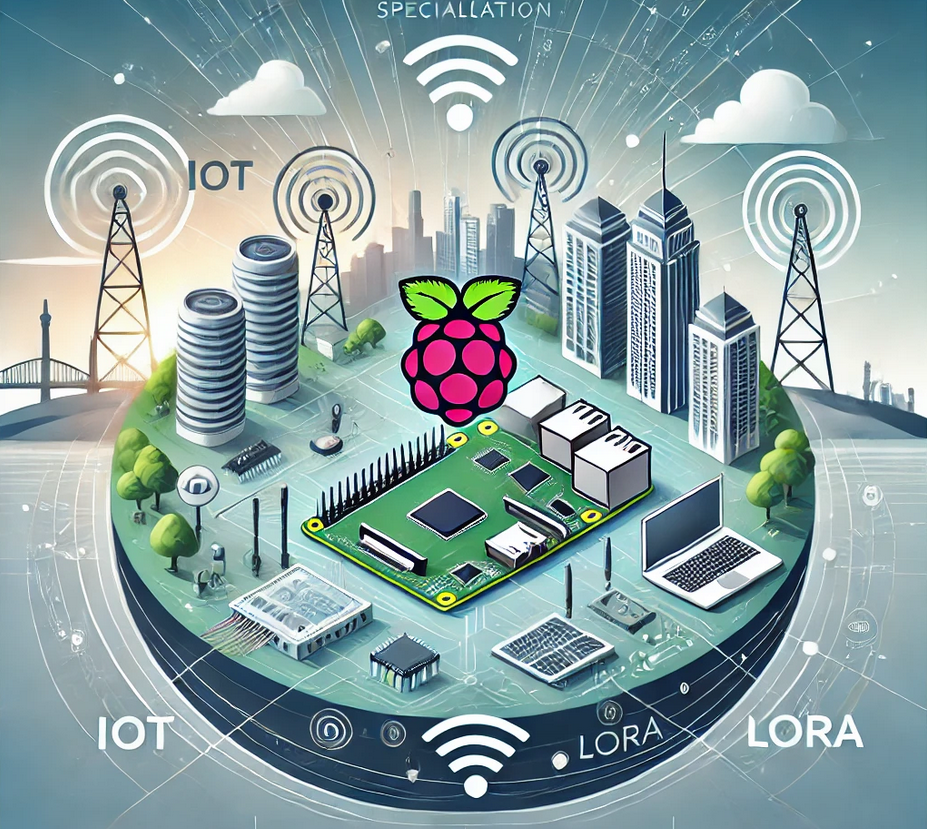
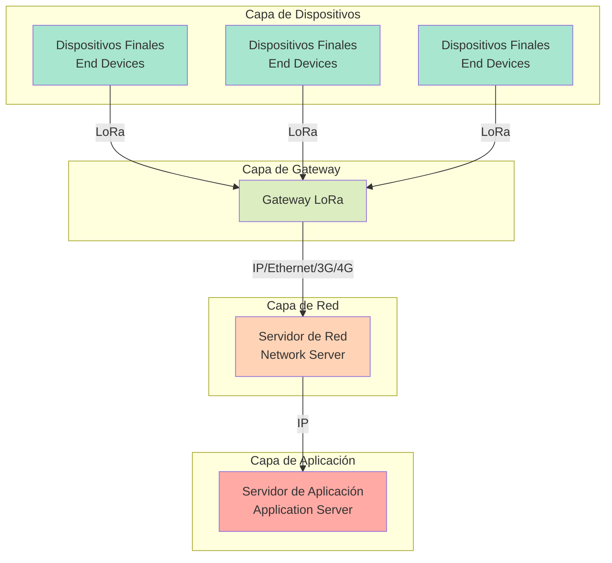
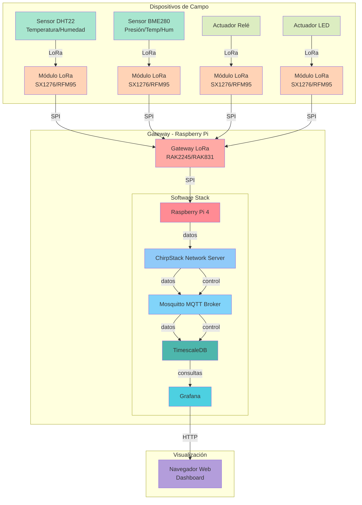
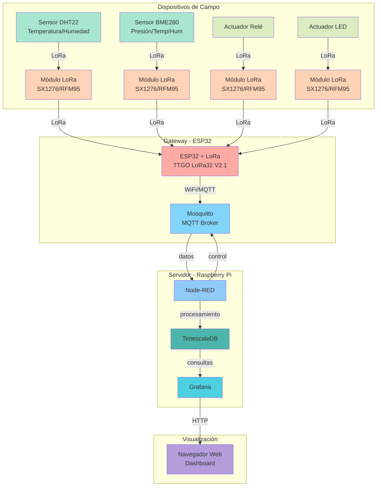
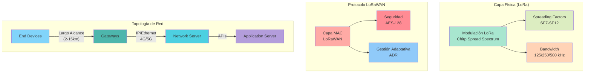
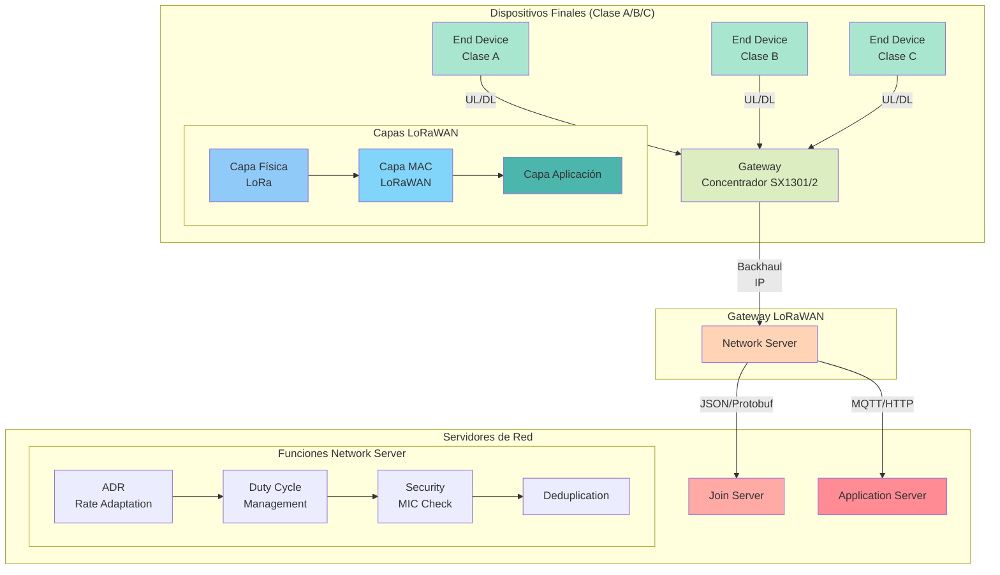

### **Protocolo de Comunicaciones LoRa (Long Range)**

LoRa es una tecnología de comunicación inalámbrica de baja potencia y largo alcance diseñada para Internet de las Cosas (IoT). LoRa utiliza una modulación de espectro ensanchado de radiofrecuencia que proporciona una comunicación robusta y eficiente en entornos complejos.

---

### **Características del Protocolo LoRa**

1. **Largo alcance**:
   - Permite comunicaciones de varios kilómetros en entornos urbanos y hasta 15-20 km en áreas rurales.

2. **Bajo consumo de energía**:
   - Diseñado para dispositivos con baterías de larga duración, que pueden operar durante años sin recarga.

3. **Modulación LoRa**:
   - Utiliza técnicas de espectro ensanchado basadas en Chirp Spread Spectrum (CSS), lo que proporciona resistencia a interferencias y ruido.

4. **Velocidades de transmisión adaptables**:
   - Ofrece tasas de datos ajustables (0.3 kbps a 27 kbps), adecuadas para transmitir datos pequeños de sensores o dispositivos IoT.

5. **Banda ISM sin licencia**:
   - Opera en bandas de frecuencia como 433 MHz, 868 MHz (Europa) y 915 MHz (América), permitiendo el despliegue sin necesidad de licencias específicas.

6. **Topología de red escalable**:
   - Soporta redes en configuración de estrella, donde los nodos finales se comunican con un gateway central.

7. **Alta capacidad de nodos**:
   - Es capaz de soportar miles de nodos en una sola red.

8. **Seguridad**:
   - Implementa cifrado AES de extremo a extremo, garantizando la integridad y confidencialidad de los datos.

---

### **Ventajas del Uso de LoRa**

1. **Cobertura extensa**:
   - Ideal para aplicaciones rurales y urbanas donde la infraestructura de red celular puede ser costosa o inexistente.

2. **Eficiencia energética**:
   - Extiende la vida útil de los dispositivos, crucial para sensores remotos o dispositivos de difícil acceso.

3. **Bajo costo**:
   - Las bandas ISM libres de licencia y la simplicidad de implementación reducen los costos operativos.

4. **Resistencia a interferencias**:
   - La modulación LoRa asegura una comunicación confiable en entornos ruidosos o congestionados.

5. **Flexibilidad de aplicaciones**:
   - Es compatible con múltiples sectores: agricultura, ciudades inteligentes, industria, logística, y medición remota de servicios públicos.

6. **Compatibilidad con LoRaWAN**:
   - Puede integrarse con LoRaWAN (un protocolo MAC de nivel superior) para gestionar dispositivos IoT de manera escalable y estructurada.

---

### **Desventajas o Limitaciones**

1. **Baja velocidad de transmisión**:
   - No es adecuado para transferencias de grandes volúmenes de datos como video o audio.

2. **Dependencia de gateways**:
   - Requiere infraestructura de gateways para conectar nodos a internet u otras redes.

3. **Capacidad limitada en redes densas**:
   - En entornos con demasiados dispositivos, la interferencia entre nodos puede ser un desafío.

---

LoRa se ha convertido en una de las tecnologías más populares para aplicaciones IoT debido a su combinación única de alcance, bajo consumo de energía y facilidad de implementación.

## Esquema de comunicaciones Lora

Veamos un diagrama que muestre la arquitectura de comunicaciones LoRa (Long Range).




Este diagrama que muestra los componentes principales de una red LoRa:

1. Capa de Dispositivos:
   - Dispositivos finales (End Devices) que utilizan el protocolo LoRa para comunicarse
   - Pueden ser sensores, actuadores u otros dispositivos IoT

2. Capa de Gateway:
   - Gateway LoRa que recibe las señales de los dispositivos finales
   - Actúa como puente entre la red LoRa y la red IP

3. Capa de Red:
   - Servidor de Red que gestiona la red LoRa
   - Maneja la deduplicación de paquetes y el enrutamiento

4. Capa de Aplicación:
   - Servidor de Aplicación donde se procesan y utilizan los datos
   - Interfaz con sistemas externos y aplicaciones de usuario final

Algunas características importantes de esta arquitectura:
- Comunicación bidireccional
- Largo alcance (hasta varios kilómetros)
- Bajo consumo de energía
- Topología en estrella de estrellas

---

### **Componentes Clave**

1. **Dispositivos/Nodos LoRa**:
   - Son dispositivos IoT equipados con módulos LoRa.
   - Tienen sensores y/o actuadores para recolectar datos o realizar acciones.
   - Ejemplos: medidores de agua, sensores de temperatura, rastreadores GPS.

2. **Gateways LoRa**:
   - Actúan como intermediarios entre los nodos LoRa y el servidor de red.
   - Reciben datos de múltiples dispositivos y los envían al servidor central a través de internet o una red local.

3. **Servidor de Red LoRaWAN**:
   - Gestiona los datos recibidos de los gateways.
   - Realiza tareas como autenticación, enrutamiento de mensajes y almacenamiento temporal.
   - Proporciona una API para que las aplicaciones accedan a los datos.

4. **Aplicaciones de Usuario**:
   - Consumen los datos procesados del servidor de red.
   - Pueden incluir dashboards para visualización, alertas en tiempo real, o sistemas de control remoto.

---

### **Flujo de Comunicación**

1. **Recolección de datos por los nodos**:
   - Los dispositivos IoT recopilan datos del entorno, como temperatura o nivel de humedad.

2. **Transmisión vía LoRa**:
   - Los nodos envían datos mediante señales de radiofrecuencia en las bandas ISM libres (como 868 MHz o 915 MHz).

3. **Recepción por los gateways**:
   - Los gateways captan las señales de múltiples nodos y las convierten en datos digitales.

4. **Envió al servidor LoRaWAN**:
   - Los gateways transmiten los datos al servidor LoRaWAN, donde se procesan y almacenan.

5. **Entrega a las aplicaciones**:
   - Los datos procesados se envían a las aplicaciones del usuario final para análisis, visualización o toma de decisiones.

---

Este esquema puede personalizarse según el tipo de aplicación, como redes privadas LoRa, integración con servicios en la nube o despliegues híbridos (privados y públicos).


## Arquitectura

Voy a crear un diagrama detallado de la arquitectura incluyendo sensores, actuadores y el software necesario en la Raspberry Pi.




## Arquitectura alternativa

Voy a modificar el esquema para usar un ESP32 con módulo LoRa como gateway, simplificando la arquitectura y reduciendo costos.



Para implementar esta arquitectura necesitarás:

1. **Hardware Gateway**:
- TTGO LoRa32 V2.1 (ESP32 + LoRa SX1276)
- Antena externa (opcional pero recomendada)

2. **Software para el ESP32**: para que actúe de puente (gateway) entre redes.
3. **Software en Raspberry Pi**:

Instalar componentes necesarios:
* Mosquito: broker MQTT
* Node-RED: Recibe MQTT y guarda en la base de datos
* DB
* Grafana

Ventajas de esta arquitectura:
1. Más económica que usar un gateway LoRa comercial
2. Menor complejidad de configuración
3. Node-RED proporciona una interfaz visual para procesar y enrutar datos
4. Fácil escalabilidad

Limitaciones:
1. Menor rango que un gateway LoRa comercial
2. No soporta características avanzadas de LoRaWAN
3. Gestión manual de la red

## LoraWAN


LoRaWAN (Long Range Wide Area Network) es un protocolo de red que se construye sobre la tecnología de modulación LoRa. Te lo explicaré en detalle.



### 1. Definición Básica
LoRaWAN es:
- Un protocolo de red de área amplia de bajo consumo (LPWAN)
- Diseñado para conectar dispositivos alimentados por batería a Internet
- Optimizado para bajo consumo, largo alcance y baja tasa de datos
- Un estándar abierto mantenido por la LoRa Alliance

### 2. Características Principales

1. **Largo Alcance**
- Cobertura de 2-5 km en áreas urbanas
- Hasta 15 km en áreas rurales
- Penetración efectiva en edificios

2. **Bajo Consumo**
- Dispositivos que funcionan años con una batería
- Optimización del ciclo de trabajo
- Modos de ahorro de energía

3. **Bidireccional**
- Comunicación de subida (uplink) y bajada (downlink)
- Diferentes clases de dispositivos según necesidades
- Confirmación opcional de mensajes

4. **Seguridad**
- Cifrado end-to-end
- Autenticación de dispositivos
- Protección contra reproducción
- Claves únicas por dispositivo

### 3. Casos de Uso

1. **Smart Cities**
- Monitoreo de parking
- Gestión de residuos
- Iluminación inteligente
- Control de tráfico

2. **Agricultura**
- Riego inteligente
- Monitoreo de cultivos
- Control de ganado
- Estaciones meteorológicas

3. **Industrial**
- Monitoreo de activos
- Control de procesos
- Mantenimiento predictivo
- Gestión de energía

4. **Edificios**
- Control de acceso
- Gestión energética
- Monitoreo ambiental
- Seguridad

### 4. Ventajas Clave

1. **Estandarización**
- Protocolo estandarizado globalmente
- Interoperabilidad garantizada
- Ecosistema maduro de productos
- Soporte multi-vendor

2. **Flexibilidad**
- Múltiples clases de dispositivos
- Adaptable a diferentes casos de uso
- Escalable desde pequeñas redes a grandes despliegues
- Compatible con múltiples modelos de negocio

3. **Economía**
- Hardware asequible
- Bajo coste de operación
- Infraestructura simple
- ROI rápido

### 5. Componentes del Sistema

1. **Dispositivos Finales**
- Sensores y actuadores
- Tres clases (A, B, C)
- Optimizados para batería
- Bidireccionales

2. **Gateways**
- Puentes entre dispositivos y red
- Cobertura de varios km
- Backhaul IP
- Multi-canal

3. **Servidores de Red**
- Gestión de la red
- Seguridad
- Optimización
- Enrutamiento

4. **Servidores de Aplicación**
- Procesamiento de datos
- Integración
- Visualización
- Almacenamiento

### 6. Diferenciadores

1. **Frente a Otras LPWAN**
- Mayor rango que Sigfox
- Más abierto que NB-IoT
- Mejor penetración que WiFi
- Más económico que celular

2. **Características Únicas**
- ADR (Adaptive Data Rate)
- Geolocalización opcional
- Multicast
- Roaming

### 7. Aplicaciones Prácticas

1. **Medición**
- Agua
- Gas
- Electricidad
- Calor

2. **Monitoreo**
- Ambiental
- Estructural
- Calidad del aire
- Nivel de ruido

3. **Control**
- Iluminación
- Riego
- Acceso
- Climatización


Veamos una descripción detallada de LoRaWAN, su arquitectura y funcionamiento.



### 1. Clases de Dispositivos

#### Clase A (Todos los dispositivos)
- Comunicación bidireccional
- Dos ventanas de recepción después de cada transmisión
- Menor consumo de energía
- Latencia controlada por el dispositivo

#### Clase B (Balizas)
- Todo lo de Clase A más:
- Ventanas de recepción programadas
- Sincronización por balizas del gateway
- Latencia controlada por la red
- Mayor consumo que Clase A

#### Clase C (Escucha Continua)
- Todo lo de Clase A más:
- Ventana de recepción continua
- Menor latencia
- Mayor consumo de energía
- Ideal para dispositivos con alimentación externa

### 2. Seguridad LoRaWAN

1. **Claves de Seguridad**:
```
NwkKey (1.0x) / AppKey (1.1x): Clave raíz para derivar otras claves
├── FNwkSIntKey: Integridad uplink
├── SNwkSIntKey: Integridad shortlink
├── NwkSEncKey: Cifrado de payload MAC
└── AppSKey: Cifrado de payload aplicación
```

2. **Mecanismos**:
- Cifrado end-to-end (AES-128)
- MIC (Message Integrity Code)
- Contadores de frames
- DevNonce/JoinNonce para OTAA

### 3. Activación de Dispositivos

#### OTAA (Over-The-Air Activation)
```json
{
    "join_request": {
        "DevEUI": "dispositivo_unico_id",
        "JoinEUI": "aplicacion_id",
        "DevNonce": "numero_aleatorio"
    },
    "join_accept": {
        "JoinNonce": "nonce_servidor",
        "NetID": "id_red",
        "DevAddr": "direccion_asignada"
    }
}
```

#### ABP (Activation By Personalization)
- DevAddr preconfigurado
- Claves de sesión precargadas
- Menos seguro pero más simple

### 4. Características Principales

1. **ADR (Adaptive Data Rate)**:
- Ajuste automático de:
  ```
  - Spreading Factor (SF7-SF12)
  - Bandwidth (125/250/500 kHz)
  - Transmission Power
  ```

2. **Control de Duty Cycle**:
```python
duty_cycle = {
    'EU868': {
        'g1': '1%',    # 865.0-868.6 MHz
        'g2': '0.1%',  # 868.7-869.2 MHz
        'g3': '10%',   # 869.4-869.65 MHz
        'g4': '100%'   # 869.7-870.0 MHz
    }
}
```

3. **Formatos de Payload**:
```
0 = Unconfirmed Data Up
1 = Unconfirmed Data Down
2 = Confirmed Data Up
3 = Confirmed Data Down
4 = RFU
5 = Rejoin Request
6 = Proprietary
```

### 5. Parámetros Regionales

**Europa (EU868)**:
```yaml
Frecuencias: 863-870 MHz
Canales: 8 (por defecto)
Potencia Max: +16 dBm
Duty Cycle: 1%
Bandwidth: 125 kHz (default)
DR0: SF12/125kHz hasta DR7: FSK
```

### 6. Arquitectura de Red

1. **Network Server**:
- Gestión de red
- Deduplicación
- ADR
- Seguridad
- MAC commands

2. **Application Server**:
- Procesamiento de datos
- Almacenamiento
- Integración con sistemas externos
- Gestión de aplicaciones

3. **Join Server**:
- Gestión de activación
- Almacén de claves
- Autenticación de dispositivos

### 7. Limitaciones y Consideraciones

1. **Payload**:
- Máximo 242 bytes
- Recomendado < 50 bytes

2. **Airtime**:
```
SF7:  41ms  (para 10 bytes)
SF12: 1318ms (para 10 bytes)
```

3. **Fair Access Policy**:
- Uplinks por día limitados
- Downlinks basados en uplinks
- Restricciones de duty cycle

## Lora vs LoraWAN

Veamos  las ventajas e inconvenientes de usar una arquitectura LoRa privada frente a LoRaWAN mediante una comparación detallada.

```mermaid
graph TB
    subgraph "LoRa Privada"
        LP_S[Sensores/Actuadores<br/>con LoRa] -->|Protocolo Simple| LP_G[Gateway Privado<br/>ESP32/RPi]
        LP_G -->|MQTT/HTTP| LP_SV[Servidor Local<br/>Base de Datos/Dashboard]
    end

    subgraph "LoRaWAN"
        LW_S[Sensores/Actuadores<br/>con LoRaWAN] -->|LoRaWAN| LW_G[Gateway LoRaWAN<br/>TTN/Helium]
        LW_G -->|IP| LW_NS[Network Server<br/>TTN/ChirpStack]
        LW_NS -->|MQTT/HTTP| LW_AS[Application Server<br/>Backend/Cloud]
    end

    style LP_S fill:#a8e6cf
    style LP_G fill:#dcedc1
    style LP_SV fill:#ffd3b6
    style LW_S fill:#ffaaa5
    style LW_G fill:#ff8b94
    style LW_NS fill:#90caf9
    style LW_AS fill:#81d4fa

```



### Ventajas LoRa Privada

1. **Control Total**
   - Control completo sobre la infraestructura
   - No hay dependencia de servicios externos
   - Personalización total del protocolo
   - Gestión directa de la seguridad

2. **Simplicidad**
   - Implementación más sencilla
   - Menos capas de protocolo
   - Menor overhead en los paquetes
   - Curva de aprendizaje más suave

3. **Latencia**
   - Menor latencia al no pasar por servidores externos
   - Control directo sobre los tiempos de transmisión
   - Posibilidad de optimizar para casos específicos

4. **Costes**
   - Sin costes de suscripción
   - Hardware más económico
   - Sin dependencia de proveedores externos

5. **Flexibilidad**
   - Adaptable a necesidades específicas
   - Fácil modificación del protocolo
   - Posibilidad de implementar funciones personalizadas

### Inconvenientes LoRa Privada

1. **Limitaciones Técnicas**
   - Sin roaming automático
   - Sin gestión automática de frecuencias
   - Sin deduplicación de paquetes
   - Menor optimización del consumo de energía

2. **Escalabilidad**
   - Más difícil de escalar
   - Gestión manual de la red
   - Limitaciones en número de dispositivos
   - Complejidad crece con el tamaño

3. **Mantenimiento**
   - Responsabilidad total del mantenimiento
   - Necesidad de personal técnico
   - Gestión manual de problemas
   - Actualizaciones manuales

### Ventajas LoRaWAN

1. **Estandarización**
   - Protocolo estandarizado
   - Interoperabilidad garantizada
   - Certificación de dispositivos
   - Amplio ecosistema de productos

2. **Características Avanzadas**
   - Gestión automática de frecuencias (ADR)
   - Roaming entre redes
   - Deduplicación de paquetes
   - Optimización automática de energía

3. **Escalabilidad**
   - Fácil de escalar
   - Gestión automática de la red
   - Soporte para miles de dispositivos
   - Infraestructura probada

4. **Seguridad**
   - Seguridad end-to-end
   - Cifrado AES-128
   - Gestión de claves automática
   - Autenticación robusta

5. **Cobertura**
   - Acceso a redes públicas existentes
   - Roaming entre operadores
   - Mayor área de cobertura
   - Redundancia de gateways

### Inconvenientes LoRaWAN

1. **Costes**
   - Costes de suscripción (en algunos casos)
   - Hardware más costoso
   - Certificaciones necesarias
   - Posibles costes por mensaje

2. **Complejidad**
   - Mayor complejidad de implementación
   - Curva de aprendizaje más pronunciada
   - Configuración más compleja
   - Más capas de protocolo

3. **Dependencia**
   - Dependencia de proveedores externos
   - Posibles problemas de servicio
   - Menos control sobre la infraestructura
   - Limitaciones del proveedor

### Recomendaciones de Uso

**LoRa Privada ideal para**:
- Proyectos pequeños/medianos
- Aplicaciones específicas
- Necesidad de control total
- Presupuesto limitado
- Requisitos de latencia bajos
- Entornos industriales cerrados

**LoRaWAN ideal para**:
- Proyectos grandes
- Despliegues comerciales
- Necesidad de escalabilidad
- Cobertura amplia
- Aplicaciones críticas
- Dispositivos móviles

## Lora en Córdoba

Dada la [cobertura de LoraWan en Córdoba](https://www.thethingsnetwork.org/community/cordoba-es/), en principio no necesitamos añadir gateways y lo dejamos para un curso posterior


