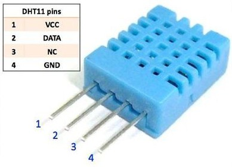

# Actuadores y sensores


## Usando un led externo

Vamos a modificar el fichero blink.py para utilizar un led externo que conectaremos al pin 26 (puede ser cualquier otro). 

El montaje es como siempre: un led en serie con una resistencia para evitar que se sobrecargue el led y lo dañemos. La resistencia suele ser de 220 Ohmios. Si no tienes de ese valor y pones una mayor el led brillará menos.

Los leds tienen polaridad, es decir hay que conectar cada led al lado positivo o negativo. El terminal negativo del led  suele ser más corto y  se representa en el esquema como recto lo conectamos hasta el lateral negativo.

Conectamos la resistencia a la misma fila del pin positivo del led (el más largo y por eso se muestra doblado) y en la parte central de la protoboard.

En el otro lateral conectamos un cable que llevamos hasta el pin 26 de la placa.


En el ejemplo hemos usado la placa Wemos D1 R32 que tiene conectores de tipo hembra y por tanto se conecta con cables a la protoboard.

El cambio en el código es también muy sencillo y le vamos a añadir un par de líneas para que se imprima 'On' y 'Off' por pantalla a la vez que se cambia el estado de led:

```python
import machine # Todo lo relacionado con el acceso al hardware
import utime   # utilidades relacionadas con el tiempo

# Creamos un objeto led conectado al pin 26 y como salida
led = machine.Pin(26, machine.Pin.OUT)

while True: # se repite para siempre
    led.on()          # encendemos
    print('On')
    utime.sleep(0.5)  # esperamos medio segundo
    led.off()         # apagamos  
    print('Off')
    utime.sleep(0.5)  # esperamos medio segundo
print('fuera del bucle')
```


En el caso de que tengamos una placa tan ancha como la protoboard, podemos usar 2 protoboard, una para cada hilera de la placa:


Otra opción es usar cables para conectar las líneas de debajo de la placa. Los cables internos de los cables red/ethernet son ideales para esto:


[](https://drive.google.com/file/d/10ZJyflnQROowDhB3bbCjvBDCdjPPDw_v/view?usp=sharing)

[Vídeo: Haciendo que parpadee un led externo](https://drive.google.com/file/d/10ZJyflnQROowDhB3bbCjvBDCdjPPDw_v/view?usp=sharing)


## Aplicación de colecciones: manejando varios relés


1. ¿Qué es un **relé**? un relé es un interruptor eléctrico que podemos accionar electrónicamente con una pequeña corriente y que funciona casi siempre electromecánicamente (un electroimán que atrae un contacto eléctrico) de ahí el 'clic-clic' que hacen al funcionar. 

1. Uso: los usaremos para controlar dispositivos que necesitan más potencia  que nuestra placa y/o que funcionan a mayores voltajes.
1. Control: para activar/desactivar los relés sólo tenemos que activar/desactivar el pin de nuestra placa al que está conectado
1. Alimentación y Consumo: el control de varios relés requiere de una mayor potencia de la que puede suministrar el puerto USB, por lo que usaremos un alimentación más potente si es posible.
1. Puesto que las señales de control de las placas son de 3.3V pudiera ser que algunos relés no se activen correctamente, aunque la mayoría sí. Lo que es importante es que alimentemos el relé (patilla V o Vcc) con 5V.

## Controlando relés

Una aplicación directa de lo que hemos visto activando leds, puede ser controlar un módulo con varios relés al mismo tiempo.


Como hemos dicho, un relé es un dispositivo que nos permite controlar un dispositivo conectado a la corriente con una salida de nuestro dispositivo y sus modestos 5 voltios. Es decir, el relé actúa como un interruptor electrónico y al activar la patilla que lo controla se cierra el contacto que deja pasar la corriente al dispositivo


En el montaje del ejemplo vemos como el relé 1 actúa como interruptor del circuito de alimentación de la bombilla. Al activar la salida 18, que controla el relé 1 (por estar conectada a IN1) cerrará la salida del relé y la alimentación llegará a la bombilla. Podemos poner la alimentación desde un enchufe o desde cualquier otra fuente de alimentación. Los relés funcionan como un interruptor eléctrico.

Los dos circuitos eléctricos, de alta potencia (la bombilla) y el de baja potencia (la placa) están aislados entre sí. No obstante **hay que tener cuidado al manejar la parte de alto voltaje/potencia**


```python
import machine

pin_reles = (18,19,23,5)
reles = []
for pin in pin_reles:
    rele = machine.Pin(pin,machine.Pin.OUT)
    reles.append(rele)

reles[0].on() # Encendemos la bombilla

reles[0].off() # Apagamos la bombilla


reles[2].on() # Encendemos el relé 2
```
Y con esto ya estamos abriendo la puerta a la domótica...

Hay que comentar que algunos relés tienen lógica invertida, es decir, cuando activamos la correspondiente entrada Inx se desactiva el relé y al revés. Suelen indicarse como "Relés de activación de nivel (trigger) bajo".

### Lectura de valores analógicos con ADC

El sistema que se encarga de hacer la medida de señales analógicas se denomina ADC: Analog to Digital Converter. Es un sistema capaz de convertir el voltaje que detecta en la entrada que estamos midiendo y nos da un número entero, traducido a una escala digital proporcional al valor máximo que puede medir.


Como vemos en la imagen, a partir de la medida la reconstrucción de la señal no siempre es aproximada.

Veamos algunas de las características de los ADC:

* Tienen un **rango de medida**, un voltaje máximo que pueden medir. No conviene sobrepasarlo, pues podríamos dañar la placa. La mayoría de las placas hoy en día funcionan a 3,3 voltios lo que quiere decir que ese es el valor máximo que podemos medir.
* Alguna, como el esp32, permiten adaptar los niveles máximos según lo que se conoce como **atenuación** pudiendo restringir los valores de voltaje para así conseguir una mayor precisión en la medida.
* También tiene lo que se llama **resolución** que es el rango de valores al que podemos convertir: a mayor rango, mayor resolución pues esta sería el valor del cociente entre el rango de medida y el rango de valores. Se suele expresar en número de bits, siendo el número de valores posibles 2^(número bits). Por ejemplo para un sistema que tenga un rango de medida de 3.3V y 10 bits, el valor de la resolución sería de 3.3V/1024 = 3 mV (milivoltios).
* La **precisión** es la calidad y repetibilidad en la medida. Es decir, que dos señales iguales dan igual medida. Aquí la calidad de los ADCs de los equipos habituales quedan un poco en evidencia, como era de esperar pues no son equipos profesionales.

A medida que vamos trabajando con los ADCs de estos sistemas nos damos cuenta que tiene una calidad aceptable pero no profesional. Si queremos trabajar con buena medida de calidad necesitaremos comprar un hardware externo. 

Como veremos en el tema siguiente, estas placas admiten que le conectemos complementos o periféricos, con los que se comunican y a los que pueden delegar tareas.  Unos de ellos pueden ser los ADCs de más precisión,o más rápidos o simplemente más canales para poder tomar más muestras a la vez. Por ejemplo [este conversor de 24 bits](https://www.amazon.es/ILS-ADS1220-Converter-m%C3%B3dulo-Sensor/dp/B07ZP152XF) tiene una sensibilidad y precisión de millonésimas de voltio y lo podríamos usar con nuestros ESP32.

Otra opción que siempre tenemos es hacer muchas medidas y realizar un tratamiento estadístico con los valores que vamos leyendo. De esta forma conseguiremos promediando tener una medida de mayor calidad y una estimación del error de este valor.


Si necesitáramos medir más allá del límite, tendríamos que usar un divisor de tensión:


## Sensores Analogicos

Existen multitud de sensores con los que podemos medir diferentes medidas físicas. Por ejemplo:temperatura, luz, humedad,... Leeremos el voltaje del sensor con el ADC y posteriormente debemos convertir estos valores a los valores de la magnitud física.

Este proceso se conoce como **calibración** consiste en establecer qué valores numéricos qué obtenemos de nuestro ADC se corresponden con los valores reales de la magnitud física medida.

Los sensores analógicos calibrados que podemos encontrar en el mercado son mucho más caros que los que solemos utilizar con estos dispositivos. El proceso de calibración es un proceso costoso y muy dependiente del dispositivo y sobre todo prácticamente manual.

A veces no necesitamos un proceso de calibración complejo sino simplemente establecer unos ciertos niveles o umbrales que serán aquellos en los que nuestros programas tengan que actuar. Por ejemplo, en un sistema de riego no necesitamos conocer con exactitud la cantidad de agua del suelo si el valor a partir del cual nosotros queremos consideramos que en el suelo está seco y tenemos que regarlo

Tenemos que distinguir entre magnitudes analógicas (casi todas) y que el sensor proporcione una señal analógica. También existen sensores que miden magnitudes analógicas pero que nos proporcionan la medida en un formato digital, por medio de un protocolo. En el próximo tema hablaremos de los segundos, ahora nos vamos a centrar en los primeros.

En estos primeros ejemplos no podemos calcular un valor absoluto de la magnitud que miden, nos conformamos con establecer unos umbrales para decidir si hay que actuar.

### Potenciómetro

Un **potenciómetro** es una resistencia variable cuyo valor podemos controlar con un cursor que gira. Se suele utilizar para poder controlar valores o ajustes.


### Resistencia sensible a la luz o LDR

Se trata de una resistencia cuyo valor cambia dependiendo de la cantidad de luz que reciba o **LDR**, se la suele llamar también célula fotoeléctrica y se usa en multitud de lugares, como sensores de paso, activación de luces automática,...


El montaje requiere de un divisor de tensión, que es una resistencia que equilibra el valor de la LDR para facilitar la medida en el punto medio. La resistencia debe tener un valor similar al del LDR.

Para determinar su rango o el umbral deberemos medir los valores que obtenemos en las condiciones reales.

### Sensor de humedad de suelo


Este sensor mide la conductividad del suelo, lo que suele ser proporcional a la humedad de este.

Mediremos los valores del suelo seco y con el nivel de humedad que deseamos para determinar el umbral.

### Sensor de nivel de agua


Es un típico sensor que nos permite medir el nivel de agua de un depósito.

### Micrófono


Este sensor nos permite medir el volumen del sonido en un momento dado.

### Sensores de temperatura analógicos: TMP36


El sensor TMP36, es un sensor de temperatura analógico, que sí viene calibrado por el fabricante, que nos proporciona una fórmula para convertir la lectura del sensor en un valor concreto de temperatura. Este sería el [código](https://raw.githubusercontent.com/javacasm/CursoMicropython/master/codigo/4.3.0.TMP36.py)


```python
import machine

adc36 = machine.ADC(machine.Pin(36), atten = machine.ADC.ATTN_11DB)
adc36.width(machine.ADC.WIDTH_9BIT)
valor = adc36.read() # entre 0 y 512

volts = 3.3 * valor / 512 # normalizamos a voltios
temperatura = (volts - 0.5) * 100  # calculamos la temperatura

print('Temperatura: ',temperatura)
```

 # Módulos en Python (y en Micropython)

Como hemos visto dentro de Python los diferentes módulos o librerías, cómo llamaríamos en otro lenguaje, están muy estructurados y vamos a usar unos u otros según nuestras necesidades y el montaje que estemos haciendo.

En este tema vamos a hablar sobre diferentes módulos que nos dan acceso a componentes hardware, pero son muchísimos los que existen. Si echas alguno en falta no dudes en preguntar por él, y si encuentras alguno interesante no dudes en comentarlo.

## Formato en cadenas

Hay veces que nos interesa generar una salida por print en la que se mezclan diferentes tipos de variables, como hemos hecho antes con la temperatura y la humedad

A medida que ha ido evolucionando Python, han ido apareciendo diferentes formas, pero a día de hoy la más utilizada es la que se conoce como **f-string** (desde Python 3.6). Indicamos que vamos a usarla anteponiendo una **f** a la comilla inicial, y definimos el hueco en el que se pondrá la variable insertando la variable rodeada de unas llaves **{variable}**. No es necesario que hagamos conversión de la variable a cadena.

```python
nombre = 'Pepe'
edad = 20

print(f'{nombre} tiene {edad} años')
```

Dentro de las f-string se pueden incluir expresiones, que pueden incluir funciones:

```python
print(f'{nombre} tiene {edad} años, naciste en {2021-edad}')
```

También podemos alinear decimales y números de la siguiente manera: 

* Usaremos ":" después de la variable indicando el formato
* número de cifras totales (enteras + decimales) y tras un punto "." el número de decimales.
* Terminaremos la expresión con una "f"

```python
valor1 = 1.45
valor2 = 45.45
print(f'{valor1:6.3f}')
print(f'{valor2:6.3f}')
```

```
 1.450
45.450
```

Por si los encuentras en el código, otros formatos más antiguos pero que dan el mismo resultado son:

```python
print("{} tiene {} años".format(nombre,edad))
print("%s tiene %d años"%(nombre,edad)) # %s indica que nombre es cadena y %d que edad es entero
```

Con esto podemos hacer modificar y simplificar la manera en la que mostramos los valores de temperatura y humedad con el siguiente formato:

```python
print(f'Temperatura: {dht22.temperature()}º C Humedad:{dht22.humidity()}%')
```

## Sensores DHT

La familia de sensores DHT está formada por sensores de **temperatura** y **humedad** de bajo coste y que se usan en multitud de dispositivos. Tienen un característico encapsulado de plástico, de diferente color según los modelos. Los diferentes sensores de la familia tienen diferente  precisión a la hora de medir.

Todos tienen en común que para comunicarse utilizan un protocolo digital (un lenguaje digital de 1 y 0, organizados de una manera concreta en el tiempo.), y requieren de un único pin digital. 

Para comunicarnos con ellos necesitaremos un módulo que implemente este protocolo de comunicaciones.

También es algo característico que tiene 4 patillas pero que sólo usaremos 3 de ellas: Vcc, GND y Data.

Podemos alimentarlos entre 3 y 5V.

No podemos medir demasiado rápido con ellos, recomendándose que se deje al menos 1 segundo entre medidas.


El DHT22 (también llamado AM2302) tiene una resolución aproximada de 0.5º al medir temperatura y del 2% en la humedad, como podemos ver en su [hoja de datos](https://www.sparkfun.com/datasheets/Sensors/Temperature/DHT22.pdf) (datasheet)



El DHT11 tiene una resolución aproximada de 2º para la temperatura y 5% en la humedad, como podemos ver en su [hoja de datos](https://www.mouser.com/datasheet/2/758/DHT11-Technical-Data-Sheet-Translated-Version-1143054.pdf)

Los podemos encontrar en formato módulo donde el fabricante suele incorporar una resistencia que mejora la calidad de la comunicación, sólo añade 3 terminales externos y añade los nombre de las patillas:


Cuando los compremos debemos asegurarnos de conocer cual es cada patilla, puesto que distintos fabricantes no respetan la misma disposición de los terminales. 

Si no respetamos la polaridad en la alimentación no sólo no funcionan, sino que se queman y quedan inservibles.

Vamos a hacer un sencillo montaje


Y ahora importamos el módulo DHT y declaramos un objeto dht del tipo correspondiente (DHT22 en mi caso) y le pasamos un objeto pin al que está conectado. Para leer llamamos a los método **measure()** y recuperamos el valor de la temperatura y la humedad con los métodos **temperature()** y **humidity()**

```python

>>> import dht
>>> import machine
>>> dht22 = dht.DHT22(machine.Pin(27))
>>> dht22.measure()
>>> dht22.temperature()
22.4
>>> dht22.humidity()
44.2
```

Vamos a empaquetarlo ahora en un fichero donde usaremos un bucle para tomar una medida cada segundo


```python
import dht
import machine
import time

v = 0.1

dht22 = dht.DHT22(machine.Pin(27))

while True:
    dht22.measure()
    print('Temperatura: ',dht22.temperature(),'º C Humedad:',dht22.humidity(),'%')
    time.sleep(1)

```

[](https://drive.google.com/file/d/1vD_YS2aPuW1wdRUmI0XrEllX7eWjO0uw/view?usp=sharing)

[Vídeo: Midiendo humedad y temperatura con un sensor DHT22 en micropython](https://drive.google.com/file/d/1vD_YS2aPuW1wdRUmI0XrEllX7eWjO0uw/view?usp=sharing)


Vamos a darle un poco más de formato:


```python
# Test dht
import dht
import machine
import time

v = 0.2

PIN_DHT = 27


dht22 = dht.DHT22(machine.Pin(PIN_DHT))

while True:
    dht22.measure()
    # Con más formato ...
    print(f'Temp: {dht22.temperature():2.1f} C ')
    print(f'Hum: {dht22.humidity():2.2f} % ')
    time.sleep(1)

```    
Donde hemos usado lo que se conoce como f-string: una mezcla de cadena y formato, donde se pueden evaluar expresiones poniéndolas dentro de unas llaves **{}**.

A medida que vayamos usando montajes más complejos y nuestro código vaya creciendo, nos vamos a encontrar con que se producen errores de ejecución que detienen nuestro código. Son lo que se llaman excepciones y vamos a hablar de ellas.

Si se produce un error de comunicación con el sensor, nuestro código producirá una excepción. Por eso es conveniente que estemos prevenidos.

## Excepciones

A veces nos podemos encontrar con errores de ejecución en nuestro código y debemos de estar prevenidos. Pueden ser debidos a errores del código y como programadores los iremos corrigiendo, mejorando así la calidad del código.  

También hay errores que se pueden producir por circunstancias externas, como por ejemplo cuando no podemos acceder a un archivo, o cuando hay un problema de acceso a la red que no está disponible. Son lo que se conoce como **errores de tiempo de ejecución** (**Runtime errors** en inglés) y un buen programa siempre tiene que estar protegido contra ellos.

También es necesario proteger nuestros programas contra  el mal uso de los usuarios, que pueden ser mal intencionados o por despiste.

No hay que confundir estos errores con los errores de sintaxis por código mal formado. Existe un mecanismo para tratar estos errores en tiempo de ejecución, cuando nuestro programa se está ejecutando.

Cuando se produce un error de estos decimos que se genera una **excepción**, y cuando se produce una nuestro programa se detiene en esa línea y se para.

Podemos hacer que nuestro código capture estas excepciones y así evitar que nuestro programa finalice. Para ello usaremos la estructura **try: ... except :**, que se divide en 2 partes, a las que llamaremos bloques:

* Ponemos **try:** antes de la parte inicial donde pensamos que se puede producir la excepción. 
* Ponemos **except:** para indicar el código que queremos que se ejecute si se produce la excepción.


Se pueden producir excepciones por ejemplo al hacer operaciones aritméticas, y en este ejemplo vamos a ver cómo podemos reconducir ese error:


```python

try:
    print(1/0)
    # a esta línea nunca se llega....
except:
    print('Se ha producido un error')
# ya fuera    
```

Este programa genera una excepción de tipo **ZeroDivisionError**. Existen muchos tipos diferentes de excepciones.

También se pueden producir errores en la lectura de los sensores, que podemos reconducir. Si no lo hiciéramos el programa se pararía.

Vamos a añadir al programa anterior de lectura del DHT22 tratamiento de excepciones:

```python
import dht
import machine
import time

v = 0.2

dht22 = dht.DHT22(machine.Pin(27))

while True:
    try:
        dht22.measure()
        print('Temperatura: ',dht22.temperature(),'º C  Humedad:',dht22.humidity(),'%')
    except :
        print('Error leyendo el sensor')
    time.sleep()

```

También podemos obtener información del tipo de excepción del siguiente modo:

```python

    try:
        ....
    except Exception as e: # creamos un objeto e con información del error
        print(f'Error: {e}')
```

## Componentes I2C

**I2C** es un protocolo de comunicación entre dispositivos, muy usado en el mundo de la electrónica. Al ser un bus, podemos conectar varios dispositivos I2C simultáneamente y además no necesitamos pines independientes para cada uno, sino que usaremos para todos los mismos pines llamados SDA(3) y SCL(5), teniendo cada uno de ellos una dirección (address) en el bus I2C, lo que nos permite dirigirnos a él.

En algunas placas se utiliza otra denominación para los pines, como SCK para SCL, SDI para SDA o Vdd para alimentación.

Este protocolo I2C funciona en un modo llamado Master/Slave, donde generalmente nuestro microcontrolador hace el papel de Master, llevando la iniciativa en todas las comunicaciones, mientras que los otros dispositivos responden a sus peticiones.

La gran ventaja de usar I2C es que conectamos todos los dispositivos en los mismos 2 pines, con ahorro de patillas.

Son muchos los dispositivos que usan el protocolo I2C:

* Pantalla LCDs
* Sensores de todo tipo
* ADCs externos
* Pantallas gráficas
* ...

En micropython el protocolo de comunicaciones I2C está en el módulo machine, que necesitamos para comunicarnos con el dispositivos, que utilizaremos para enviar comandos y recuperar datos de ellos.

Para facilitar nuestra programación, usaremos otro módulo específico de cada componente con su propio código que nos permitirá trabajar a alto nivel y enviará esos comandos por nosotros.

### Detectando componentes

Cuando conectamos un dispositivo I2C, lo primero que debemos hacer es comprobar que tenemos comunicación con él. Eso lo haremos creando un componente **SoftI2C** que nos permite usar dintintos pines, aunque en el ESP32 se suelen utilizar el 21 como SDA y el 22 como SCL:

```python
import machine

i2c = machine.SoftI2C(scl=machine.Pin(22), sda=machine.Pin(21))
```

Una vez que lo hemos creado llamamos al método **scan()** que nos devolverá una lista con las direcciones que encuentre:

```python
>>> import machine
>>> i2c = machine.SoftI2C(scl=machine.Pin(22), sda=machine.Pin(21))
>>> dispositivos_i2c = i2c.scan()
>>> print(dispositivos_i2c)
[100,25,11]
>>> if len(dispositivos_i2c) < 1:
        print('No se han encontrado dispositivos I2C')

```

Donde también hemos comprobado si ha encontrado algún dispositivo.

El fabricante nos dirá la dirección de cada modelo de dispositivo y también podemos comprobar si está la lista de los encontrados de la siguiente manera:

```python
if 0x37 in dispositivos_i2c:
    print('El dispositivo se ha encontrado')
else:
    print('No se ha detectado el dispositivo')

```

Normalmente los fabricantes nos dan las direcciones en hexadecimal (base 16), con lo que se mostrarán con el prefijo "0x". Nosotros también podemos usar números en formato hex anteponiéndoles el prefijo "0x".

Cambiamos nuestro programa para se muestre así con la función **hex(valor_decimal)**:

```python
import machine

v = 0.2

i2c = machine.SoftI2C(scl=machine.Pin(22), sda=machine.Pin(21))

dispositivos_i2c = i2c.scan()

if len(dispositivos_i2c) < 1:
    print('No se han encontrado dispositivos I2C')
else:
    print('Dispositivos I2C: )
    for disp in dispositivos_i2c:
        print(hex(disp), end =' ') # un espacio para separar
   
if 0x37 in dispositivos_i2c:
    print('El dispositivo se ha encontrado')
else:
    print('No se ha detectado el dispositivo')

```

[](https://drive.google.com/file/d/1oPnlk9ooau4wNHKiuuwoGGymZ9kr-kw8/view?usp=sharing)

[Vídeo: Escaneando los dispositivos I2C conectados con micropython](https://drive.google.com/file/d/1oPnlk9ooau4wNHKiuuwoGGymZ9kr-kw8/view?usp=sharing)

Ahora tenemos que añadir los ficheros con los módulos de aquellos componentes que no estén incluidos por defecto en nuestro firmware.

## Sensores atmosféricos

## Sensor atmosférico BMP180

Sensor I2C atmosférico BMP180

Subimos el fichero bmp180.py de https://github.com/micropython-IMU/micropython-bmp180


```python
import machine
import bmp180
import Wemos

i2c = machine.I2C(sda = machine.Pin(Wemos.D2),scl = machine.Pin(Wemos.D1))
i2c.scan() # [119] o 0x77

bmp = bmp180.BMP180(i2c)

bmp.temperature
bmp.pressure

bmp.baseline = 101234## Presion a nivel del mar
bmp.altitude

```

## Sensor de temperatura ds18x20 (onewire)

Una de las ventajas de usar OneWire es que puesto que cada sensor tiene una dirección propia podemos conectar varios sensores a un mismo pin y podremos leer su valor usando su dirección rom. 

Por esto lo primero que hacemos es escanear la red oneWire para saber los sensores conectados. Para ello usamaremos el método **scan** que nos devolverá las direcciones de cada sensor, a lo que suele llamar "rom"

Veamos la conexión de varios sensores de temperatura ds18x20 con conexión onewire conectado al mismo pin


Conectamos los pines iguales de todos los sensores (GND,Vdd y Data). El fabricante recomienda que  pongamos una resistencia de 4.7KOhmios entre Vcc y Data.

Para leer sensores de temperatura haremos:

* Primero definimos la red onewire asociada al pin al que hemos conectado los sensores.

```python
ds = ds18x20.DS18X20(onewire.OneWire(machine.Pin(pinOneWire)))
```
* Escanemos la red para obtener las direcciones rom de los sensores llamando al método **scan** que nos devuelve una colección con las direcciones encontradas:

```python
roms = ds.scan()
```
* Llamamos al método **convert_temp** para hacer que los sensores midan la temperatura
* Iteramos por las rom

El código completo puede ser este

```python
import onewire, ds18x20 
ds = ds18x20.DS18X20(onewire.OneWire(machine.Pin(Wemos.D2)))
roms = ds.scan() # escaneamos las direcciones de los sensores
ds.convert_temp() # iniciamos la medida
for rom in roms:
    print(f'{rom} {ds.read_temp(rom)}') # leemos el valor del sensor de id 'rom'

```

Algunos sensores también permiten conexión en alimentación parásita, es decir, toman la alimentación del pin de datos.


# from https://docs.micropython.org/en/latest/esp8266/tutorial/onewire.html
# https://docs.micropython.org/en/latest/esp32/quickref.html?highlight=onewire
# https://github.com/micropython/micropython/blob/master/drivers/onewire/ds18x20.py


## Sensor de temperatura y humedad DHT12 (I2C)

Sensor de temperatura y humedad DHT12 vía I2C con los pines D1 y D2


[Módulo y ejemplo](https://github.com/mcauser/micropython-dht12)


```python
import dht12
from machine import I2C, Pin
i2c = I2C(scl=Pin(5), sda=Pin(4))
sensor = dht12.DHT12(i2c)
sensor.measure()
print(sensor.temperature())
print(sensor.humidity())
```

From [Temperature Sensor](https://docs.micropython.org/en/latest/esp8266/tutorial/dht.html#temperature-and-humidity) in esp8266 micropython tutorial
```
Sensor without I2C in 1-wire mode (eg. DHT11, DHT22, AM2301, AM2302):

1=VDD, 2=Data, 3=NC, 4=GND
Sensor with I2C in 1-wire mode (eg. DHT12, AM2320, AM2321, AM2322):

1=VDD, 2=Data, 3=GND, 4=GND
Sensor with I2C in I2C mode (eg. DHT12, AM2320, AM2321, AM2322):

1=VDD, 2=SDA, 3=GND, 4=SCL
You should use pull-up resistors for the Data, SDA and SCL pins.

To make newer I2C sensors work in backwards compatible 1-wire mode, you must connect both pins 3 and 4 to GND. This disables the I2C interface.
```

## SHT30

[Instalacion via PyPi](
https://pypi.org/project/micropython-sht30/)

[Módulo](
https://github.com/rsc1975/micropython-sht30)

https://github.com/rsc1975/micropython-sht30/blob/master/sht30.py


```python
from sht30 import SHT30

sensor = SHT30()

try:
    t, h = sensor.measure()
except SHT30Error as ex:
    print('Error:', ex)
```


## Configuración del Wifi

Una de las características más útiles y que durante bastante tiempo ha sido distintiva de los dispositivos ESP ha sido la conectividad Wifi.

Conviene recordar que para usar el wifi necesitamos usar los pines del bloque ADC 1, con lo que no podremos usarlos para lecturas analógicas. Si intentamos hacerlo obtendremos una excepción de "ValueError: invalid Pin for ADC"


### Conectando a una red wifi ya existente

Configuramos la conexión para conectarnos a una red wifi ya existente, es lo que se conoce como **Station Interface**. Podemos usar este código sustituyendo "SSID" por el nombre de nuestro wifi y "CLAVE_SSID" por la clave de nuestro wifi:

```python
>>> import network
>>> wl = network.WLAN(network.STA_IF) # configuramos modo Station
>>> wl.active(True)     # activamos el interface wifi
>>> wl.connect("SSID","CLAVE_SSID")
>>> wl.ifconfig()  # Nos da la configuración de red: (ip,mask,gateway,dns server)
 ('192.168.1.55', '255.255.255.0', '192.168.1.1', '192.168.1.1') 

```
De esta forma el router nos asignará una dirección ip automáticamente.

Podemos saber si la interface wifi está activa con el método __active()__ sin parámetros

Para saber si se está conectada usamos __isconnected()__

El método __scan()__ nos devuelve una lista de las redes disponibles, con los datos organizados en tuplas que contienen (ssid, bssid, channel, RSSI, authmode, hidden)

En un momento dado podemos saber la red a la que estamos conectada con 

```python
wl.config('essid')
```
O el canal con 

```python
wl.config('channel')
```

Más parámetros en la [documentación](https://docs.micropython.org/en/latest/library/network.WLAN.html#network.WLAN.config)

También podemos ver los valores de determinados parámetros de la conexión actual con el método **status**

```python
wl.status('rssi') # Para ver la intensidad de la señal wifi
```

Podemos ver si nuestro wifi está activo llamando al método **active()** sin argumentos y nos devoverá el estado.

También podemos comprobar si estamos conectados a alguna red con **isconnected()**

Con esto podemos hacer [un código](https://raw.githubusercontent.com/javacasm/CursoMicropython/master/codigo/init_wifi.py) que verifique el estado del módulo y de la conexión y lo active y conecte si es necesario.

```python
import network
import time
import machine

SSID = 'miWifi'  # Aqui ponemos el nombre de la wifi a la que queremos conectarnos
WIFI_PASSWD = 'miPassword'  # Esta es la clave del wifi al que nos conectaremos

try:
    w = network.WLAN(network.STA_IF)
    if not w.active():  # Si no está activa la activamos
        w.active(True)
    if not w.isconnected(): # si no está conectada nos conectamos
        print(f'wifi:{SSID} passwd: {WIFI_PASSWD}')
        w.connect(SSID, WIFI_PASSWD)

        while not w.isconnected() : # mientras conecta ...
            time.sleep(1)
            print('.', end = '')    # imprimimos "." en la consola
        
    print(f'IP: {w.ifconfig()[0]}')
    

except Exception as e:
    print(f'Error {e}')
```

### Creando un punto de acceso

Si no existe un wifi o queremos crear uno propio podemos hacerlo sin más que creando el objeto WLAN con el parámetro  __network.AP_IF__  Es lo que se conoce como modo __Punto de Acceso__.

La configuración será esta:


```python
>>> import network
>>> wl = network.WLAN(network.AP_IF)
>>> wl.active(True)
>>> wl.config(ssid = 'miwifi','mipasswd')
```

Obviamente cuando hacemos esto, nuestra red no tiene acceso a internet, puesto que estamos haciendo una red interna o privada.

### Configuración de ip estática

Si queremos establecer nuestros valores de conexión a red podemos hacerlo con el método __ipconfig((ip,mask,router,dnsserver))__

```python
>>> w.ifconfig()
('192.168.1.138', '255.255.255.0', '192.168.1.1', '192.168.1.1')
>>> w.ifconfig(('192.168.1.166','255.255.255.0', '192.168.1.1', '192.168.1.1'))
>>> w.ifconfig()
('192.168.1.166', '255.255.255.0', '192.168.1.1', '192.168.1.1')
```
### Configuración del wifi en el arranque

Para que se conecte al iniciar podemos poner la conexión en el fichero boot.py:

```python
import network
import os
import time

print(f'm5Stack Core {os.uname()}')

iw = network.WLAN(network.STA_IF)
iw.active(True)
if not iw.isconnected(): # Comprobamos si ya está conectada
    iw.connect('miWifi','miPasswd')
    while not iw.isconnected():
        print('.', end='')
        time.sleep(1)
print(f'IP:{iw.ifconfig()[0]}')
```

Hay que tener en cuenta que cuando hacemos un soft reset, no se desactiva el wifi, pero sí que se ejecuta el fichero boot.py. Por eso comprobamos si ya está conectado.

[](https://drive.google.com/file/d/1hgANRO5-cUGRYTPxzkmd3dPB9pipn4o6/view?usp=sharing)

[Vídeo: 6.0 Configuración de la conexión Wifi a una red existen con micropython](https://drive.google.com/file/d/1hgANRO5-cUGRYTPxzkmd3dPB9pipn4o6/view?usp=sharing)


## Protocolo NTP

Ya que tenemos acceso a internet vía Wifi, vamos a usar el protocolo **ntp** para actualizar la hora. Este protocolo usa servidores muy precisos y nos permite consultar el tiempo para sincronizarnos con sus relojes.

Podemos añadir estas líneas a nuestro fichero boot.py para garantizar que cuando arrancamos y estamos conectados a internet, tendremos una hora precisa


```python

>>> import ntptime
>>> ntptime.settime() 
>>> rtc.datetime()  
(2022, 2, 20, 6, 1, 58, 0, 339519)
```

Si nuestro sistema no está conectado a internet podemos ajustar la hora manualmente pasándole al método __rtc.datetime((año,mes,.....))__ una tupla con la hora actual.


