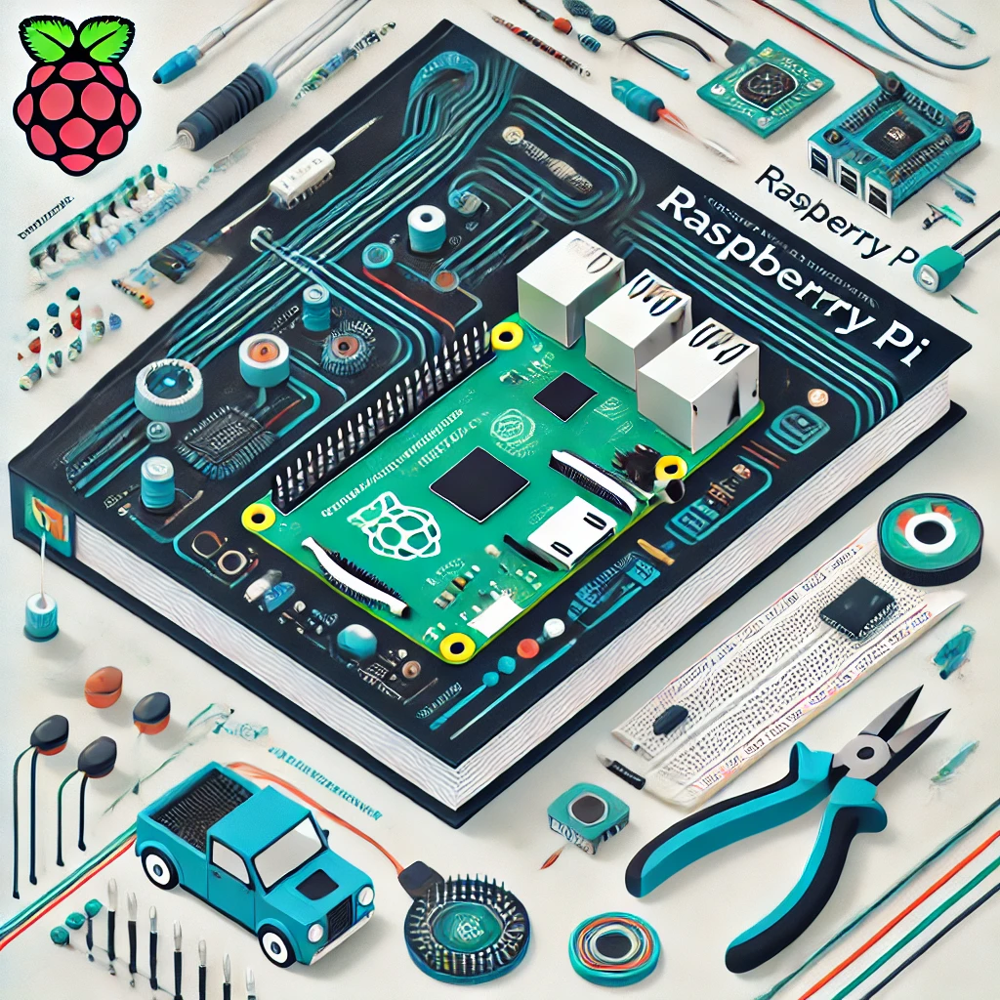

Raspberry Pi se ha convertido, junto con Arduino, en uno de los máximos exponentes del desarrollo con herramientas libres accesible a diferentes niveles de especialización, desde el básico o inicial al profesional, pudiendo usarse como una plataforma hardware de desarrollo, un pequeño ordenador personal sobre el que programar, navegar o editar un documento de texto, un reproductor de música, películas o imágenes, o la base sobre la que construir un sistema de almacenamiento en red para compartir archivos entre los equipos que tengamos conectados.

Como veremos a lo largo del curso, podemos usar una Raspberry Pi como un ordenador versátil utilizando cualquier teclado y ratón convencional USB y la salida HDMI de vídeo, conectándonos a la red local y a Internet a través de su conector Ethernet o el wifi. 

Por sus características y bajo precio, se ha convertido en una plataforma con muchísimo potencial que contribuye a desarrollar habilidades tecnológicas, promoviendo el aprendizaje de lenguajes de programación como Python, C o Perl, llevando el mundo de la programación a todo aquel que tenga interés en aprender, experimentar y realizar sus propios proyectos.

## Documentación sobre Raspberry Pi

Existe mucha documentación sobre Raspberry Pi, veamos cómo obtener alguna de ella.

### Aplicación Bookshelf

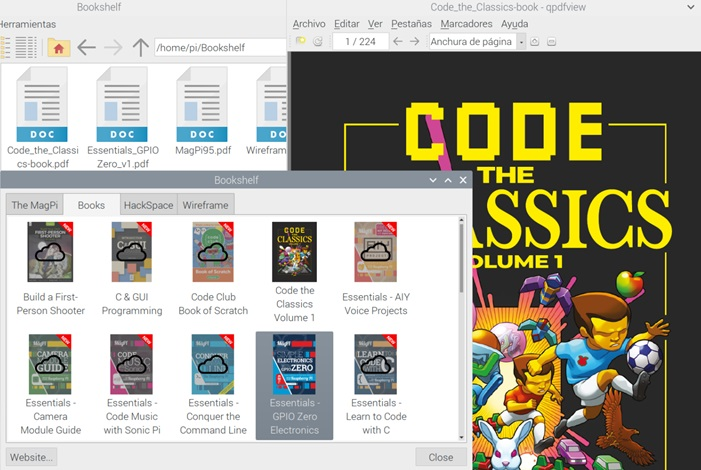

En las últimas versiones de Raspberry Pi OS (antes Raspbian), se incluye una aplicación llamada Boolshelf que nos permite descargar y ver las publicaciones gratuitas de la Fundación Raspberry Pi, que incluyen libros y las revistas The Mag Pi, Hack Space y Wireframe...

### Revistas

La principal revista (mensual) sobre Raspberry Pi es [The Magpi](https://magpi.raspberrypi.com/). Es una fuente de información extraordinaria, repleta de proyectos y consejos. Se puede descargar gratuitamente pero si compras la edición en papel, suele traer regalos. En el famoso número 40 de la revista ¡regalaban una Raspberry Pi Zero! Ni que decir tiene que se agotó rápidamente.

Puedes descargar gratis [todos los números](https://magpi.raspberrypi.com/issues) directamente. 

También han creado una colección de [libros](https://magpi.raspberrypi.com/books), algunos temáticos (sobre la cámara, programación en C, Scratch, etc.) o con proyectos.

Todas estas publicaciones se pueden comprar en papel (tienen una edición muy cuidada) a precios muy bajos, pero la mayoría son descargables en pdf de forma gratuita.

## Arquitectura

Vemos que tiene un bloque central con la CPU y GPU, un frontal con conectores USB y Ethernet (LAN), en un lateral las salidas HDMI y en el lateral opuesto una doble fila de pines, llamados GPIO (General Purpose Input/Output o Entradas/Salidas de Propósito General) donde podemos conectar nuestros propios componentes o proyectos electrónicos.

Su tamaño es realmente pequeño: 86 x 57 mm, y aunque a lo largo de las distintas versiones ha ido evolucionando, añadiendo y mejorando los componentes, manteniendo el mismo tamaño. 

Las versiones posteriores usan cada vez procesadores más potentes y con mayor cantidad de memoria RAM. También se han ido añadiendo nuevos conectores externos. 

En la siguiente imagen podemos ver los distintos conectores y componentes de  la [Raspberry Pi 3+](https://www.raspberrypi.com/products/raspberry-pi-3-model-b-plus/) 

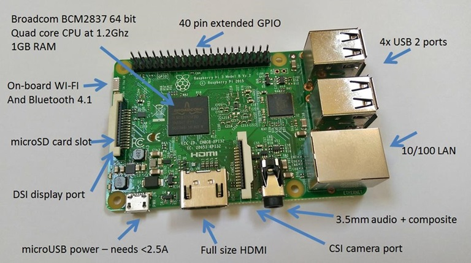


* USB: podremos conectar cualquier dispositivo USB, pero teniendo en cuenta que no debe consumir demasiado.
* HDMI: conectamos el monitor HDMI.
* LAN: típico conector RJ45 para cable ethernet.
* Conector Micro-USB en las primeras versiones y USB-C en las recientes por el que la alimentaremos.
* Conectores CSI para monitores o  cámaras.
* Conector DSI para un monitor específico.
* GPIO, 40 pines accesibles para utilizar como entradas y salidas. Hay que tener mucho cuidado con ellos porque están conectados directamente al microprocesador y podríamos estropearlos fácilmente.

Si ahora la comparamos con la versión 5 de la imagen inferior, veremos que guarda gran similitud.

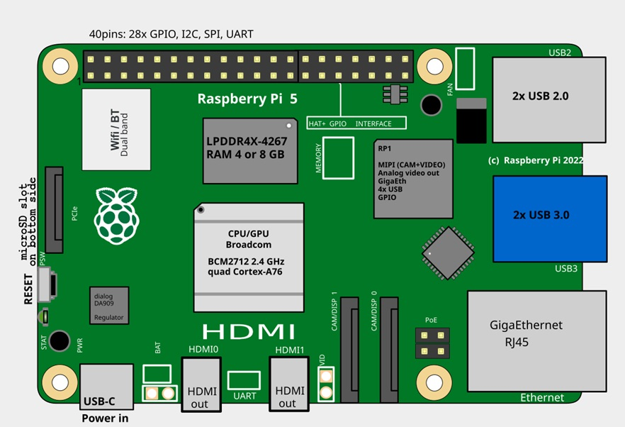


En las versiones 4 y 5 se han incluido 2 conectores micro-HDMI, se ha cambiado el conector de alimentación que ahora es USB-C y las placas son cada vez más complejas.

En la versión 5 se han incluido conectores para permitir la conexión de más periféricos de alto rendimiento como coprocesadoress de IA o discos SSD.

## Dispositivos para conectar

En este diagrama vemos los dispositivos que se pueden conectar a la Raspberry Pi:
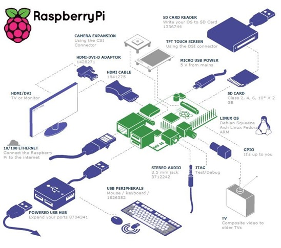

Para conectar dispositivos y con el fin de no sobrecargar la fuente de alimentación, deberíamos intentar usar dispositivos autoalimentados, incluir un adaptador hub USB alimentado y en la medida de lo posible, usar teclado y ratón inalámbricos.

### Componentes necesarios

* Además de la Raspberry Pi
* Fuente de alimentación de 5V:
	* Con conector micro-USB y al menos 2A (mejor si son 2.5A) para la Raspberry Pi 3+ 
	* Con conector USB-C y al menos 3A para la Raspberry Pi 4, pero cuidado porque hay algunas fuentes que no funcionan bien.
	* Con conector USB-C y al menos 5A (27W) para la Raspberry Pi 5.

* Tarjeta SD de al menos 16GB o más (recomendados 32GB) de capacidad. La propia [Raspberry Pi ha creado unas nuevas tarjetas SD de extremada calidad](https://www.raspberrypi.com/products/sd-cards/) y rendimiento. Se recomienda que la tarjeta sea de clase 10 mínimo, por su velocidad. La elección de una tarjeta de calidad es crítica, con tarjetas baratas nos vamos a encontrar un bajo rendimiento, cuelgues inesperados e incluso puede que tengamos problemas de arranque.

* Cable de red ethernet (no es necesario si tenemos Wifi, pero facilita la primera conexión que no requiere configuración)


Y si la vas a usar como un ordenador:

* Monitor y cable microHDMI-HDMI o adaptador VGA (existen muchos tipos de conversores, pero no todos funcionan bien con cables largos).
* Salvo que hayas elegido una Raspberry Pi 400, teclado y ratón USB (mejor si el ratón es inalámbrico porque necesita menos alimentación procedente de la Raspberry Pi, puesto que toma su energía de las pilas o baterías que incluye y consume menos). 
* Lo que queremos es que la Raspberry Pi alimente a la menor cantidad posible de periféricos, por eso también se recomienda un hub USB alimentado, para que los dispositivos conectados lleven su propia alimentación.

### Opcionales

* Una caja o carcasa (para evitar problemas, es muy fácil hacer un contacto con algo metálico), también te puedes imprimir o montar una. Comprueba que sea la adecuada para tu modelo.
* Ventilador: si vas a utilizarla intensamente, mejor refrigerarla con un ventilador adecuado para tu modelo y caja.
* Conector Hub USB con alimentación, así podremos añadir más dispositivos y evitaremos cargar la potencia de la Raspberry.

### ¿Dónde encontrarlos?

* [Raspberrypi.com](http://Raspberrypi.com)
* [www.tiendatec.es](https://www.tiendatec.es/)
* [www.bricogeek.com](http://www.bricogeek.com)


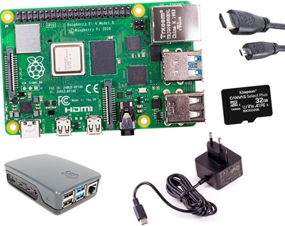

En la mayoría de estas tiendas, como en [TiendaTec](https://www.tiendatec.es/13-kits-raspberry-pi), puedes encontrar kits que incluyen todo lo necesario y te aseguras que son los adecuados. 

También puedes encontrar kits en Amazon o en Aliexpress, pero comprueba las opiniones de los usuarios antes de comprar...  

## Instalación

La Fundación Raspberry Pi ha publicado una herramienta gratuita llamada [**Raspberry Pi Imager**](https://www.raspberrypi.com/software/) que  hace aún más sencilla la instalación del sistema operativo, permitiéndonos elegir entre muchísimos sistemas operativos, encargándose de formatear la tarjeta SD, de descargar el sistema operativo y escribir la imagen del sistema directamente en la tarjeta. 

También nos permite hacer una primera configuración, como es el usuario, contraseña, wifi, nombre del equipo... que se grabarán en la tarjeta SD, arrancando ya el sistema con esa configuración.

Podemos descargarlo desde el apartado de [Software de la página de Raspberry Pi](https://www.raspberrypi.com/software/) eligiendo la versión adecuada para nuestro sistema operativo.

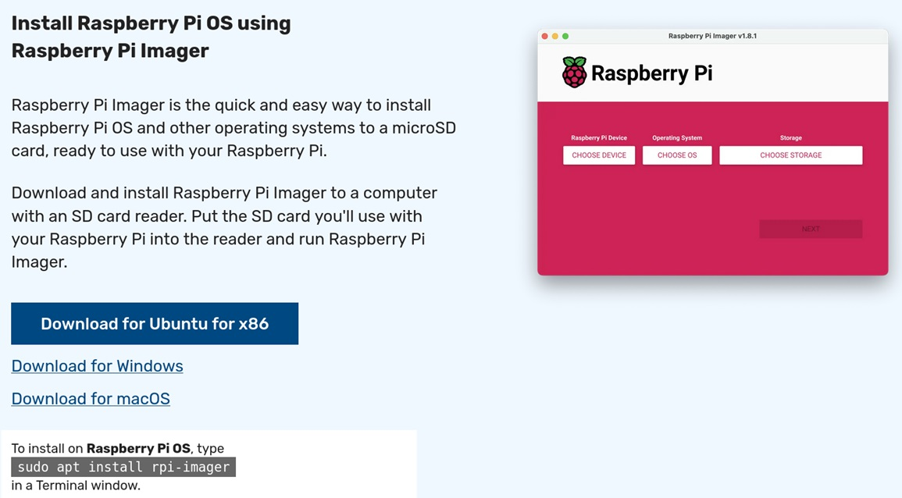


Tras descargarlo, lo instalaremos.

Para ejecutarlo, necesitamos estar conectados a Internet para que se pueda descargar la lista de los sistemas operativos disponibles y las imágenes que vamos a usar.

Al ejecutarlo, tendremos la siguiente pantalla:

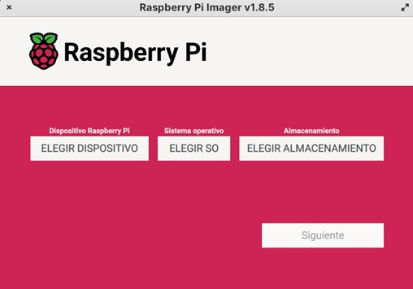

En primer lugar selecciona el tipo de Raspberry Pi que vamos a usar, para filtrar los sistemas operativos compatibles con el dispositivo seleccionado:

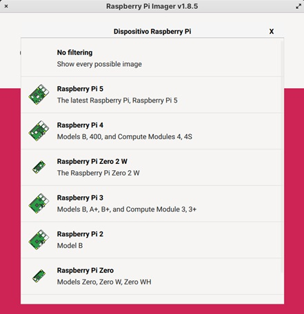

La versión 1.8.5  nos permite instalar los siguientes sistemas operativos:

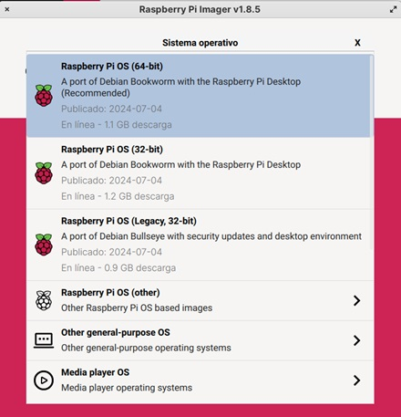

Al seleccionar el sistema operativo veremos distintas opciones, como por ejemplo al seleccionar Ubuntu:

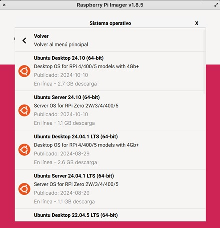

Donde vemos que aparecen opciones de instalar diferentes versiones de 32 o de 64 bits.

A día de hoy (octubre de 2024) existen 2 versiones disponibles de Raspberry Pi OS:

* La versión derivada de **Bullseye**, que es la más reciente, pero que hasta ahora mismo no es compatible al 100% con algunas librerías de Python. Cada vez son menos las aplicaciones que no son compatibles.
* La versión **Legacy** que es una actualización de la versión anterior **Buster**, que sí es compatible con las librerías de Python antiguas, por ejemplo las de usar la cámara.

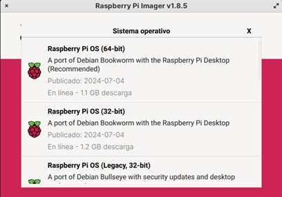

Elegiremos una u otra, según el tipo de aplicación que queramos usar. Ante la duda, mejor instalar la versión más moderna de 64 bits.

Por último seleccionaremos  la tarjeta SD o el dispositivo  donde vamos a escribir la imagen (los datos de la tarjeta se borrarán).

 Nos preguntará si queremos configurar la instalación, lo que nos permitirá definir usuario, idioma, teclado, nombre de la máquina, conexión wifi y acceso remoto.

  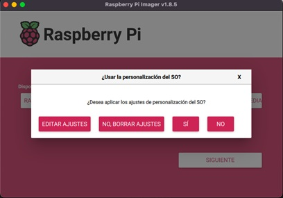

Configuramos nuestra instalación con:

* Nombre de nuestra máquina (necesario para acceder remotamente). Importante que no se repita en la red.
* Usuario/contraseña (no podemos olvidarlo o no podremos acceder).
* SSID y contraseña del wifi.

	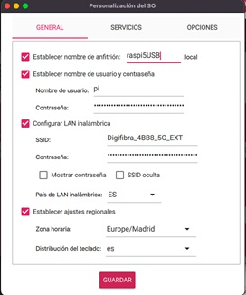
	
* En la pestaña Servicios: activamos acceso ssh para poder conectarnos remotamente:

	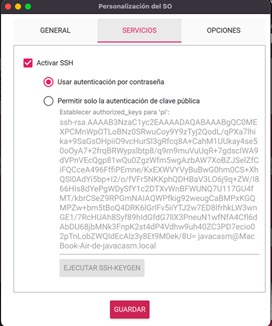

Ésta es una gran ventaja, pues al arrancar, ya tendremos toda esta configuración realizada. Además esta configuración se guarda en el instalador y podremos fácilmente reutilizar los datos para posteriores instalaciones.

En las versiones actuales ya se permite que el usuario no sea "pi", pudiendo poner cualquier nombre de usuario.

A día de hoy RPI Imager no permite instalar varios sistemas operativos en la misma tarjeta, pero sí que nos permite seleccionar entre muchos sistemas, además de los propios de raspberrypi.org como podemos ver en el siguiente vídeo.

[](https://drive.google.com/file/d/15T_fPbQdCdTvPMLpMd4RLAzlFYYnDi-c/view?usp=sharing)

[Vídeo: Nuevo instalador RPI Imager: 64 bits, configuración y bootloader](https://drive.google.com/file/d/15T_fPbQdCdTvPMLpMd4RLAzlFYYnDi-c/view?usp=sharing)

Al pulsar **Write** se descargará la imagen desde Internet, se escribirá en el soporte elegido y posteriormente se verificará si se ha grabado correctamente.  

También podemos usar RPI Imager para formatear la tarjeta, para crear tarjetas SD capaces de recuperar una instalación con problemas, para escribir imágenes que ya hemos descargado, etc.

[](https://drive.google.com/file/d/1vZCdJa2551mNAdr1cwsOAJMn440eqXMG/view?usp=sharing)

[Vídeo: Instalación de Raspberry Pi OS usando Imager](https://drive.google.com/file/d/1vZCdJa2551mNAdr1cwsOAJMn440eqXMG/view?usp=sharing)

Si todo va bien al cabo de unos segundos y si tenemos conectado un monitor,  veremos el escritorio, un escritorio ligero pero con buen aspecto y con la funcionalidad a la que estamos acostumbrados hoy en día.

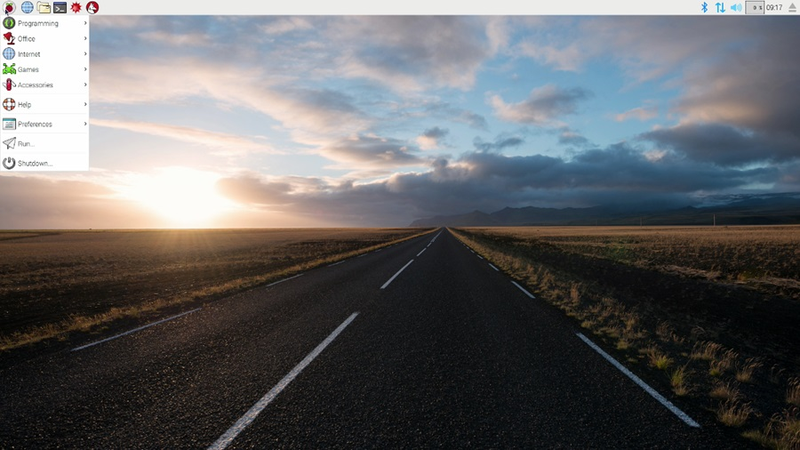

La primera vez que arranquemos tendremos que configurar, si no lo hemos hecho ya, el idioma y la zona horaria, establecer la contraseña del usuario por defecto “pi”  y el sistema se actualizará.

Si no tenemos monitor conectado, pasados unos segundos ya podemos intentar conectarnos por __ssh__, siempre que la hayamos activado en la configuración de la imagen. (Un poco más adelante vamos a tratar el tema de la conexión ssh en mayor detalle).

* En Linux, Mac o Windows 11 lo podemos hacer directamente en la línea de comandos (consola o terminal).
```python
ssh nombre_usuario@nombre_maquina.local
```
* En Windows anteriores a 11 instalamos [Putty](https://putty.org), herramienta open source y, a pesar del  nombre, totalmente confiable. Desde ahí podremos acceder usando el nombre de usuario elegido y el nombre de la máquina. [Putty](http://www.chiark.greenend.org.uk/~sgtatham/putty/download.html "http://www.chiark.greenend.org.uk/~sgtatham/putty/download.html") es una herramienta open source disponible para muchos sistemas operativos pensada para conectar remotamente con equipos usando distintos protocolos como ssh, telnet, serie, etc. Permite guardar las credenciales de cada sistema, facilitando la conexión.

	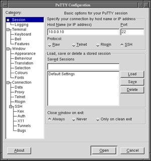

* Introducimos la contraseña (que no se ve al escribirla, tampoco) y accedemos a nuestra Raspberry Pi por línea de comandos.

## ¿Escritorio o línea de comandos?

La Raspberry Pi (y todos los ordenadores que usan Linux/Unix) se puede usar con el ratón o con comando desde el terminal del sistema: 

* El ratón es más intuitivo, sólo hay que ir mirando por las opciones de menú, que suelen ser bastante descriptivas.
* La línea de comandos da un control más detallado y una vez que te acostumbras, es más productiva, sobre todo porque se pueden automatizar tareas con facilidad.

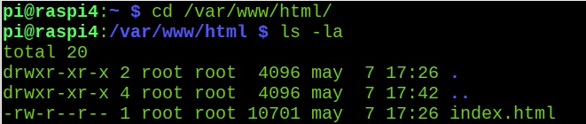

Sobre los comandos de consola, hay libros y libros, en este curso hemos intentado incluir algunas de las "recetas" más habituales. Muchos de ellos están incluidos en la documentación del curso.  

Por ejemplo, como veremos un poco más adelante, para instalar software, podemos hacerlo usando el ratón desde la opción "Add/Remove software" del menú "Preferencias" o desde la consola con:

```bash
sudo apt update
sudo apt install wolfram-engine # Instala el  programa Mathematica de Wolfram
```

Hay gente a la que le gusta usar los comandos y otros son más de ratón, puedes hacer casi lo mismo con los dos sistemas. Usa el que más cómodo te sea. 

## Uso del escritorio

Vamos a ver algunos de los menús e iconos más importantes de Pixel Raspberry Pi.

A la izquierda tenemos el menú de aplicaciones.

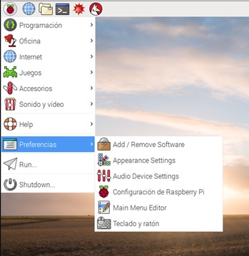

A la derecha, podemos pulsar sobre el icono del Wifi o de la red para configurarla, si fuera necesario.

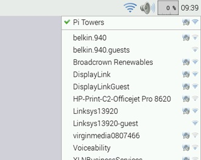

Demos un paseo por el interfaz del escritorio.

En este [vídeo](https://drive.google.com/file/d/1Xctv-39GG117f1Zm_0QbfQbRZoZd_MKG/view?usp=sharing) podéis ver el uso del entorno visual  Pixel de Raspberry Pi.

[](https://drive.google.com/file/d/1Xctv-39GG117f1Zm_0QbfQbRZoZd_MKG/view?usp=sharing)

### Usando Pixel el entorno de Raspberry Pi en tu PC

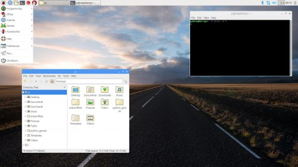

Puedes usar Pixel el entorno gráfico de Raspberry Pi en tu PC o MAC, solo necesitas descargar la [imagen](http://downloads.raspberrypi.org/pixel_x86/images/pixel_x86-2016-12-13/2016-12-13-pixel-x86-jessie.iso) desde un CD o USB.

Más detalles en [esta página](https://www.raspberrypi.com/news/pixel-pc-mac/)


### Acceso remoto

Salvo que vayamos a usar nuestra Raspberry Pi como un ordenador de mesa, con su pantalla, ratón y teclado, vamos a necesitar conectarnos a ella remotamente, a través de la red.

Podemos acceder remotamente de 2 formas:

* Accediendo al escritorio visual,  que se nos mostrará como si de un monitor se tratara y lo controlaremos con nuestro teclado y ratón. Este tipo de conexión se conoce como **VNC** por ser el protocolo más empleado a día de hoy. Para conectarnos, necesitaremos tener instalado en nuestro ordenador  un cliente de ese protocolo **VNC**.

 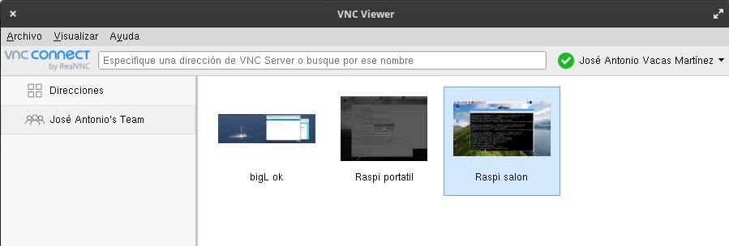

* Conectando sólo con un interfaz de tipo texto, como un terminal o consola usando el protocolo de acceso remoto **ssh**. Aunque a primera vista puede parecer más limitado, la realidad es que podemos hacer casi lo mismo desde el teclado que desde el escritorio. Para conectarnos por **ssh** necesitaremos un cliente de este protocolo, que viene incluido en todos los sistemas operativos modernos.

	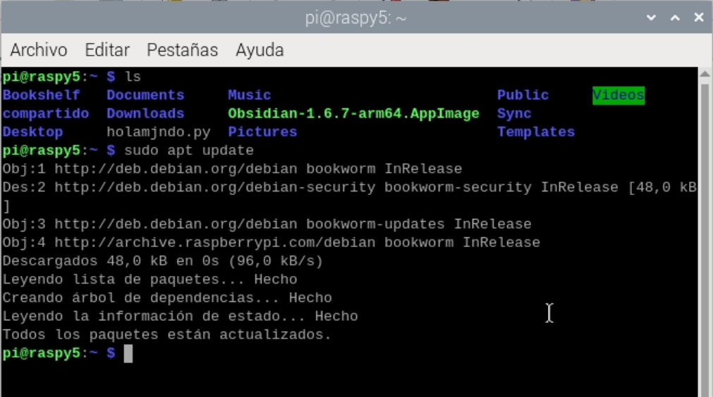

Por tema de seguridad, los accesos remotos están cortados y tenemos que activarlos para poder acceder remotamente.

Si hemos hecho la instalación con RPI Imager ya habremos configurado el acceso al wifi, y también podemos activar el acceso por ssh desde el  principio.

Antes de ver cómo usar estos métodos de conexión, vamos a ver algunos detalles sobre la forma en la que podemos acceder remotamente o no, a nuestra Raspberry Pi.

### Conceptos de redes

Primero, veamos un diagrama simplificado de una red doméstica típica:

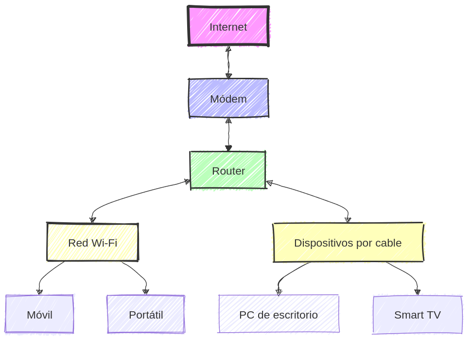

Ahora, expliquemos los componentes y su funcionamiento:

1. Conexión a Internet:
   - El módem se conecta directamente a la infraestructura de tu Proveedor de Servicios de Internet (ISP).
   - Recibe una dirección IP pública, asignada por el ISP.

2. Router:
   - Actúa como el punto central de tu red doméstica.
   - Crea y gestiona tu red local (LAN).
   - Proporciona conexiones tanto por cable (Ethernet) como inalámbricas (Wi-Fi).

3. Red local:
   - El router asigna direcciones IP privadas (generalmente en el rango 192.168.x.x o 10.0.x.x) a todos los dispositivos conectados.
   - Esto incluye dispositivos conectados por cable y por Wi-Fi.

4. Network Address Translation (NAT):
   - El router utiliza NAT para traducir entre las direcciones IP privadas de tu red local y la dirección IP pública.
   - Cuando un dispositivo en tu red local solicita datos de Internet, el router cambia la dirección IP privada del dispositivo por la IP pública, antes de enviar la solicitud.
   - Cuando los datos regresan, el router sabe a qué dispositivo enviarlos dentro de la red local.

Ahora, ¿por qué el router nos conecta a Internet pero no permite conexiones desde fuera?

1. Seguridad por defecto:
   - Los routers están configurados para proteger tu red local de amenazas externas.
   - Por defecto, bloquean las conexiones entrantes no solicitadas.

2. Funcionamiento de NAT:
   - NAT permite que los dispositivos internos inicien conexiones hacia Internet.
   - Sin embargo, no tiene forma de saber a qué dispositivo interno enviar una conexión entrante no solicitada.

3. Firewall integrado:
   - La mayoría de los routers incluyen un firewall básico, que bloquea el tráfico entrante no autorizado.

4. Ausencia de reenvío de puertos:
   - Para permitir conexiones entrantes específicas, necesitarías configurar el reenvío de puertos, lo cual no está activado por defecto.

5. IP dinámica:
   - Muchos ISP asignan direcciones IP públicas dinámicas que cambian periódicamente, dificultando las conexiones entrantes consistentes.

Esta configuración proporciona un buen equilibrio entre facilidad de uso y seguridad para la mayoría de los usuarios domésticos. Permite que todos los dispositivos de la red local accedan a Internet, mientras protege la red de accesos no autorizados desde el exterior.

Para permitir conexiones entrantes (como para SSH, VNC o para alojar un servidor web), necesitarás configurar específicamente tu router para ello, lo que generalmente implica:

1. Configurar el reenvío de puertos.
2. Posiblemente configurar una IP pública estática o usar un servicio de DNS dinámico.
3. Ajustar la configuración del firewall.

Vamos a ampliar ahora el diagrama para incluir las operadoras de telefonía. 

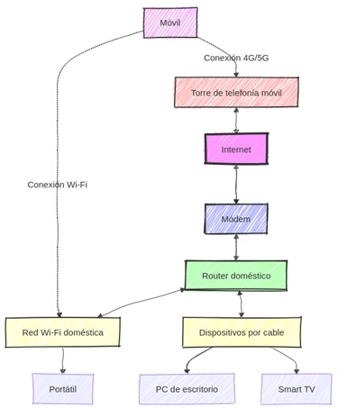

Explicación del diagrama:

1. Red doméstica:
   - Similar al diagrama anterior, muestra el módem conectado a Internet, el router, y los dispositivos conectados por cable y Wi-Fi.

2. Red de la operadora móvil:
   - Se muestra una torre de telefonía móvil conectada a Internet.

3. Móvil:
   - El móvil aparece con dos conexiones posibles:
     a) Una conexión 4G/5G a la torre de telefonía móvil.
     b) Una conexión Wi-Fi a la red doméstica.

Este diagrama ilustra cómo un móvil puede alternar entre dos tipos de conexiones:

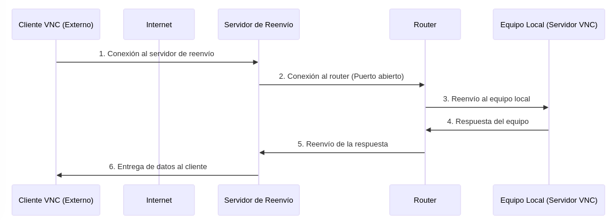

1. Conexión a la red móvil (4G/5G):
   - El teléfono se conecta directamente a la torre de telefonía móvil.
   - Esta conexión se usa típicamente cuando estás fuera de casa o fuera del alcance de redes Wi-Fi conocidas.
   - La operadora móvil proporciona acceso a Internet a través de su propia infraestructura.

2. Conexión a la red Wi-Fi doméstica:
   - Cuando estás en casa, el teléfono puede conectarse a tu red Wi-Fi.
   - En este caso, el tráfico de Internet del móvil pasa por tu router doméstico, igual que el resto de dispositivos de la casa.
   - Esta conexión suele ser preferida en casa porque generalmente es más rápida y no consume datos del plan móvil.

Aspectos importantes a considerar:

1. Cambio automático: Los móviles modernos pueden cambiar automáticamente entre estas conexiones, priorizando generalmente el Wi-Fi cuando está disponible.

2. Direcciones IP diferentes: El teléfono tendrá diferentes direcciones IP dependiendo de la red a la que esté conectado.

3. Seguridad: La conexión Wi-Fi doméstica puede ser más segura si está correctamente configurada, mientras que las conexiones móviles pueden ser más vulnerables en ciertos aspectos.

4. Acceso remoto: Cuando el móvil está en la red de la operadora, se enfrenta a los mismos desafíos para acceder a tu red doméstica que cualquier otro dispositivo externo, debido al NAT y firewall de tu router.

Este escenario dual es lo que permite a los móviles mantener una conexión constante a Internet, alternando entre redes móviles y Wi-Fi según la disponibilidad y la configuración del usuario.

### Conexión desde una red externa

Por todo esto, podremos acceder a nuestra Raspberry Pi remotamente dentro de nuestra red, pero no podremos acceder cuando está en otra red, por ejemplo, si la tenemos en casa y queremos acceder desde la red del trabajo o si queremos acceder desde el móvil cuando estamos usando datos.

Existen varias soluciones para este problema:

* Usar una VPN que nos permita acceder a la otra red, es una solución típica de muchas empresas para permitir acceder a los ordenadores remotamente. 
* Algunos software como RealVNC (una versión del protocolo VNC), nos lo permiten hacer con cuentas de pago.
* Utilizar una herramienta de Raspberry Pi llamada __Raspberry Pi Connect__.

Vamos a ver esta última opción por sencillez.

### Raspberry pi Connect

Nos proporciona la misma funcionalidad de acceso remoto de la versión comercial de RealVNC pero además, de momento, sin límite de dispositivos, se llama Raspberry Pi Connect y puedes leer más información en [esta publicación](https://www.raspberrypi.com/news/raspberry-pi-connect/)

Para instalarlo:

```sh
sudo apt update
sudo apt upgrade
sudo apt install rpi-connect
```

Tras instalarlo tenemos que rearrancar, bien con el comando adecuado

```sh
sudo reboot
``` 

pulsando el botón de **reset**, o con la opción de **Apagar** del menú.

Tras rearrancar, aparecerá el icono en la barra de herramientas:

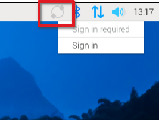

Si no saliera, lo activamos a mano con:

```console
systemctl --user start rpi-connect
```

que arrancará el servicio.

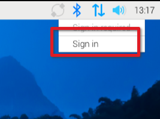

Ahora pulsamos **"Sign in"** para conectar con nuestra cuenta (o crearla si no la tenemos).Nos llevará a la siguiente web:

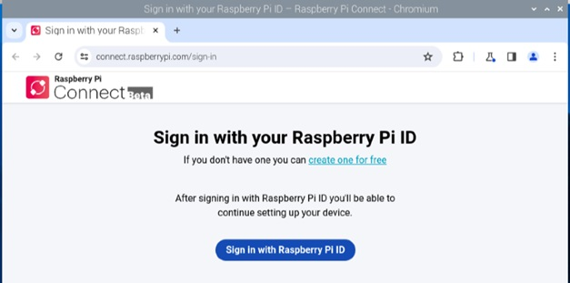

Si no nos aparece el icono para conectarnos por primera vez, ejecutamos:

```console
$ rpi-connect signin
```

que nos dará un mensaje similar a este:

```console
Complete sign in by visiting https://connect.raspberrypi.com/verify/XXXX-XXXX
```

Nos conectamos a esa URL, y completamos el registro.

Si no tenemos cuenta la creamos. Tras crear la cuenta o conectarnos a la que ya teníamos, nos pedirá el nombre del nuevo equipo.

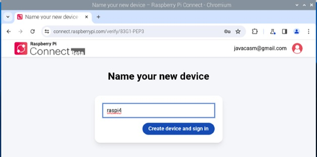

Ahora cuando entremos en [https:\\connect.raspberrypi.com]  desde cualquier ordenador, desde nuestra red o desde internet, veremos nuestros dispositivos.

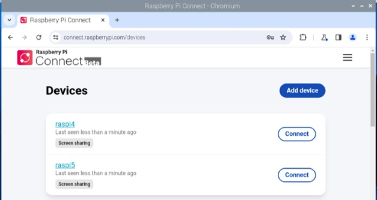

Desde esta página, podemos ver los detalles de cada máquina, pudiendo cambiar su nombre 

Podemos elegir si queremos acceder al escritorio del equipo o a una conexión de terminal vía ssh:

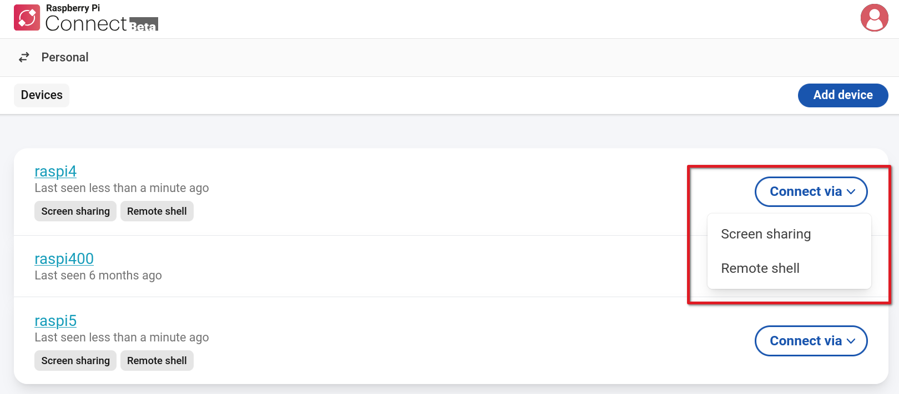

Tras pulsar **connect**, podemos acceder al equipo remotamente.

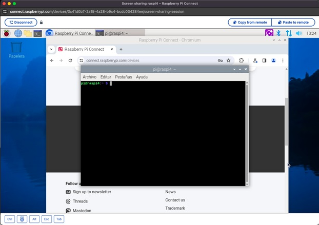

El icono aparece de color morado cuando hay una conexión remota.

Una vez instalado y operativo, podemos desactivar el acceso e incluso apagar el servicio Rasperry Pi Connect, desde las opciones del icono de la barra de tareas

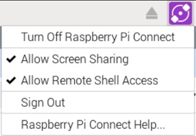

En el siguiente [vídeo](https://drive.google.com/file/d/1rpLkifN_uGr0gwP7rjS-iCQQuyp5rhNs/view?usp=sharing) explicamos la instalación y uso de RPI-Connect

[](https://drive.google.com/file/d/1rpLkifN_uGr0gwP7rjS-iCQQuyp5rhNs/view?usp=sharing)

Más detalles técnicos en la [Página de RBP connect](https://www.raspberrypi.com/documentation/services/connect.html)

### ¿Cómo hace VNC o los servicios similares para acceder remotamente a los ordenadores de nuestra red local?

Los servicios como VNC (Virtual Network Computing) utilizan varias técnicas para permitir el acceso remoto a equipos en una red local desde fuera de ella.

Primero, veamos un diagrama simplificado del proceso:

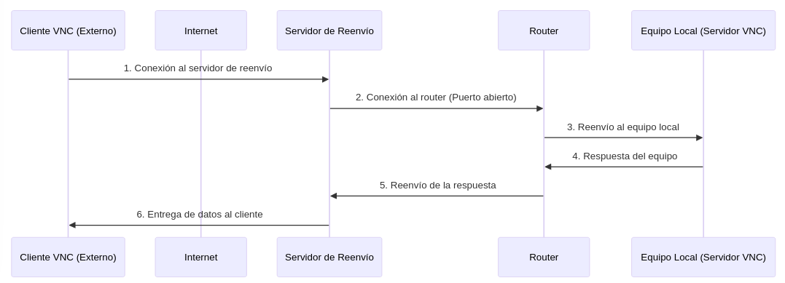

Ahora, expliquemos cómo funcionan estos servicios y las técnicas que utilizan:

1. Configuración del Router:
   - Reenvío de Puertos (Port Forwarding): Se configura el router para que redirija las conexiones entrantes en un puerto específico (por ejemplo, 5900 para VNC) a la dirección IP local del equipo con el servidor VNC.

2. Uso de Servidores de Reenvío:
   - Muchos servicios VNC utilizan servidores intermediarios para facilitar la conexión.
   - El equipo local (servidor VNC) establece una conexión saliente al servidor de reenvío.
   - El cliente VNC externo se conecta a este servidor de reenvío.
   - El servidor actúa como puente, redirigiendo el tráfico entre el cliente y el servidor VNC.

3. Técnicas de Atravesamiento de NAT:
   - UDP Hole Punching: Técnica que permite establecer conexiones directas entre dispositivos detrás de NAT.
   - STUN (Session Traversal Utilities for NAT): Ayuda a descubrir la IP pública y el tipo de NAT.

4. Uso de VPN (Red Privada Virtual):
   - Algunos servicios VNC pueden usar una VPN para crear una conexión segura entre el cliente y la red local.

5. Servicios de DNS Dinámico:
   - Asignan un nombre de dominio a tu IP pública dinámica, facilitando la conexión incluso si la IP cambia.

6. Protocolos de Conexión Inversa:
   - El servidor VNC inicia la conexión hacia un servidor intermediario, evitando problemas de NAT y firewalls.

7. Encriptación y Seguridad:
   - Utilizan protocolos de encriptación para asegurar la conexión.
   - Implementan autenticación robusta para prevenir accesos no autorizados.

Proceso típico de conexión:

1. El servidor VNC en tu red local se registra con un servicio de reenvío.
2. Cuando quieres conectarte remotamente, tu cliente VNC contacta al servicio de reenvío.
3. El servicio de reenvío facilita la conexión entre tu cliente y el servidor VNC en tu red local.
4. Se establece una conexión encriptada y autenticada.
5. Puedes ver y controlar tu equipo remoto como si estuvieras frente a él.

Consideraciones importantes:

- Seguridad: Es crucial configurar correctamente la autenticación y usar conexiones encriptadas.
- Ancho de banda: El acceso remoto puede requerir una buena conexión a Internet en ambos extremos.
- Latencia: Puede haber un ligero retraso en las acciones debido a la distancia y el enrutamiento.

### SSH (vía consola)

SSH es el protocolo de acceso remoto por consola (o terminal). Se suele utilizar cuando no necesitamos (o no tenemos) un entorno gráfico. Es una forma de conexión segura (usa encriptación y verificación a ambos lados) utilizada para acceder al router y otros dispositivos remotos.

Tenemos que activarlo en la configuración para poder acceder desde fuera. Entramos en la configuración avanzada:

```sh
sudo raspi-config
```

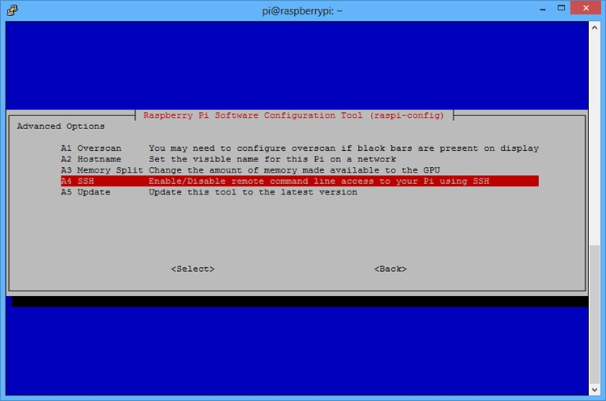

Podemos hacerlo también por comandos con:

```sh
sudo service ssh start
sudo insserv ssh
```

Ahora podremos conectarnos remotamente con ssh, desde Linux con el comando **ssh** o con otras herramientas que veremos a continuación:

```sh
ssh pi@192.189.0.123
```

Si lo vamos a activar se recomienda cambiar la contraseña para evitar que cualquiera pueda acceder a nuestro equipo.

[](https://drive.google.com/file/d/1Eu0yXNhgxUOZj9TjB35dlq-3y1--L4Lq/view?usp=sharing)

[Vídeo: Conexión vía SSH a Raspberry Pi](https://drive.google.com/file/d/1Eu0yXNhgxUOZj9TjB35dlq-3y1--L4Lq/view?usp=sharing)

### Herramientas de conexión ssh

Son muchas las herramientas que existen para poder conectarnos entre equipos usando SSH, vamos a ver un par de ellas.

#### Putty 

[Putty](http://www.chiark.greenend.org.uk/~sgtatham/putty/download.html) es una herramienta open source disponible para muchos sistemas operativos pensada para conectar remotamente con equipos usando distintos protocolos como ssh, telnet, serie, etc


Permite guardar las credenciales de cada sistema, facilitando la conexión.

#### JuiceSSH

[JuiceSSH](https://play.google.com/store/apps/details?id=com.sonelli.juicessh) es una herramienta de conexión ssh para móviles y tabletas Android.

También nos permite gestionar las credenciales de acceso y los diferentes equipos a los que conectarnos: 

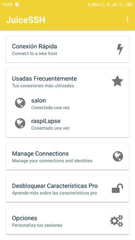

El uso en un móvil es incluso más cómodo de lo que parece, puesto que permite el uso de teclas como TAB, Ctrl, cursor, etc...

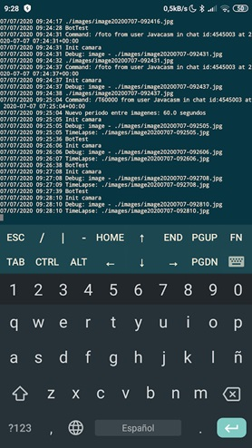


[Vídeo sobre Cliente SSH para móviles y tabletas Android: JuiceSSH](https://drive.google.com/file/d/1GG4mscjTBS9VqsDxgyXM6n1UopfQzrIB/view?usp=sharing)

[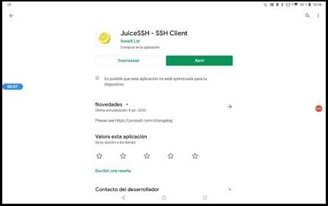](https://drive.google.com/file/d/1GG4mscjTBS9VqsDxgyXM6n1UopfQzrIB/view?usp=sharing)

### Automatizar conexiones ssh

Si vamos a conectarnos frecuentemente a un mismo equipo, puede resultar pesado tener que poner siempre usuario y contraseña. 

Podemos automatizar el protocolo ssh sin más que añadir nuestra **clave pública ssh** a la lista de host autorizados del servidor al que nos vamos a conectar, haciendo lo siguiente:

1. Generar nuestra **clave pública ssh**, asociada al usuario y la máquina:
```sh
ssh-keygen -t rsa -b 4096 -C user@email.com
```
2. Ahora copiamos nuestra clave pública ssh a:
```sh
cat ~/.ssh/id_rsa.pub | ssh username@server.address.com 'cat >> ~/.ssh/authorized_keys'
```
La siguiente vez que nos conectemos lo haremos sin necesidad de introducir la clave.

Como podemos ver en el último comando que hemos usado, podemos usar ssh de muchas formas diferentes:

* Para conectarnos de manera interactiva a otro ordenador.
* Para enviar ficheros entre equipos. En un proyecto más adelante lo usaremos bastante.
* Para enviar contenido entre equipos como hemos hecho con el comando 'cat'.
* Para ejecutar comandos remotamente. Por ejemplo si hacemos:
```sh
ssh pi@raspi4 df -h
```
Nos permitirá saber cómo de llenos están los discos en el ordenador raspi4.


### VNC

VNC es un protocolo que nos permite acceder remotamente al escritorio de otra máquina.

En las nuevas versiones de Raspbian podemos activar VNC desde la configuración (o desde raspi-config), en el apartado de Interfaces.

Para conectarnos necesitamos instalar un cliente de VNC, como por ejemplo [RealVNC](https://www.realvnc.com/en/connect/download/viewer/). Una vez instalado lo usaremos introduciendo la IP o el nombre de nuestra Raspberry Pi.


### Cambio de resolución del escritorio

Cuando arrancamos una Raspberry Pi sin tener el monitor conectado y la tenemos configurada para que se cree el escritorio gráfico, suele crearse con una resolución pequeña.

En el siguiente vídeo, vamos a ver cómo hacer para modificar esa resolución. No hay más que entrar en Configuración de Raspberry Pi -> Display y pulsar en Set Resolution.

[](https://drive.google.com/file/d/1o8hYMcc-zDuWLMg7_wBSPXxQGDwuB7Np/view?usp=sharing)

[Vídeo: Cambio de resolución del escritorio de una Raspberry Pi](https://drive.google.com/file/d/1o8hYMcc-zDuWLMg7_wBSPXxQGDwuB7Np/view?usp=sharing)

### Instalación de programas desde el escritorio

Dependiendo de la versión de Raspberry Pi OS que instalemos (Lite o Full), tendremos más o menos aplicaciones disponibles al  empezar a usar nuestra Raspberry Pi. No obstante, siempre podemos añadir o quitar programas.

Como todos los sistemas operativos basados en **Debian**, la Raspberry Pi dispone de  una lista de repositorios donde está organizados los diferentes los paquetes y aplicaciones, cada uno de estos paquetes contiene información sobres las dependencias que existen entre ellos, sus versiones, así como todo lo necesario para instalarlo, configurarlo o desinstalarlo. 

Al seleccionar un paquete para su instalación, se consultará si ya se dispone de los paquetes de los que dependen en nuestra máquina y en caso negativo se instalarán. También se comprueba si existe algún tipo de incompatibilidad con el software existente

Desde el escritorio podemos instalar o desinstalar aplicaciones usando cualquiera de estas dos  herramientas visuales desde el menú Preferencias. Ambas usan el mismo sistema de instalación y son compatibles al 100% entre ellas:

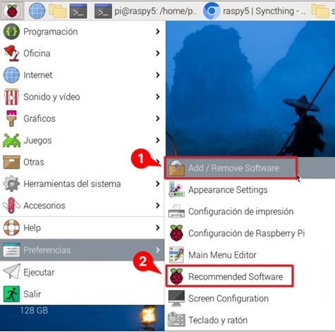

1. Desde la herramienta **"Add/Remove Software**"  (Añadir/Eliminar programas), tendremos acceso a una enorme cantidad de programas, podemos navegar por las diferentes categorías o buscar por el nombre del paquete.
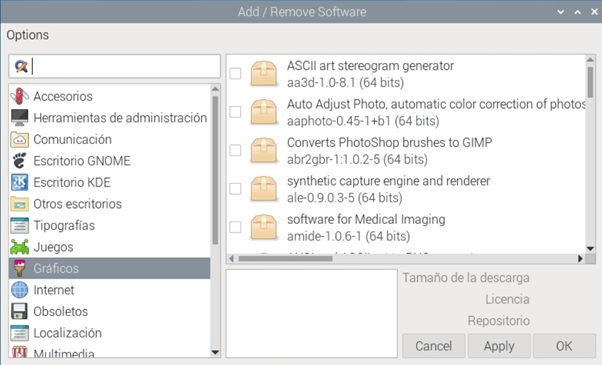
	
2. Desde la herramienta "**Recommended Software**" (Software recomendado),  aparecen los paquetes más frecuentes, y que se instalan por defecto en la opción de instalación completa.

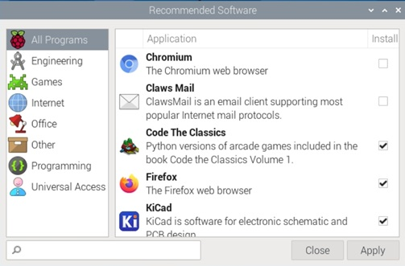	


En este [vídeo](https://drive.google.com/file/d/1c_LRoSGBBeoYAdmiOQ91qIT4NKQxBLS-/view?usp=sharing) vemos cómo actualizar e instalar software para la Raspberry Pi usando las herramientas de escritorio.

[](https://drive.google.com/file/d/1c_LRoSGBBeoYAdmiOQ91qIT4NKQxBLS-/view?usp=sharing)

### Instalación de programas desde línea de comandos

También podemos instalar paquetes desde la consola. Para ello, tenemos que conocer el nombre completo y ejecutaremos el siguiente comando desde un terminal:

```sh
sudo apt install paquete
```

Más adelante, veremos en más detalle esta herramienta y cómo la podemos utilizar para actualizar el sistema.
