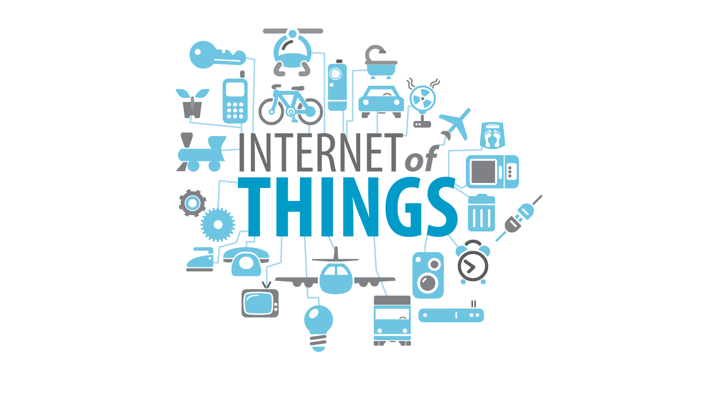

## [¿Qué es IOT?](https://es.wikipedia.org/wiki/Internet_de_las_cosas)


(De Drawed by Wilgengebroed on Flickr - Translated by Prades97, CC BY-SA 3.0, https://commons.wikimedia.org/w/index.php?curid=32745149)

IoT, o "Internet de las Cosas" (del inglés, *Internet of Things*), es un concepto que se refiere a la interconexión de objetos cotidianos a Internet, permitiendo que estos dispositivos recopilen, compartan y, en algunos casos, procesen datos de manera autónoma. Estos "objetos inteligentes" pueden ser desde electrodomésticos, sensores industriales y vehículos, hasta dispositivos de salud, ropa y ciudades enteras. La finalidad del IoT es mejorar la eficiencia, la comodidad y la toma de decisiones mediante el uso de datos en tiempo real.

### ¿Cómo funciona el IoT?

La arquitectura de IoT generalmente, se compone de varios elementos clave:
1. **Dispositivos o sensores**: Los dispositivos IoT tienen sensores o actuadores que recopilan datos, como la temperatura, la ubicación, o incluso el ritmo cardíaco en dispositivos médicos.
2. **Conectividad**: Estos dispositivos se conectan a Internet o a redes locales a través de Wi-Fi, Bluetooth, redes móviles, entre otras tecnologías, para transmitir los datos.
3. **Nube o almacenamiento**: Los datos se almacenan en servidores o plataformas en la nube, donde pueden procesarse y analizarse.
4. **Procesamiento y análisis**: Los datos recopilados se analizan para proporcionar información útil o activar acciones automáticas, como encender una luz, activar un sistema de seguridad o realizar predicciones basadas en tendencias.
5. **Interfaz de usuario**: Muchas veces, los datos se muestran en una aplicación o panel, donde los usuarios pueden monitorear y controlar los dispositivos.

### Ejemplos de aplicaciones de IoT

1. **Hogares inteligentes**: Dispositivos como termostatos, cerraduras y asistentes de voz (ej. Alexa o Google Home), automatizan tareas y permiten controlar el hogar de forma remota.
2. **Salud y bienestar**: Los dispositivos portátiles como pulseras o relojes inteligentes monitorizan constantes vitales y ayudan en la gestión de la salud.
3. **Industria 4.0**: En las fábricas, los sensores y máquinas conectadas permiten un control detallado y en tiempo real de los procesos productivos, optimizando recursos y reduciendo fallos.
4. **Ciudades inteligentes**: La iluminación, el tráfico y los sistemas de gestión de residuos en las ciudades pueden automatizarse para mejorar la eficiencia y reducir costos.
5. **Agricultura**: IoT facilita el monitoreo del clima y el estado del suelo, permitiendo un riego y una gestión de cultivos más precisa.

### Ventajas del IoT

- **Eficiencia y ahorro de recursos**: Ayuda a reducir costos y optimizar procesos.
- **Toma de decisiones basada en datos**: Permite decisiones informadas gracias a los datos en tiempo real.
- **Automatización de tareas**: Mejora la comodidad y reduce la necesidad de intervención humana.
- **Personalización**: Los dispositivos pueden adaptarse a las preferencias y necesidades del usuario.

### Desafíos y preocupaciones

- **Seguridad y privacidad**: Al estar conectado a Internet, el IoT es vulnerable a ataques cibernéticos, lo que plantea problemas de privacidad de datos.
- **Interoperabilidad**: Hay muchos dispositivos y fabricantes distintos, y no siempre son compatibles entre sí.
- **Estandarización**: Faltan estándares globales para regular y facilitar la conectividad entre dispositivos.

En resumen, el IoT está transformando la manera en que interactuamos con el mundo que nos rodea al conectar el entorno físico al digital.

¿Qué dispositivos IOT conoces?



## IOT con Raspberry

Dada la capacidad de procesamiento y la compatibilidad con todo tipo de sistemas, Raspberry Pi es ideal para ser el centro de las comunicaciones de un sistema IOT. Puede actuar como:

* _Broker de comunicaciones_, a donde se conectan todos los otros dispositivos.
* _Base de datos_ para guardar los datos.
* _Visualizador de datos_ usando aplicaciones específicas.
* _Hacer  data mining_ para analizar y crear patrones de grandes volúmenes de datos guardados.
* _Publicar contenidos_ en forma de página web, canal de Telegram, etc

# IOT (Internet de las cosas)

¿Qué dispositivos te gustaría controlar remotamente?

* Calefacción.
* Aire acondicionado.
* Encender la cocina para calentar la comida antes de que lleguemos a casa.
* ¿Estás seguro que se han apagado todas las luces de la casa al salir?.
* Una alarma que nos avise de si hay algún problema cuando no estamos en casa.
* Poder ver el estado de un familiar remotamente.
* Controlar el ejercicio que hace durante un día para así motivarte a hacer más.
* Todas las aplicaciones que se te ocurran relacionadas con la domótica de una casa.

## Características de los dispositivos IOT

* Bajo consumo o mejor autosuficiencia (un panel solar y una batería). Si tiene una pulsera de actividad, sabrá que es necesario cargarla una vez al mes.
* Conectividad con otros dispositivos, como puede ser un teléfono móvil, ya sea por medio de Bluetooth y /o WiFi.
* Medir algo: actividad, temperatura, consumo.
* Almacenar los datos que se guardan, hasta que se vuelven a sincronizar.
* Estos datos se suelen subir a páginas web (Thingspeak, Blynk, Adafruit, Cayenne, etc), dónde se almacenan, y dónde posteriormente, podemos construir nuestros gráficos e informes.

## Proyectos

Veamos algunos de los proyectos en los que podríamos trabajar:

* _Estación meteorológica_: mediremos las magnitudes atmosféricas, mostrando los datos, guardándose y publicándose en internet para su posterior análisis.

* _Medida de consumo y fomento de la eficiencia energética_: mediremos el consumo de nuestro propio equipo y veremos cómo a medida que vamos incluyendo más componentes el consumo se hace mayor. Podríamos adaptar este sistema a un uso real dentro de la casa y viendo el consumo de los electrodomésticos.

* _Control remoto de componentes_: mediante el uso de un relé, vamos a poder encender y apagar dispositivos remotamente con nuestro sistema, bien por el cambio de algunos de los sistemas con que medimos, o bien por accionamiento externo.

* _Medida de calidad del aire_: Usaremos sensores de medida de partículas para determinar la calidad del aire y al mismo tiempo, también mediremos el contenido en gases y los parámetros atmosféricos. Publicaremos todos estos datos en una página web, para poder comparar la medida en diferentes lugares.

## Algunos ejemplos:

* _Pulsera para medir la actividad física_.
  * Su batería dura unos ¡¡¡30 días!!!
  * Almacena sus datos (en local) y cuando puede, se sincroniza (guardando datos en la nube).
  * Sólo proporciona información que luego vemos en otros dispositivos.
* _Sistema de riego inteligente_.
  * Un Arduino que mide la humedad y decide si activar o no una bomba de agua, es una prueba de concepto.
  * _Sistema de riego para una instalación de gran tamaño_:
    * Cientos/miles de sensores de humedad.
    * Multitud de puntos de riego (válvulas/bombas).
    * Hacemos un data mining sobre los datos de humedad y se activan los puntos de riego.

### Qué le pedimos al IOT

* _Inteligencia_:
    * [Niveles](http://www.domodesk.com/a-fondo-que-es-el-internet-de-las-cosas): identidad, ubicación, estado, contexto, criterio. Ejemplo: los cientos de sensores de humedad de una gran explotación. Un nivel más de Inteligencia sería incluir predicción (por ejemplo, la atmosférica: si sabemos que va llover, esperamos antes de regar).
* _Arquitectura_:
  * [_Protocolos_](http://www.domodesk.com/a-fondo-que-es-el-internet-de-las-cosas): Cable, Wifi, Zigbee, Bluetooth, GSM (y todas sus Gs), ...
  * _M2M_: Comunicación Machine to Machine.
    * Un dron recoge datos del nivel de suciedad de los paneles solares.
    * Envía los datos  a la central.
    * Cuando el nivel es el adecuado, se activa el robot de limpieza en determinada zona.


## ¿Cómo hacerse un IOT?

Veamos las distintas partes de la arquitectura IOT


Vemos que podemos usar la Raspberry Pi, prácticamente en todas las  partes de un proyecto IOT:

* Para visualización podemos usar una sencilla página web o un sistema más profesional como **Grafana**, ambas disponibles fácilmente en la Raspberry Pi
* Para procesar o filtrar los datos podemos usar un programa creado por nosotros mismos con Python o **NodeRed**, un entorno de programación para control de flujo de datos, también en la Raspberry Pi
* Para almacenar sólo tenemos que instalar una base de datos, de entre las que tenemos disponibles.
* Los dispositivos podrán acceder al sistema a través de Internet o de una red privada, tipo Lora

En los siguientes capítulos, vamos a ir viendo cómo hacerlo.

## Domótica

Una vez tenemos una forma de comunicación entre sistemas, sólo necesitamos ir integrando equipos de manera que interaccionen entre ellos, y nosotros podamos controlarlos.

Cuando estos equipos los tenemos en casa, decimos que tenemos una instalación domótica.

En este apartado, voy a contar unos sencillos ejemplos que he utilizado en casa. Los he utilizado para aprender sobre el tema y hay que entender, que son prototipos y pruebas de concepto pero que nos ayudan a entender el funcionamiento, y las posibilidades de este tipo de sistemas.

En los siguientes capítulos, veremos algunos ejemplos de sistemas más profesionales para trabajar la domótica.

### Sistemas comerciales

Existen en el mercado, multitud de elementos domóticos comerciales que podemos comprar por muy pocos euros:

* Bombillas que se activan con el móvil, incluso podemos cambiar el color de la luz que emite.


* Relés genéricos para controlar el encendido de dispositivos por wifi.


* Enchufes, que se controlan por wifi.
* Interruptores, para controlar cualquier dispositivo.


* Termostatos inalámbricos.


* Sistemas para controlar el ventilador desde el móvil.


* ...

Todos ellos, utilizan una aplicación en nuestro móvil que tras emparejarlos, nos permite controlar su funcionamiento. 

Al usar varios de ellos, ya nos encontramos con un primer problema:

* Cada fabricante usa una aplicación diferente.
* Incluso si tenemos equipos de un mismo fabricante pero comprados en diferentes fechas, podemos tener que usar diferentes aplicaciones.

La mayoría de estas aplicaciones nos permiten hacer que unos equipos interaccionen con otros, pero siempre que sean del mismo fabricante.

Por otro lado, algo que nos queda oculto es que aunque estemos junto a nuestro equipo, en la gran mayoría de los casos, los datos viajan hasta los servidores del fabricante y nuestras acciones también han de hacerlo, con lo que nuestros datos, y el uso de los distintos aparatos está moviéndose a través de internet. 

Esto cuando menos, debería de preocuparnos.

Esta imagen de Adafruit, refleja claramente el movimiento de nuestros datos:


Por todo ello, vamos a ver en primer caso, cómo hacer un sencillo sistema doméstico para entender su arquitectura.

En un segundo nivel veremos algunas distribuciones con un acabado más profesional, como Home Assistant.

También veremos de pasada un ejemplo con Google Assistant, para entender la complejidad y dónde están los problemas.

[La serie de vídeos sobre Domótica de Jorge Pascual](https://www.youtube.com/watch?v=IQLFgVg4TjM&list=PLFe_vhJmgS_51XlV_a5Atl1Re4fJA_b-d)son una excelente forma de aprender sobre este apasionante tema.

## MQTT

Vamos a ver uno de los protocolos más usados en los sistemas domóticos: el MQTT.

**MQTT** es un protocolo de comunicaciones entre dispositivos, sencillo y ligero. Está pensado para que pueda funcionar en equipos con poca capacidad de cálculo, pero sin limitar sus características. Podemos ver todos los detalles del protocolo en [su web](https://mqtt.org/) donde se encuentran las especificaciones y versiones de software que lo implementan.

Es un protocolo seguro que soporta autenticación y cifrado SSL, aunque podemos elegir no usar estas características.

También implementa distintos niveles de QoS (Quality of Service), que van desde un nivel 0 sin garantía de entrega de paquetes/notificaciones, hasta un nivel máximo donde se asegura que todos los paquetes se reciben.

Todo ello, hace que este protocolo sea muy útil y versátil, capaz de funcionar entre grandes servidores y entre sistemas de microcontroladores.

Los equipos conectados por **MQTT** envían y reciben mensajes que están formados por un **Topic**, que es como una etiqueta con estructura arbórea y un **mensaje** o contenido.

Decimos que los topics tienen estructura arbórea porque podemos estructurarlos y además usar comodines ('+' y '#'), como se hace con los ficheros. 

Por ejemplo, si decimos que estamos interesados en el topic "/MeteoSalon/#" diremos que nos interesan todos los mensajes que empiecen por "/MeteoSalon/". 

Si decimos que queremos suscribirnos a los topics de la forma "/sensores/+/Temperatura" recibiremos todos los que tenga esa estructura sin importar si son "/sensores/10/temperatura" o "/sensores/9/temperatura" o cualquier otro con ese formato.

Todos los participantes pueden **publicar** mensajes y/o también se pueden **suscribir** a determinados topics, de manera que reciban los mensajes con ese topic.

Utiliza una arquitectura como la que se ve en la imagen, donde el sistema central actúa como **Broker**, recibiendo los mensajes de todos los equipos y notificando a aquellos que se han suscrito a topics.


Al ser un servicio sencillo actúa como transporte en sistemas más complejos. Por ejemplo, podemos hacer que un equipo se suscriba a todos los topics y los guarde en una base de datos. 


Existen brokers accesibles (y gratuitos para cierto número de peticiones) a través de internet como por ejemplo el de [HiveMQ](https://www.hivemq.com/public-mqtt-broker/) o [el de Adafruit](https://io.adafruit.com/) o [este mismo de mosquitto org](https://test.mosquitto.org/). En [esta página](https://diyprojects.io/8-online-mqtt-brokers-iot-connected-objects-cloud/#.XwoEW9_ni-g) tenemos un listado.

## Instalación en Raspberry Pi

Instalamos el servidor **mosquitto** que actúa como broker en la Raspberry:

```sh
sudo apt install mosquitto
```

Ejecutamos mosquitto. 


Si queremos que se arranque como servicio al iniciar la Raspberry Pi, hacemos:

```sh
sudo systemctl enable mosquitto.service
```

Para publicar y recibir mensajes necesitaremos las herramientas cliente, que podemos instalar con:

```sh
sudo apt install mosquitto-clients
```

Podemos suscribirnos a un tema/topic con el comando:

```sh
mosquitto_sub -h servidorMQTT -t Tema
``` 

Para publicar en un "Topic" un "Mensaje" (siempre son cadenas):

```sh
mosquitto_pub -h servidorMQTT -t "Topic" -m "Mensaje"
```

Para depurar el funcionamiento de mosquitto y ver los logs cuando funciona como servicio podemos usar [MQTT-Explorer](https://github.com/thomasnordquist/MQTT-Explorer). En [esta página](https://community.home-assistant.io/t/how-to-debug-mosquitto-mqtt/107709/20) y en [esta otra](http://www.steves-internet-guide.com/mosquitto-logging/) te explican cómo hacerlo.

## Ejemplos

Vamos a suscribirnos al topic "MeteoSalon/#", es decir a todos los mensajes que "cuelgen" del topic "MeteoSalon".
La opción **-v** es para que muestre más detalles sobre los mensajes:

```sh
mosquitto_sub -h 192.168.1.200 -t "MeteoSalon/#" -v
```

y la aplicación quedará esperando hasta que se reciban mensajes con un topic compatible.

Desde el mismo servidor, podemos probar que funciona con la utilidad **mosquitto_pub**:

```sh
mosquitto_pub -h 192.168.1.200 -t "MeteoSalon/led" -m "On"
```

En el servidor vemos la siguiente traza:

```sh
1574598811: New connection from 192.168.1.200 on port 1883.
1574598811: New client connected from 192.168.1.200 as mosqpub/7375-raspberryp (c1, k60).
1574598811: Client mosqpub/7375-raspberryp disconnected.
```

y en la aplicación cliente:

```sh
MeteoSalon/led On
```

### Ejemplo de arquitectura de topics

A medida que vamos añadiendo dispositivos y enviando más mensajes, se puede complicar el árbol de topics.

Por ello es mejor usar una cierta jerarquía en los topics, estableciendo un primer nivel según el tipo de mensaje

* _Telemetría_  (**tele**) para que los dispositivos aporten información, por ejemplo los sensores.
* _Comandos_ (**cmnd**) para que se ejecuten acciones.
* _Estados_ (**stat**) para confirmaciones de estados.

Podría ser algo así:

```sh
    "cmnd/esp/01/power" # para activar ese estado de activación
    "stat/esp/01/power" # para confirmar el estado
    "tele/esp/01/Temp"  # para conocer el valor de la temperatura
```


## MQTT y python

Vamos a ver cómo integrar MQTT en nuestros proyectos

Usaremos el módulo  **paho-mqtt** que permite tanto publicar como suscribirse a topics. Lo instalamos

```sh
sudo pip3 install paho-mqtt
```

Y lo podemos probar con [ejemplo sencillo como este](https://github.com/javacasm/RaspberryOnline2ed/raw/master/codigo/testMQTT.py):

Tendremos que poner la ip de nuestra Raspberry sustituyendo la que aparece en el codigo, donde usamos "192.168.1.200"

```python
import paho.mqtt.client as mqtt # Importamos  MQTT library
import time # The time library is useful for delays
import datetime

v = '1.0'

IP_RASPBERRY = "192.168.1.200"

# Se llamará a esta función cada vez que nos llegue un mensaje
def messageFunction (client, userdata, message):
    topic = str(message.topic)
    message = str(message.payload.decode("utf-8"))
    print(str(datetime.datetime.now().strftime("%d/%m/%Y %H:%M:%S.%f "))+ topic + message)

ourClient = mqtt.Client("NuestroClienteDeEjemplo") # Creamos un cliente y le damos un id
ourClient.connect(IP_RASPBERRY, 1883) # IP del servidor MQTT
ourClient.subscribe("MeteoSalon/#") # Nos suscribimos a todos los topic que empiecen por MeteoSalon
ourClient.on_message = messageFunction # Funciń a la que se llamará cuando llegue un mensaje
ourClient.loop_start() # Arrancamos el cliente

# Main program loop
last_pub = int(round(time.time() * 1000))
while(1):
    now = int(round(time.time() * 1000))
    if (now - last_pub) > 30000: # Revisamos cada 30 segundos 
        ourClient.publish("MeteoSalon/Test", "Just Testing") # Publicamos un mensaje de teste
        last_pub = now
    time.sleep(0.1) # Esperamos 1 segundo
```

Podemos usar nuestra instancia de mosquitto y las herramientas cliente para probar su funcionamiento.
