## IOT en Raspberry pi

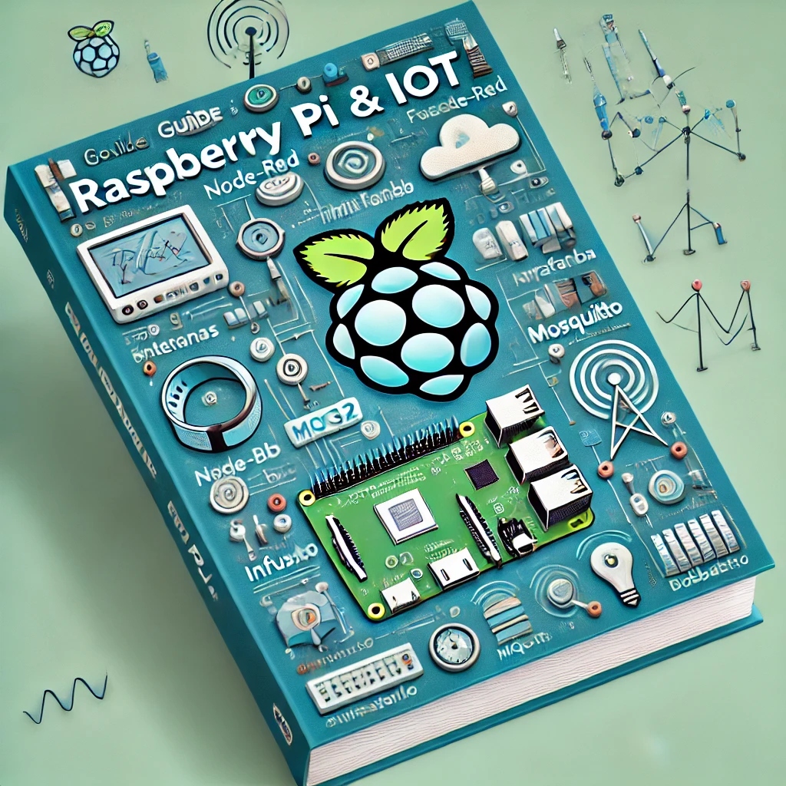

Vamos a hablar sobre lo que se denomina  IOTstack, la traducción más adecuada al castellano de "IoT Stack" sería "Pila de IoT" o "Pila tecnológica para IoT", donde:

- IoT (Internet of Things) se traduce como "Internet de las Cosas", aunque es común mantener el acrónimo IoT incluso en castellano
- "Stack" se traduce como "pila" o "pila tecnológica" en el contexto de tecnologías de la información

Por lo tanto, algunas opciones válidas serían:

- Pila tecnológica para Internet de las Cosas
- Pila de Internet de las Cosas
- Pila IoT (versión híbrida más comúnmente usada)

Sin embargo, es importante mencionar que en el ámbito técnico en español, es muy común mantener el término en inglés "IoT Stack" sin traducir.
junto con un diagrama que muestre la arquitectura.


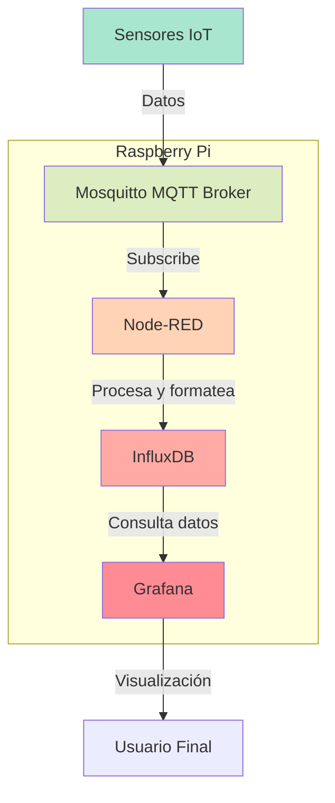
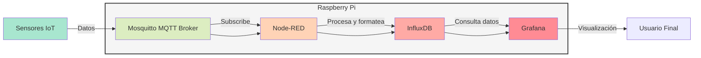
Veamos en detalle cada componente del stack IoT y cómo interactúan entre sí:

1. Mosquitto MQTT Broker:
- Es el punto central de comunicación que maneja el protocolo MQTT
- Recibe los datos de los sensores IoT a través de topics
- Permite la comunicación publicación/suscripción entre dispositivos
- Se ejecuta como servicio en la Raspberry Pi
- Gestiona la distribución de mensajes entre publishers y subscribers

2. Node-RED:
- Actúa como middleware para procesar y transformar datos
- Se suscribe a los topics de MQTT para recibir datos
- Permite crear flujos visuales de procesamiento de datos
- Puede realizar transformaciones y filtrado de datos
- Formatea los datos para almacenarlos en InfluxDB
- Ofrece una interfaz web para programación visual

3. InfluxDB:
- Base de datos especializada en series temporales
- Optimizada para almacenar datos de sensores con timestamps
- Alta eficiencia en escritura y consulta de datos secuenciales
- Permite definir políticas de retención de datos
- Proporciona un lenguaje de consulta similar a SQL llamado InfluxQL

4. Grafana:
- Plataforma de visualización de datos
- Se conecta directamente a InfluxDB como fuente de datos
- Permite crear dashboards interactivos
- Soporta múltiples tipos de gráficas y visualizaciones
- Configurable para mostrar datos en tiempo real
- Permite configurar alertas basadas en umbrales

Flujo de datos típico:
1. Los sensores publican datos en topics específicos del broker MQTT
2. Node-RED se suscribe a estos topics y recibe los datos
3. Node-RED procesa y transforma los datos según sea necesario
4. Los datos procesados se almacenan en InfluxDB
5. Grafana consulta InfluxDB y actualiza las visualizaciones

### Instalación y configuración manual

Configuración básica necesaria:
1. Instalar los componentes:
```bash
sudo apt update
sudo apt install -y mosquitto mosquitto-clients
sudo apt install -y nodejs npm
sudo npm install -g node-red
sudo apt install -y influxdb
sudo apt install -y grafana
```

2. Habilitar los servicios:
```bash
sudo systemctl enable mosquitto
sudo systemctl enable nodered
sudo systemctl enable influxdb
sudo systemctl enable grafana-server
```

3. Iniciar los servicios:
```bash
sudo systemctl start mosquitto
sudo systemctl start nodered
sudo systemctl start influxdb
sudo systemctl start grafana-server
```

Este stack proporciona una solución completa para:
- Recolección de datos (MQTT)
- Procesamiento (Node-RED)
- Almacenamiento (InfluxDB)
- Visualización (Grafana)

Te voy a detallar en profundidad cada uno de los componentes del stack IoT.

1. MOSQUITTO MQTT BROKER


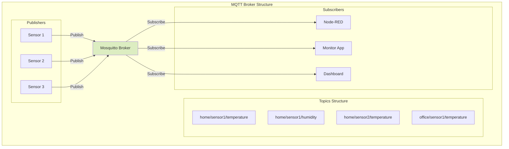

Configuración básica de Mosquitto:
```bash
# Archivo: /etc/mosquitto/mosquitto.conf

# Permitir conexiones en puerto 1883
listener 1883

# Permitir conexiones anónimas (desarrollo)
allow_anonymous true

# Para producción, usar autenticación
password_file /etc/mosquitto/passwd
```

Comandos útiles para pruebas:
```bash
# Suscribirse a un topic
mosquitto_sub -h localhost -t "home/sensor1/#"

# Publicar en un topic
mosquitto_pub -h localhost -t "home/sensor1/temperature" -m "23.5"

# Crear usuario y contraseña
mosquitto_passwd -c /etc/mosquitto/passwd usuario1
```

2. NODE-RED

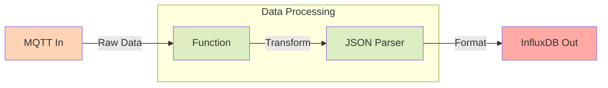

Ejemplo de flujo Node-RED para procesar datos:
```javascript
// Nodo función para procesar datos de temperatura
msg.payload = {
    measurement: 'temperature',
    tags: {
        sensor: msg.topic.split('/')[1],
        location: msg.topic.split('/')[0]
    },
    fields: {
        value: parseFloat(msg.payload)
    },
    timestamp: new Date().getTime() * 1000000
}
return msg;
```

Configuración básica de Node-RED:
```javascript
// settings.js
module.exports = {
    // Puerto HTTP
    uiPort: 1880,
    
    // Seguridad
    adminAuth: {
        type: "credentials",
        users: [{
            username: "admin",
            password: "hash-de-tu-password",
            permissions: "*"
        }]
    },
    
    // Nodos personalizados
    nodesDir: '/home/pi/.node-red/nodes',
}
```

3. INFLUXDB

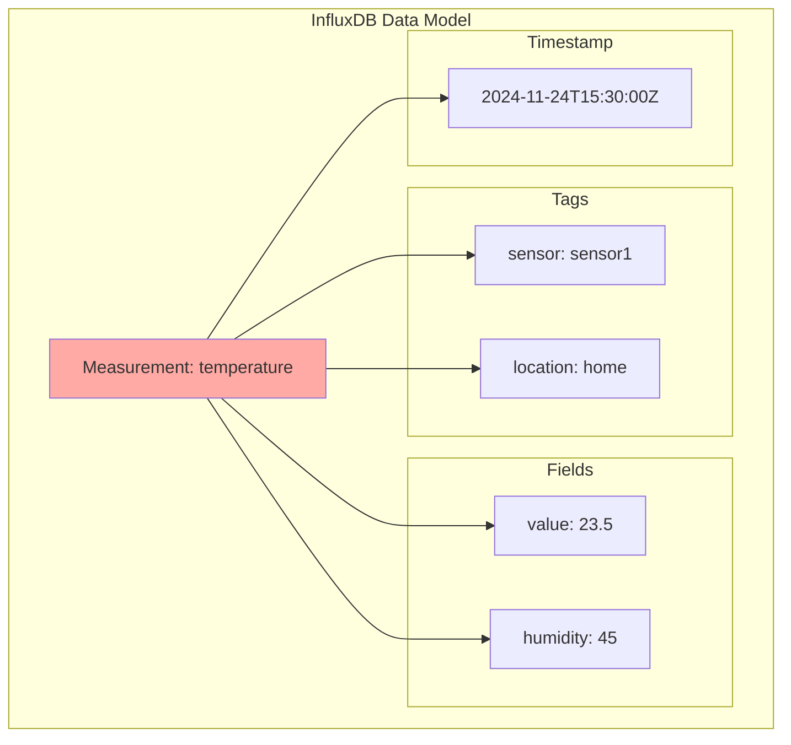

Configuración básica de InfluxDB:
```ini
# /etc/influxdb/influxdb.conf

[http]
  enabled = true
  bind-address = ":8086"
  
[data]
  dir = "/var/lib/influxdb/data"
  wal-dir = "/var/lib/influxdb/wal"
  
# Política de retención
[retention]
  enabled = true
  check-interval = "30m"
```

Comandos útiles de InfluxDB:
```sql
-- Crear base de datos
CREATE DATABASE iot_data

-- Crear política de retención
CREATE RETENTION POLICY "one_month" ON "iot_data" DURATION 30d REPLICATION 1 DEFAULT

-- Consulta básica
SELECT mean("value") 
FROM "temperature" 
WHERE "sensor"='sensor1' 
AND time >= now() - 24h 
GROUP BY time(1h)
```

4. GRAFANA

```tsx
import React from 'react';
import { Card, CardContent } from '@/components/ui/card';

const GrafanaDashboard = () => {
  return (
    <div className="grid grid-cols-2 gap-4 p-4">
      <Card className="col-span-2">
        <CardContent className="p-4">
          <div className="bg-blue-100 p-4 rounded-lg">
            <h3 className="text-lg font-bold mb-2">Temperatura en tiempo real</h3>
            <div className="h-48 bg-white rounded-lg border border-gray-200"></div>
          </div>
        </CardContent>
      </Card>
      
      <Card>
        <CardContent className="p-4">
          <div className="bg-green-100 p-4 rounded-lg">
            <h3 className="text-lg font-bold mb-2">Humedad 24h</h3>
            <div className="h-40 bg-white rounded-lg border border-gray-200"></div>
          </div>
        </CardContent>
      </Card>
      
      <Card>
        <CardContent className="p-4">
          <div className="bg-yellow-100 p-4 rounded-lg">
            <h3 className="text-lg font-bold mb-2">Estadísticas</h3>
            <div className="h-40 bg-white rounded-lg border border-gray-200"></div>
          </div>
        </CardContent>
      </Card>
    </div>
  );
};

export default GrafanaDashboard;

```

Configuración básica de Grafana:
```ini
# /etc/grafana/grafana.ini

[server]
http_port = 3000
domain = localhost

[security]
admin_user = admin

[auth.anonymous]
enabled = false

[snapshots]
external_enabled = false
```

Pasos para configurar un dashboard:

1. Añadir InfluxDB como fuente de datos:
```yaml
Name: InfluxDB
Type: InfluxDB
URL: http://localhost:8086
Database: iot_data
User: grafana_user
Password: ****
```

2. Consulta InfluxQL para panel:
```sql
SELECT mean("value") 
FROM "temperature" 
WHERE $timeFilter 
GROUP BY time($__interval), "sensor"
```

3. Configuración de alertas:
```yaml
Condition: avg() of query(A,5m,now) > 30
Evaluate every: 1m
For: 5m
Notifications:
  - Send to email
  - Send to Telegram
```

Consideraciones de seguridad para todo el stack:

1. MQTT:
- Usar autenticación con usuario y contraseña
- Implementar SSL/TLS para conexiones
- Definir ACLs para control de acceso por topic

2. Node-RED:
- Habilitar autenticación
- Usar HTTPS
- Limitar acceso a nodos críticos

3. InfluxDB:
- Crear usuarios con permisos específicos
- Habilitar autenticación
- Usar HTTPS para API

4. Grafana:
- Cambiar contraseña por defecto
- Configurar HTTPS
- Limitar acceso a dashboards por rol
- Usar autenticación externa (LDAP/OAuth)

Te explicaré paso a paso cómo configurar cada componente para que trabajen juntos en la Raspberry Pi.

1. CONFIGURACIÓN DE MOSQUITTO MQTT


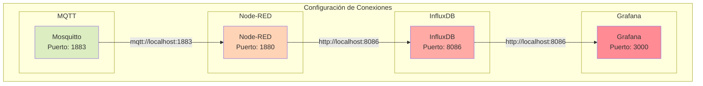

Primero, vamos a configurar cada componente individualmente y luego las conexiones entre ellos:

1. CONFIGURACIÓN DE MOSQUITTO:

```bash
# /etc/mosquitto/mosquitto.conf

# Configuración básica
listener 1883
protocol mqtt

# Habilitar autenticación
allow_anonymous false
password_file /etc/mosquitto/passwd

# Crear usuario y contraseña
sudo mosquitto_passwd -c /etc/mosquitto/passwd mqtt_user
```

2. CONFIGURACIÓN DE NODE-RED:

```javascript
// ~/.node-red/settings.js

module.exports = {
    // Configuración básica
    uiPort: 1880,
    
    // Instalar nodos necesarios
    // npm install node-red-contrib-mqtt-broker
    // npm install node-red-contrib-influxdb
    
    // Configuración de seguridad
    adminAuth: {
        type: "credentials",
        users: [{
            username: "admin",
            password: "tu_password_hasheado",
            permissions: "*"
        }]
    }
}
```

Flujo básico en Node-RED:
```json
[
    {
        "id": "mqtt-in",
        "type": "mqtt in",
        "topic": "sensors/#",
        "broker": "localhost",
        "port": "1883",
        "credentials": {
            "username": "mqtt_user",
            "password": "tu_password"
        }
    },
    {
        "id": "influx-out",
        "type": "influxdb out",
        "database": "iot_data",
        "name": "InfluxDB",
        "url": "http://localhost:8086",
        "measurement": "sensor_data"
    }
]
```

3. CONFIGURACIÓN DE INFLUXDB:

```bash
# /etc/influxdb/influxdb.conf

[http]
  enabled = true
  bind-address = ":8086"
  auth-enabled = true

# Crear base de datos y usuario
influx
> CREATE DATABASE iot_data
> CREATE USER influx_user WITH PASSWORD 'tu_password' WITH ALL PRIVILEGES
> CREATE RETENTION POLICY "30_days" ON "iot_data" DURATION 30d REPLICATION 1 DEFAULT
```

4. CONFIGURACIÓN DE GRAFANA:

```ini
# /etc/grafana/grafana.ini

[server]
http_port = 3000

[security]
admin_user = admin
admin_password = tu_password

[auth.anonymous]
enabled = false
```

5. CONEXIÓN ENTRE COMPONENTES:

A. Conectar Node-RED con MQTT:
```javascript
// En Node-RED, configurar nodo MQTT:
{
    "broker": "localhost",
    "port": "1883",
    "clientid": "node-red-client",
    "username": "mqtt_user",
    "password": "tu_password"
}
```

B. Conectar Node-RED con InfluxDB:
```javascript
// En Node-RED, configurar nodo InfluxDB:
{
    "hostname": "localhost",
    "port": "8086",
    "database": "iot_data",
    "name": "InfluxDB Connection",
    "username": "influx_user",
    "password": "tu_password"
}
```

C. Conectar Grafana con InfluxDB:
En la interfaz web de Grafana (http://localhost:3000):
1. Ir a Configuration → Data Sources
2. Add data source → InfluxDB
3. Configurar:
```yaml
Name: InfluxDB
URL: http://localhost:8086
Database: iot_data
User: influx_user
Password: tu_password
```

6. VERIFICACIÓN DE CONEXIONES:

```bash
# Probar MQTT
mosquitto_pub -h localhost -p 1883 -u mqtt_user -P tu_password -t "sensors/test" -m "23.5"

# Verificar InfluxDB
curl -G 'http://localhost:8086/query?db=iot_data' \
  --data-urlencode 'q=SELECT * FROM sensor_data' \
  -u influx_user:tu_password

# Verificar Grafana
curl http://localhost:3000/api/health
```

7. SCRIPT DE PRUEBA COMPLETO:

```python
import paho.mqtt.client as mqtt
import time
import random

# Configuración MQTT
client = mqtt.Client()
client.username_pw_set("mqtt_user", "tu_password")

# Conectar y publicar datos
client.connect("localhost", 1883, 60)
client.loop_start()

while True:
    temperatura = random.uniform(20, 30)
    humedad = random.uniform(40, 60)
    
    client.publish("sensors/temperatura", temperatura)
    client.publish("sensors/humedad", humedad)
    
    time.sleep(5)
```

CONSIDERACIONES DE SEGURIDAD:

1. Cambiar todas las contraseñas por defecto
2. Usar HTTPS cuando sea posible
3. Limitar el acceso a puertos específicos en el firewall
4. Mantener actualizados todos los componentes

```bash
# Configurar firewall
sudo ufw allow 1883  # MQTT
sudo ufw allow 1880  # Node-RED
sudo ufw allow 8086  # InfluxDB
sudo ufw allow 3000  # Grafana
```

¿Necesitas que profundice en algún aspecto específico de la configuración o que te explique cómo verificar que todo funciona correctamente?

### Instalación usando  Docker

Docker es una plataforma de virtualización a nivel de sistema operativo que permite empaquetar aplicaciones y sus dependencias en unidades estandarizadas llamadas contenedores. Piensa en un contenedor como una caja que contiene todo lo necesario para que una aplicación funcione, incluyendo:

- El código de la aplicación
- Las bibliotecas necesarias
- Las dependencias
- Las configuraciones
- El entorno de ejecución

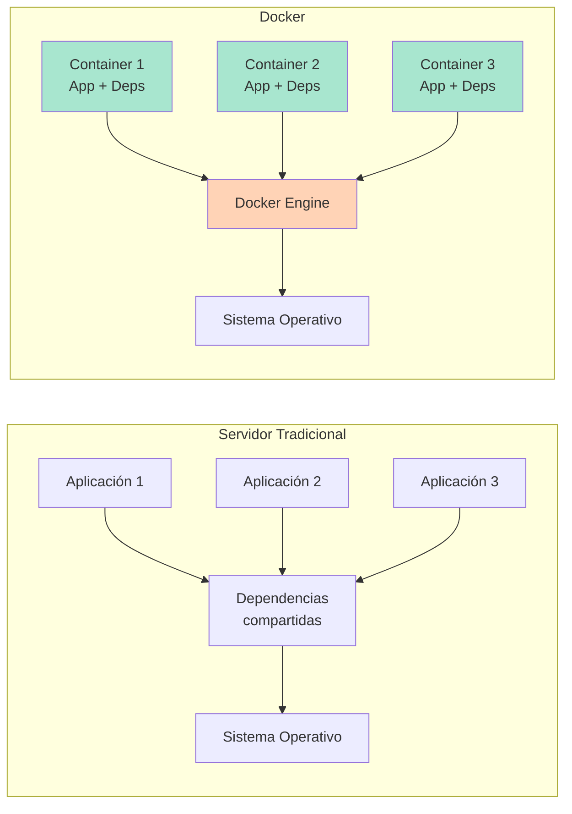

Principales ventajas:

1. Portabilidad
- "Si funciona en mi máquina, funcionará en cualquier lugar"
- Elimina problemas de "en mi ordenador funciona"
- Mismo comportamiento en desarrollo y producción

2. Consistencia
- Todos los desarrolladores trabajan en el mismo entorno
- Fácil replicación de entornos
- Control de versiones de todo el entorno

3. Eficiencia
- Menos recursos que las máquinas virtuales tradicionales
- Inicio rápido de aplicaciones
- Mejor aprovechamiento del hardware

4. Aislamiento
- Las aplicaciones no interfieren entre sí
- Cada contenedor tiene sus propias dependencias
- Mayor seguridad

5. Escalabilidad
- Fácil de replicar contenedores
- Actualización sencilla de aplicaciones
- Gestión simplificada de servicios

En resumen, Docker resuelve el problema común de "funciona en mi máquina" al empaquetar todo lo necesario para ejecutar una aplicación en un contenedor portable y aislado, facilitando enormemente el desarrollo, distribución y ejecución de software.

Veamos más detalles para  entender Docker, su arquitectura y utilidad.


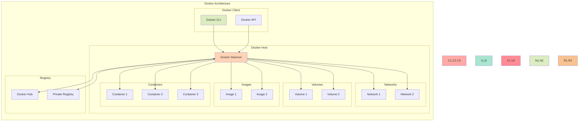

DOCKER: CONCEPTOS BÁSICOS

1. ¿Qué es Docker?
- Sistema de virtualización a nivel de sistema operativo
- Permite empaquetar aplicaciones y dependencias en contenedores
- Los contenedores son ligeros, portables y aislados
- Facilita el desarrollo, distribución y ejecución de aplicaciones

2. Componentes Principales:

a) Docker Engine:
- Daemon (dockerd): Gestiona contenedores, imágenes, redes y volúmenes
- REST API: Interfaz para interactuar con el daemon
- CLI (docker): Interfaz de línea de comandos

b) Imágenes:
- Plantillas de solo lectura
- Contienen el sistema operativo, aplicación y dependencias
- Se construyen por capas
- Se definen mediante un Dockerfile

c) Contenedores:
- Instancias ejecutables de imágenes
- Aislados pero comparten el kernel del host
- Tienen su propio sistema de archivos, red y procesos
- Son efímeros (los cambios no persisten por defecto)

3. Ventajas de Docker:

```plaintext
1. Consistencia:
   - Mismo entorno en desarrollo y producción
   - "Works on my machine" → "Works everywhere"

2. Aislamiento:
   - Aplicaciones no interfieren entre sí
   - Mejor seguridad y control de recursos

3. Portabilidad:
   - Funciona en cualquier plataforma que soporte Docker
   - Fácil distribución y despliegue

4. Eficiencia:
   - Menos sobrecarga que las máquinas virtuales
   - Inicio rápido y bajo consumo de recursos

5. Escalabilidad:
   - Fácil replicación de contenedores
   - Integración con orquestadores (Kubernetes, Swarm)
```

COMANDOS BÁSICOS:

```bash
# Gestión de imágenes
docker pull nginx               # Descargar imagen
docker build -t myapp .        # Construir imagen
docker images                  # Listar imágenes

# Gestión de contenedores
docker run -d -p 80:80 nginx   # Crear y ejecutar contenedor
docker ps                      # Listar contenedores en ejecución
docker stop container_id       # Detener contenedor
docker rm container_id         # Eliminar contenedor

# Redes y volúmenes
docker network create mynet    # Crear red
docker volume create mydata    # Crear volumen
```

EJEMPLO DE DOCKERFILE:

```dockerfile
# Imagen base
FROM python:3.9-slim

# Directorio de trabajo
WORKDIR /app

# Copiar archivos necesarios
COPY requirements.txt .
COPY app.py .

# Instalar dependencias
RUN pip install -r requirements.txt

# Puerto a exponer
EXPOSE 5000

# Comando de inicio
CMD ["python", "app.py"]
```

CASOS DE USO COMUNES:

1. Desarrollo:
- Entornos de desarrollo consistentes
- Aislamiento de dependencias
- Pruebas en diferentes versiones

2. Integración Continua:
- Construcción automatizada
- Pruebas en contenedores aislados
- Despliegue consistente

3. Microservicios:
- Servicios independientes
- Fácil escalado
- Gestión simplificada

4. Aplicaciones Legacy:
- Encapsulación de aplicaciones antiguas
- Compatibilidad con versiones específicas
- Migración gradual

MEJORES PRÁCTICAS:

1. Imágenes:
- Usar imágenes oficiales como base
- Minimizar capas y tamaño
- Implementar multi-stage builds
- Especificar versiones exactas

2. Seguridad:
- No ejecutar como root
- Escanear vulnerabilidades
- Limitar capacidades
- Mantener imágenes actualizadas

3. Rendimiento:
- Optimizar caché de capas
- Minimizar datos copiados
- Usar .dockerignore
- Implementar health checks

4. Gestión:
- Usar docker-compose para múltiples servicios
- Implementar logging adecuado
- Monitorizar recursos
- Establecer políticas de reinicio

¿Te gustaría que profundice en algún aspecto específico de Docker o que te muestre ejemplos prácticos de algún caso de uso particular?

### Instalación del IOTStack en Raspberry usando Docker

La instalación del IOTStack usando Docker es bastante más sencilla y además nos permite tener preparado nuestro sistema para ampliaciones y es más tolerante a errores.

 Veamos cómo instalar el IoT Stack usando Docker, lo que nos permitirá tener todos los servicios containerizados y fácilmente gestionables.


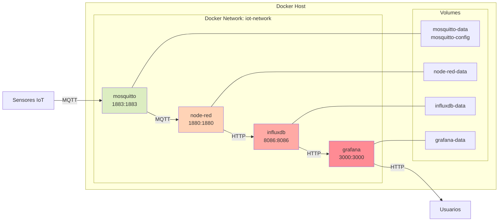


Para ello usaremos Docker Compose, una herramienta que permite definir y gestionar aplicaciones multi-contenedor. Sus principales características son:
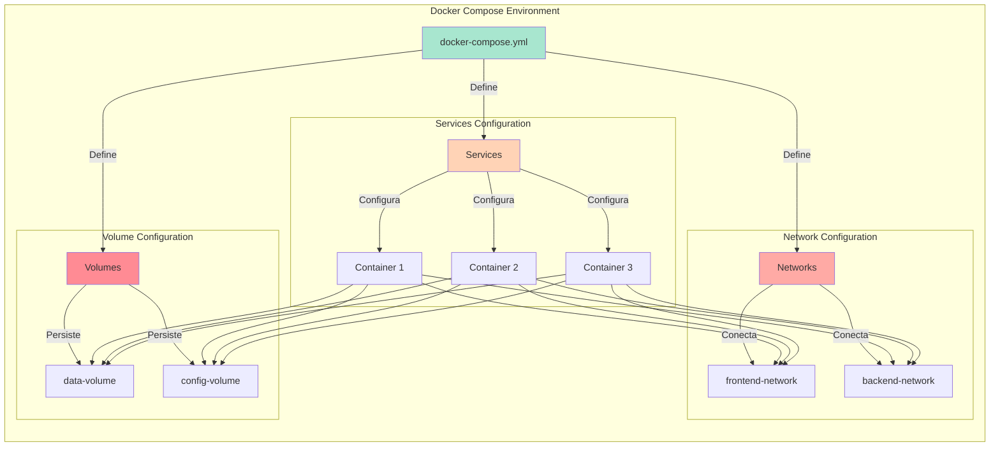


1. ESTRUCTURA BÁSICA:
```yaml
version: '3.8'                 # Versión de Docker Compose
services:                      # Definición de servicios (contenedores)
networks:                      # Redes personalizadas
volumes:                       # Volúmenes persistentes
```

2. EJEMPLO PRÁCTICO:
```yaml
version: '3.8'

services:
  # Servicio Web
  webapp:
    image: nginx:latest                # Imagen a usar
    ports:
      - "80:80"                        # Mapeo de puertos
    volumes:
      - ./web:/usr/share/nginx/html    # Montaje de volumen
    environment:                       # Variables de entorno
      - NODE_ENV=production
    depends_on:                        # Dependencias
      - db
    restart: unless-stopped            # Política de reinicio

  # Base de datos
  db:
    image: mysql:8.0
    environment:
      - MYSQL_ROOT_PASSWORD=secreto
      - MYSQL_DATABASE=app
    volumes:
      - db_data:/var/lib/mysql

volumes:
  db_data:                            # Volumen persistente

networks:
  app_network:                        # Red personalizada
    driver: bridge
```

3. PRINCIPALES ELEMENTOS:

a) Services (Servicios):
- Define cada contenedor
- Especifica imagen, configuración y recursos
- Gestiona dependencias entre contenedores
- Configura redes y volúmenes

b) Networks (Redes):
- Conecta contenedores entre sí
- Aísla grupos de servicios
- Configura DNS interno
- Gestiona comunicación

c) Volumes (Volúmenes):
- Persiste datos
- Comparte archivos entre contenedores
- Gestiona backups
- Mejora rendimiento

4. COMANDOS PRINCIPALES:
```bash
# Iniciar servicios
docker-compose up -d

# Detener servicios
docker-compose down

# Ver logs
docker-compose logs

# Listar servicios
docker-compose ps

# Reiniciar servicio específico
docker-compose restart servicio

# Construir imágenes
docker-compose build
```

5. CARACTERÍSTICAS AVANZADAS:

```yaml
services:
  webapp:
    build:                          # Construir imagen personalizada
      context: ./app
      dockerfile: Dockerfile.dev
    deploy:                         # Configuración de despliegue
      replicas: 3
      resources:
        limits:
          cpus: '0.5'
          memory: 512M
    healthcheck:                    # Verificación de salud
      test: ["CMD", "curl", "-f", "http://localhost"]
      interval: 30s
      timeout: 10s
      retries: 3
```

6. VARIABLES DE ENTORNO:

a) En archivo .env:
```plaintext
MYSQL_ROOT_PASSWORD=secreto
MYSQL_DATABASE=app
```

b) En docker-compose.yml:
```yaml
services:
  db:
    environment:
      - MYSQL_ROOT_PASSWORD=${MYSQL_ROOT_PASSWORD}
      - MYSQL_DATABASE=${MYSQL_DATABASE}
```

7. CONFIGURACIÓN DE REDES:
```yaml
services:
  frontend:
    networks:
      - frontend-net
      
  backend:
    networks:
      - frontend-net
      - backend-net
      
networks:
  frontend-net:
  backend-net:
    internal: true  # Red aislada
```

8. BUENAS PRÁCTICAS:

1. Organización:
- Un servicio por contenedor
- Nombres descriptivos
- Documentar configuraciones
- Usar variables de entorno

2. Seguridad:
- No exponer puertos innecesarios
- Usar redes internas cuando sea posible
- Limitar recursos
- Gestionar secretos adecuadamente

3. Rendimiento:
- Usar build cache
- Optimizar imágenes
- Configurar healthchecks
- Gestionar logs apropiadamente

Docker Compose simplifica enormemente la gestión de aplicaciones multi-contenedor, permitiendo definir toda la infraestructura como código y facilitando el desarrollo, pruebas y despliegue de aplicaciones complejas.

Veamos para nuestro IOTStack

1. CREAR DOCKER-COMPOSE:

```yaml
# docker-compose.yml

version: '3.8'

services:
  mosquitto:
    image: eclipse-mosquitto:latest
    ports:
      - "1883:1883"
      - "9001:9001"
    volumes:
      - ./mosquitto/config:/mosquitto/config
      - ./mosquitto/data:/mosquitto/data
      - ./mosquitto/log:/mosquitto/log
    restart: unless-stopped
    networks:
      - iot-network

  node-red:
    image: nodered/node-red:latest
    ports:
      - "1880:1880"
    volumes:
      - ./node-red-data:/data
    depends_on:
      - mosquitto
      - influxdb
    restart: unless-stopped
    networks:
      - iot-network

  influxdb:
    image: influxdb:2.0
    ports:
      - "8086:8086"
    volumes:
      - ./influxdb-data:/var/lib/influxdb2
    environment:
      - DOCKER_INFLUXDB_INIT_MODE=setup
      - DOCKER_INFLUXDB_INIT_USERNAME=admin
      - DOCKER_INFLUXDB_INIT_PASSWORD=your_password
      - DOCKER_INFLUXDB_INIT_ORG=your_org
      - DOCKER_INFLUXDB_INIT_BUCKET=iot_data
    restart: unless-stopped
    networks:
      - iot-network

  grafana:
    image: grafana/grafana:latest
    ports:
      - "3000:3000"
    volumes:
      - ./grafana-data:/var/lib/grafana
    depends_on:
      - influxdb
    environment:
      - GF_SECURITY_ADMIN_USER=admin
      - GF_SECURITY_ADMIN_PASSWORD=your_password
    restart: unless-stopped
    networks:
      - iot-network

networks:
  iot-network:
    driver: bridge
```

2. CONFIGURACIÓN DE MOSQUITTO:

```bash
# Crear directorios necesarios
mkdir -p mosquitto/config mosquitto/data mosquitto/log

# Crear archivo de configuración
cat > mosquitto/config/mosquitto.conf << EOF
listener 1883
allow_anonymous false
password_file /mosquitto/config/passwd
persistence true
persistence_location /mosquitto/data/
log_dest file /mosquitto/log/mosquitto.log
EOF

# Crear archivo de contraseñas
docker-compose exec mosquitto mosquitto_passwd -c /mosquitto/config/passwd mqtt_user
```

3. CONFIGURACIÓN INICIAL:

```bash
# Crear directorios para volúmenes
mkdir node-red-data influxdb-data grafana-data

# Establecer permisos
sudo chown -R 1000:1000 node-red-data
sudo chown -R 472:472 grafana-data

# Iniciar los servicios
docker-compose up -d
```

4. VERIFICACIÓN DE SERVICIOS:

```bash
# Verificar estado de los contenedores
docker-compose ps

# Ver logs de cada servicio
docker-compose logs mosquitto
docker-compose logs node-red
docker-compose logs influxdb
docker-compose logs grafana
```

5. SCRIPTS DE ADMINISTRACIÓN:

```bash
# backup.sh - Script de respaldo
#!/bin/bash
BACKUP_DIR="./backups/$(date +%Y%m%d)"
mkdir -p $BACKUP_DIR

# Detener servicios
docker-compose down

# Respaldar datos
tar czf $BACKUP_DIR/mosquitto-data.tar.gz mosquitto/
tar czf $BACKUP_DIR/node-red-data.tar.gz node-red-data/
tar czf $BACKUP_DIR/influxdb-data.tar.gz influxdb-data/
tar czf $BACKUP_DIR/grafana-data.tar.gz grafana-data/

# Reiniciar servicios
docker-compose up -d
```

6. COMANDOS ÚTILES:

```bash
# Iniciar todos los servicios
docker-compose up -d

# Detener todos los servicios
docker-compose down

# Reiniciar un servicio específico
docker-compose restart mosquitto

# Ver logs en tiempo real
docker-compose logs -f

# Actualizar imágenes
docker-compose pull
docker-compose up -d
```

7. PRUEBA DEL SISTEMA:

```python
# test_mqtt.py
import paho.mqtt.client as mqtt
import json
import time

def on_connect(client, userdata, flags, rc):
    print(f"Connected with result code {rc}")

client = mqtt.Client()
client.on_connect = on_connect
client.username_pw_set("mqtt_user", "your_password")

client.connect("localhost", 1883, 60)

while True:
    data = {
        "temperature": 25.5,
        "humidity": 60
    }
    client.publish("sensors/data", json.dumps(data))
    time.sleep(5)
```

8. CONSIDERACIONES DE SEGURIDAD:

```bash
# Asegurar archivos de configuración
chmod 600 mosquitto/config/passwd
chmod 600 docker-compose.yml

# Configurar firewall
sudo ufw allow 1883  # MQTT
sudo ufw allow 1880  # Node-RED
sudo ufw allow 8086  # InfluxDB
sudo ufw allow 3000  # Grafana
```

Para acceder a los servicios una vez instalados:
- Node-RED: http://localhost:1880
- InfluxDB: localhost:8086
- Grafana: http://localhost:3000

### Instalación automática

Para una primera versión o si no nos queremos complicar, podemos usar el [proyecto IOTStack](https://github.com/SensorsIot/IOTstack) que automatiza la instalación y configuración de muchos servicios y sistemas dentro de  contenedores para nuestra querida Raspberry Pi . Seguiremos [su documentación](https://sensorsiot.github.io/IOTstack/Basic_setup/)

Para ello descargamos el script de instalación y lo ejecutamos:

```bash
curl -fsSL https://raw.githubusercontent.com/SensorsIot/IOTstack/master/install.sh | bash
```

El script está pensado para que se ejecute varias veces si es necesario y va instalando todo lo necesario. Puede necesitar reiniciar la Raspberry Pi y lo hará.

Una vez instalado, ejecutamos el menú de configuración:

```bash
cd ~/IOTstack
./menu.sh
```

Que nos permitirá seleccionar los servicios que queremos instalar y configurar. Generará nuestro fichero `docker-compose.yml`

### Pruebas 

* mosquitto: raspy4.local:1883
- Node-RED: http://raspy5.local:1880
- InfluxDB: raspy5.local:8086
- Grafana: http://raspy5.local:3000
#### Pruebas mosquitto

Para publicar y recibir mensajes necesitaremos las herramientas cliente, que podemos instalar con:

```shell
sudo apt install mosquitto-clients
```

Podemos suscribirnos a un tema/topic con el comando:

```shell
mosquitto_sub -h servidorMQTT -t "#"
```

Para publicar en un "Topic" un "Mensaje" (siempre son cadenas):

```shell
mosquitto_pub -h servidorMQTT -t "Topic" -m "Mensaje"
```

### Pruebas node-red


### Pruebas Grafana

* Entramos con usuario _admin/admin_
* Cambiamos la clave

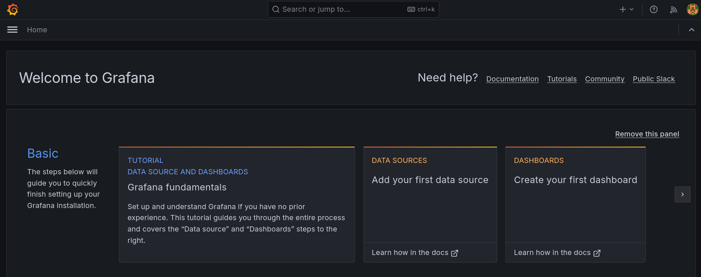

