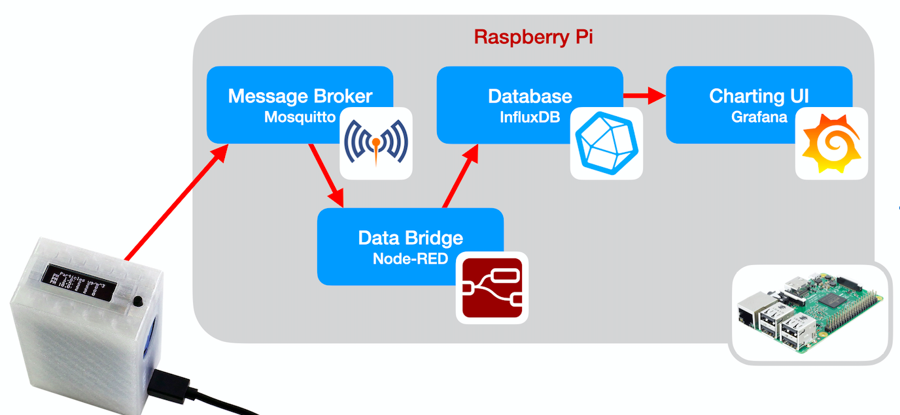
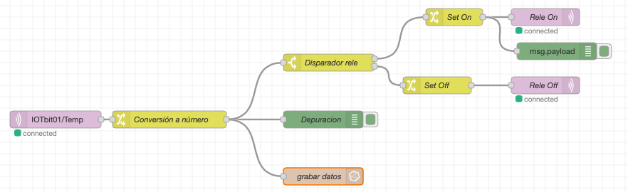

# Raspberry Pi


Raspberry Pi ordenador en una sola placa, de pequeño tamaño y bajo costo, que se ha diseñado para ser utilizada en proyectos de enseñanza de la informática y la programación. Aunque es pequeña, Raspberry Pi cuenta con un procesador potente y puede ser utilizada para muchas de las mismas tareas que una computadora de escritorio o portátil tradicional.

Raspberry Pi se ha utilizado ampliamente en proyectos de robótica y para crear aplicaciones para la Internet de las cosas (IoT). También se ha utilizado para construir sistemas embebidos y media centers, y se ha utilizado en proyectos de ensamblaje de computadoras y en la enseñanza de la programación.

Raspberry Pi es una placa de computadora muy versátil y puede ser utilizada en una amplia variedad de proyectos y aplicaciones. Es especialmente popular entre los aficionados a la tecnología y los educadores debido a su bajo costo y su capacidad para ser utilizada en proyectos de enseñanza.

## Software usado

100% Open Source

* Raspberry Pi OS
* Broker de conexiones (MQTT): mosquitto
* Programación de flujos: NodeRed
* Base de datos: InfluxDB
* Servidor gráfico: Grafana


## Detalles técnicos


La Raspberry Pi 5 es la última versión de la placa de computadora de bajo costo de Raspberry Pi. Algunas de sus características técnicas incluyen:

**Procesador**: La Raspberry Pi 5 viene con un procesador de cuatro núcleos Quad-core Arm Cortex-A76 a 2,4 GHz.

**Memoria**: La Raspberry Pi 5 viene en versiones con hasta16 GB de RAM LPDDR4.

**Almacenamiento**: La Raspberry Pi 4 viene con un slot para tarjeta microSD para almacenamiento masivo.

**Conectividad**: La Raspberry Pi 5 viene con conectividad Ethernet Gigabit y Wi-Fi 5 (IEEE 802.11ac). También tiene Bluetooth 5.0.

**Puertos**: La Raspberry Pi 5 tiene 
* 2 puertos HDMI de alta definición
* 2 puertos USB 2.0
* 2 puertos USB 3.0
* Puerto Ethernet Gigabit
* 2  puertos MIPI de 4 pistas (para cámaras o monitores)
* Puerto PCIe 2.0 para dispositivos de alta velocidad (Discos SSD, coprocesadores IA)
* Puerto GPIO 40 pines
* Puerto de carga USB-C para alimentación. 

**Dimensiones**: La Raspberry Pi 5 mide 85 x 56 x 17 mm.

**Sistema operativo**: La Raspberry Pi 5 es compatible con varios sistemas operativos, incluyendo Raspberry Pi OS (un sistema operativo basado en Debian especialmente diseñado para Raspberry Pi), así como otras distribuciones de Linux y sistemas operativos basados en Unix. También es compatible con Windows 10 IoT.
# Arquitectura IOT

Para que la Raspberry Pi actúe como un servidor de IOT, necesitamos que estén instalados y funcionando al menos 4 servicios, que reciben, formatean, almacenan y muestran los datos


* Mosquitto - servidor (Broker) MQTT al que  se conectan los dispositivos remotos usando el protocolo MQTT. Es el servidor al que nos conectamos, en el programa pondremos los datos de conexión (wifi), IP y puerto del servidor. También necesitamos especificar el protocolo MQTT y por eso usamos bloques para este tipo de conexión
* Node-RED - servicio que convierte los datos recibidos desde MQTT en un formato adecuado para procesarlos, convirtiendo los datos en valores decimales y añadiéndoles fecha y hora de recepción. Una vez convertidos los inserta en la base de datos. Necesitamos establecer un 
* InfluxDB - base de datos donde se guardan los datos recibidos, preparándolos para que se puedan procesar, filtrar, generar acumulados, promedios...
* Grafana - sistema de visualización de datos que nos permite filtrar, agregar y mostrar gráficamente
## Mosquitto

Configuración Wifi para conectividad: SSID y contraseña
Configuración broker MQTT: IP y puerto

Cada dispositivo tiene un nombre distinto para poder distinguir los datos de cada uno. Los datos que se envía van etiquetados con ese nombre

Veremos en la pantalla OLED los datos que se envían

Si estamos habituados a trabajar con la Raspberry Pi, podemos comprobar que los datos que llegan al servidor con el comando 

```sh
mosquitto_sub -h 192.168.1.100 -t "#" -d
```

y veremos los datos que llegan

```sh
Client mosqsub|18752-raspi4 received PUBLISH (d0, q0, r0, m0, 'IOTbit01/Temp', ... (2 bytes))
24
Client mosqsub|18752-raspi4 received PUBLISH (d0, q0, r0, m0, 'IOTbit01/rele', ... (2 bytes))
On
Client mosqsub|18752-raspi4 received PUBLISH (d0, q0, r0, m0, 'IOTbit01/Luz', ... (1 bytes))
8
Client mosqsub|18752-raspi4 received PUBLISH (d0, q0, r0, m0, 'IOTbit01/envios', ... (2 bytes))
```

## Node-Red

En Node-Red definimos los flujos de datos para transformar los datos que envía la micro:bit (que vienen en formato texto) en datos numéricos, etiquetándolos con fecha y hora. Podemos conectarnos desde un navegador a  http://raspiIP:1880 (sustituyendo raspiIP por la IP de la Raspberry Pi)



Cuando se recibe un dato, se filtra por el nombre, se convierte a número y por un lado se guarda en la base de datos y por otro se comprueba si la temperatura es mayor o menor de 22 grados se envía una orden para hacer que el led se ilumine en rojo o en verde

Por cada placa micro:bit, con un nombre distinto tenemos que crear una copia de esta regla con la etiqueta adecuada según el nombre de la placa tanto en la recepción de datos como en el guardado de datos en la base de datos.

Podemos copiar todo el flujo con Ctrl+C y hacer una copia con Ctrl+V 

En el nuevo cambiamos la etiqueta del paquete que se recibe y en el nodo de grabación de datos. También deberíamos cambiar el nombre paquete para control del LED por el correspondiente a su número

Hacemos "Deploy"

## InfluxDB

Datos guardados en formato de series temporales para facilitar su recuperación

## Grafana

Creamos cada gráfica que queremos mostrar. Filtramos los datos según lo que queramos mostrar. Para ello tenemos que haber recibido algunos datos.

http://raspiIP:3000 con usuario/contraseña admin/admin

[Vídeo resumen](https://youtu.be/yV0yYC0gze0)
[](https://youtu.be/yV0yYC0gze0)

# Instalación

Raspberry Pi OS 64

usuario/contraseña de la Raspberry Pi  pi/raspberry

## ssh y VNC

Activamos el acceso remoto con ssh y VNC

## Actualización


```sh
sudo apt update
sudo apt full-upgrade
sudo apt autoclean
sudo apt autoremove
```

Cambiamos el idioma y la configuración de teclado   


## Software

### MQTT broker - mosquitto

```sh
sudo apt install mosquitto mosquitto-clients
```

Editamos la configuracion __/etc/mosquitto/mosquitto.conf__

```sh
port 1883

allow_anonymous true
```

(http://www.steves-internet-guide.com/mossquitto-conf-file/)

#### test

```sh
mosquitto_sub -t "#" -v

# (desde otra maquina)

mosquitto_pub -h raspiIP -t '/test' -m 'hola'
```

Cambiando raspiIP por la IP de nuestra Raspberry Pi

## node-red

instalacion

```sh 
bash <(curl -sL https://raw.githubusercontent.com/node-red/linux-installers/master/deb/update-nodejs-and-nodered)
```

Activamos como servicio

```sh
sudo systemctl enable nodered.service
```

Arrancamos

```sh
sudo systemctl start nodered.service
```

Accedemos desde un navegador 

```
http://raspiIP:1880
```

con usuario/contraseña pi/ParqueCiencias55

# Flujo

* Damos de alta el servidor MQTT
* Añadimos la paleta de influxDB
* Damos de alta el servidor InfluxDB


## influxDB

```sh
sudo apt install influxdb influxdb-client
influx

>> create database lora_db
```

# Grafana

## instalacion grafana

```sh
curl https://apt.grafana.com/gpg.key | gpg --dearmor | sudo tee /usr/share/keyrings/grafana-archive-keyrings.gpg >/dev/null

echo "deb [signed-by=/usr/share/keyrings/grafana-archive-keyrings.gpg] https://apt.grafana.com stable main" | sudo tee /etc/apt/sources.list.d/grafana.list

sudo apt update 

sudo apt install grafana

## admin/admin

sudo systemctl enable grafana-server.service

sudo systemctl start grafana-server.service
```

Podemos acceder con usuario/contraseña admin/ParqueCiencias55

```sh
http://raspiIP:3000
```

(Cambiando raspiIP por la IP de la Raspberry Pi)

## Configuración de vistas


* add influxdb como Datasource

* Add dashboard y select measurement

sudo /bin/systemctl enable grafana-server

sudo /bin/systemctl start grafana-server


