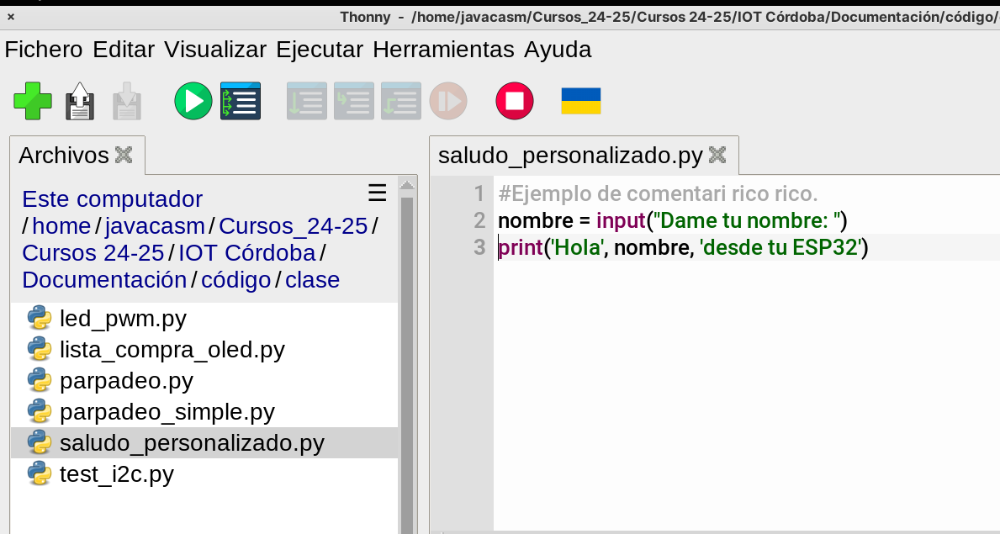
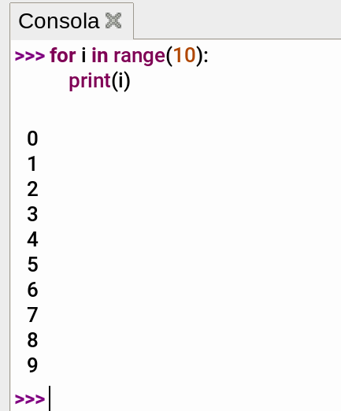
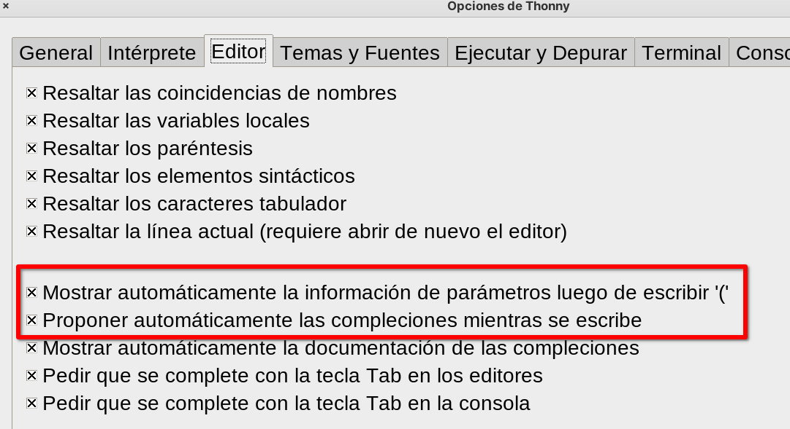
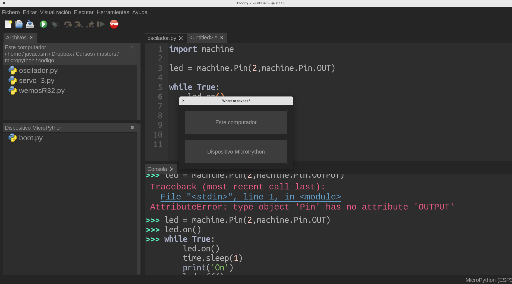

# Sesiones 1 y 2

* Instalación de [Thonny](https://thonny.org)
* Primeros programas


1. Desde la barra de herramientas podemos crear nuevos documentos, abrirlos o guardarlos. También podemos ejecutarlos o detenerlos
2. En el **editor** es donde creamos y editados los programas. Podemos abrir varios en diferentes pestañas y los podemos ejecutar.
3. En la **consola** podemos ejecutar nuestro código interactivamente, es decir se va ejecutando a medida que lo escribimos y pulsamos la tecla "Enter"

### Programa saludo

Empezamos con el clásico "Hola mundo" en la consola (usando la función _print_):

```python
>>> print('Hola Mundo')
'Hola Mundo'
```

(llamamos prompt a '>>>', nos indica que el intérprete de python está esperando nuestros comandos)

También podemos pedir al usuario que escriba su nombre y lo guardamos en una variable con _input_. Guardamos su valor en la variable y podemos mostrarlo en pantalla con _print_

```python
>>> nombre = input('Escribe tu nombre: ')
```


Ahora vamos a crear un fichero con todo junto, añadiendo un comentario que empezará con el caracter '#' al principio

```python
# Programa de saludo personalizado
nombre = input('Escribe tu nombre: ')
print('Hola', nombre, 'desde tu ESP32')
```

Abrimos la pestaña "Archivos" desde el menú "Visualizar", seleccionamos el directorio donde queremos guardar nuestro código y lo guardamos con la opción "Guardar" del menú "Fichero"


## Primeros bucles

Para hacer un bucle que nos recorra un grupo de números podemos usar el bucle _for_

```python
for i in range(10):
    print(i)
```



Vemos que hace un bucle desde 0 hasta el número anterior al indicado en _range_.

Si queremos hacer un bucle entre otros números podemos usar _rango(numero_inicial,numero_final+1,incremento)_ donde _incremento_ indica cuando sumamos al número anterior en cada repetición

Vamos a hacer un programa que nos pida un número inicial y otro final  y que nos muestre los números entre uno y otro.

Como la función _input_ siempre almacena lo que escribimos como texto, tendremos que convertirlo en entero con la función _int_ para poder iterar.

Los nombres de las variables no pueden contener espacios, acentos, ni ñ. Si que pueden contener "_" que usaremos para mayor claridad. Intenta siempre que tu variable tenga un nombre descriptivo. No te  importe que sea largo porque el autocompletado te ayuda. Recuerda activarlo desde la configuración:


El [programa](./código/clase/bucle_personalizado.py) quedará así:

```python
# bucle personalizado entre 2 números dados

numero_inicial = input('Indica el número inicial: ')
numero_inicial_entero = int(numero_inicial)

numero_final = input('Indica el número final: ')
numero_final_entero = int(numero_final)

for i in range(numero_inicial_entero, numero_final_entero+1):
    print(i)

```

## Lista de la compra

Una **lista** es una colección de cosas, puede contener cualquier tipo de elementos, texto, número, o cualquier cosa, incluso mezclados:

```python
>>> lista_compra = ['cafe','patata','cerveza','papel higienico']
```

Podemos acceder a un elemento concreto indicando su posición, teniendo en cuenta que el primer elemento es el 0.

```python
>>> lista_compra[2]
'cerveza'
```

Vamos a hacer un [programa](./codigo/clase/lista_compra.py) que:

* Contenga una lista de la compra básica.
* Nos la muestre en la consola
* Nos pregunta si queremos añadir más elementos hasta que contestemos 'no'
* Nos vuelve a mostrar la nueva lista

```python
'''
Programa para gestionar la lista de la compra
'''

lista_compra = ['cafe','patata','cerveza','papel higienico']

def mostrar_lista_compra(): #definición de la función
    for i in lista_compra:
        print(i) 
                                 
mostrar_lista_compra() # ejecuto la función

while True: # bucle  
    compra = input("¿Quieres comprar algo más? ('no' para terminar) ")
    if compra != 'no': # comparamos lo que hemos escrito 
        lista_compra.append(compra) # añadimos el elemento a la lista
    else:
        break  # salimos del bucle
mostrar_lista_compra() # ejecuto la función

```

Para no repetir nuestro código hemos hecho una **función**  _mostrar_lista_compra  que ejecutamos en 2 ocasiones

## Instalación de firmware micropython

Consulta la documentación "3.0 Micropython.pdf" para ver detalles de cómo instalar el firmware

## Placa LilyGo Lora32


Vemos dónde está conectada la pantalla OLED, la tarjeta SD, el módulo LORA y las capacidades que tiene cada patilla.

## Parpadeando leds

Vemos en la imagen anterior que el led de la placa está conectado en el pin 25. Hacemos un sencillo programa que hace parpadear el led

```python
# import machine
from machine import Pin 
from time import sleep_ms, sleep 

#led =machine.Pin(25, machine.Pin.OUT)
led = Pin(25,Pin.OUT)

while True: # bucle infinito o el loop de arduino
    led.on()
    sleep_ms(50)
    led.off()
    sleep_ms(210)
```

Si tenemos la placa conectada, al guardar un fichero, nos preguntará si queremos guardarlo en el PC o en la placa



### Controlando el brillo de un led

Usamos **PWM** para controlar el brillo de un led. Podemos graduar el b rillo entre 0 (apagado) y 1023, máximo  brillo 

Podemos ver los detalles sobre el uso de **PWM** en la [documentación oficial de micropython para ESP32](https://docs.micropython.org/en/latest/esp32/quickref.html#pwm-pulse-width-modulation)

```python
# import machine
from machine import Pin , PWM
from time import sleep_ms, sleep 

#led =machine.Pin(25, machine.Pin.OUT)
led = Pin(25,Pin.OUT)

led_pwm = PWM(led)
led_pwm.freq(500) # cambio la frecuencia PWM a 500
print('Frecuencia del PWM:',led_pwm.freq())

for brillo in range(0,1024,4): # entre 0 y 1023
    led_pwm.duty(brillo)
    sleep_ms(5)
    
for brillo in range(1022,0,-4): # entre 1022 y 0
    led_pwm.duty(brillo)
    sleep_ms(5)
led_pwm.duty(0) # apagamos todo el brillo
```

## Pantalla Oled

Podemos usar la pantalla OLED incluída sin más que indicar la configuración de los pines I2C y declarando una variable de tipo **SSD1306_I2C**


```python
>>> from machine import Pin, SoftI2C
>>> from ssd1306 import SSD1306_I2C

>>> i2c = SoftI2C(scl=Pin(22), sda=Pin(21))

>>> pantalla = SSD1306_I2C(128, 64, i2c) # ancho, algo, conexión i2c
>>> pantalla.text('Hola OLED',0,0,1) # texto, x, y, color
```
Veremos en pantalla el texto indicado.


Vamos a añadir el código para usar la pantalla OLED a nuestro programa de la compra, para que ésta se muestre en la pantalla

```python
'''
Programa para gestionar la lista de la compra y que se muestre en la pantalla OLED
'''
from machine import Pin, SoftI2C
from ssd1306 import SSD1306_I2C

i2c = SoftI2C(scl=Pin(22), sda=Pin(21))

pantalla = SSD1306_I2C(128, 64, i2c) # ancho, algo, conexión i2c
pantalla.fill(0) # borro la pantalla

lista_compra = ['cafe','patata','cerveza','papel higienico']

def mostrar_lista_compra_oled(): #definición de la función
    y = 0
    for i in lista_compra:
        pantalla.text(i,0,y,1)
        y = y + 9 # 8 pixel de cada letra + 1 pixel de espacio
        print(i)
    pantalla.show()     
                                 
mostrar_lista_compra_oled() # ejecuto la función

while True:
    compra = input("¿Quieres comprar algo más? ('no' para terminar) ")
    if compra != 'no':
        lista_compra.append(compra)
    else:
        break 

mostrar_lista_compra_oled() # ejecuto la función
```

## Sobre micropython

* ficheros especiales: boot y main 
* funciones
	* argumentos
	* valores de retorno
* variables locales y globales
* Módulos
	* time
	* random
	* math
* Configuración wifi
	* ntp
* MQTT
* Guardando datos en ficheros

## Lista de la compra guardando en fichero

Con truco de 'python'

```python
'''
Programa para gestionar la lista de la compra

Cargamos la lista de la compra del fichero "mi_lista_compra.py"
'''
from mi_lista_compra import lista_compra

def mostrar_lista_compra(): #definición de la función
    for i in lista_compra:
        print(i) 

def guarda_lista_compra():
    f = open('mi_lista_compra.py', 'wt', encoding='utf8') # abrimos el fichero para escritura
    f.write('# programa de lista de la compra v2\n') # escribimos el comentario
    f.write('lista_compra = ') # declaramos la variable
    f.write(str(lista_compra)) # guardamos los valores de la lista
    f.write('\n') # añadimos un final de línea
    f.close() # cerramos el fichero
    
def guarda_lista_compra_v2():
    f = open('mi_lista_compra.py', 'wt', encoding='utf8') # abrimos el fichero para escritura
    f.write('# programa de lista de la compra v2\n') # escribimos el comentario
    f.write(f'lista_compra = {lista_compra}\n') # añadimos un final de línea
    f.close() # cerramos el fichero 

                          
mostrar_lista_compra() # ejecuto la función

while True: # bucle  
    compra = input("¿Quieres comprar algo más? ('no' para terminar) ")
    if compra != 'no': # comparamos lo que hemos escrito 
        lista_compra.append(compra) # añadimos el elemento a la lista
    else:
        break  # salimos del bucle
mostrar_lista_compra() # ejecuto la función

guarda_lista_compra_v2()
```

Sin truco

```python
'''
Programa para gestionar la lista de la compra

Cargamos la lista de la compra del fichero "mi_lista_compra.py"
'''
lista_compra = []

FICHERO_LISTA_COMPRA = 'lista_compra.txt'

def cargar_lista_compra_v3():
    try:   
        f = open(FICHERO_LISTA_COMPRA, 'rt', encoding='utf8')
        while True:
            cosa = f.readline()
            if cosa and cosa != '':
                lista_compra.append(cosa.rstrip())
            else:
                break
        f.close()
    except Exception as e:
        print('No existe el fichero',e)
        
def mostrar_lista_compra(): #definición de la función
    print('Lista de compra actual\n'+'-'*30)
    for i in lista_compra:
        print(f'\t{i}') 

def guarda_lista_compra_v3():
    f = open(FICHERO_LISTA_COMPRA, 'wt', encoding='utf8') # abrimos el fichero para escritura
    for cosa in lista_compra:
        f.write(f'{cosa}\n')
    f.close() # cerramos el fichero

cargar_lista_compra_v3()
                          
mostrar_lista_compra() # ejecuto la función

while True: # bucle  
    compra = input("¿Quieres comprar algo más? ('no' para terminar) ").strip().lower()
    if compra not in  ('no','No','NO','') : # comparamos lo que hemos escrito
        if compra not in lista_compra:
            lista_compra.append(compra) # añadimos el elemento a la lista
        else:
            print(f'{compra} ya está en la lista')
    else:
        break  # salimos del bucle
mostrar_lista_compra() # ejecuto la función

guarda_lista_compra_v3()
```