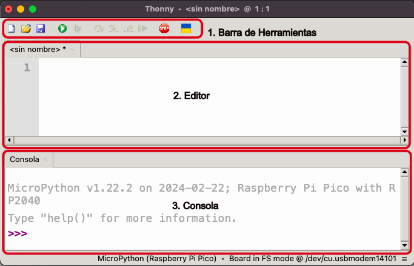

# Sesión 1

* Instalación de [Thonny](https://thonny.org)
* Primeros programas

### Programa saludo

## Primeros bucles

## Lista de la compra

## Instalación de firmware micropython

## Parpadeando leds

## Sobre micropython

* Comentarios de línea y extensos
* Versiones
* ficheros especiales: boot y main 
* funciones
	* declaración y uso
	* argumentos
	* valores de retorno
* variables locales y globales
* Módulos
	* time
	* random
	* math
* I2C
* Pantallas OLED
* Configuración wifi
	* ntp
* Documentación