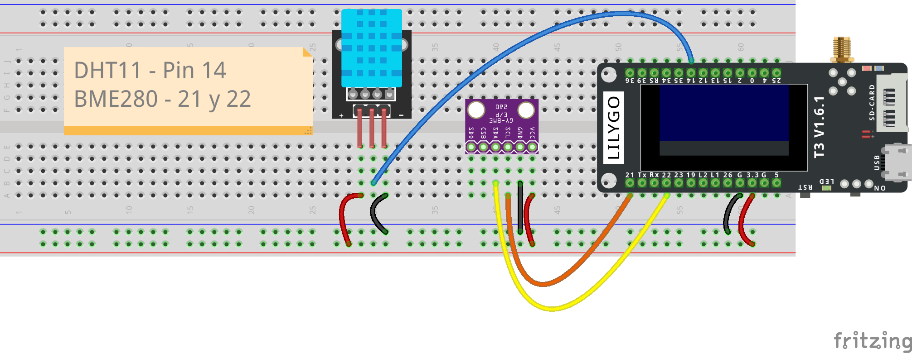

```python
from machine import Pin
from dht import DHT11
from BME280 import bme280
from time import sleep
from test_board import show
from config_lora import DHT_PIN,OLED_SDA,OLED_SCL

sensorDHT = None

def init_DHT():
    global sensorDHT
    if sensorDHT == None:
        sensorDHT = DHT11(Pin(DHT_PIN)) # configuración

def lee_sensor_DHT():
    init_DHT()
    sensorDHT.measure()
    temperatura_medida = sensorDHT.temperature()
    humedad_medida = sensorDHT.humidity()
    return {'Temperatura':temperatura_medida, 'Humedad':humedad_medida}

def init_BME280():
    if i2c == None:
        i2c = SoftI2C(scl=Pin(OLED_SCL), sda=Pin(OLED_SDA))
    if sensorBME280 == None:
        sensorBMR280 = BME280(i2c=i2c)

def lee_sensor_bme280():
    init_BME280()
    temp = bme.temperature
    hum = bme.humidity
    pres = bme.pressure        
    return {'Temperatura':temp,'Humedad':hum,'Presión':pres}

def lee_sensor_prueba():
    return {'Temperatura':21.1,'Humedad':55.5,'Presión':999}


espera = 10

while True:
    clear_oled()
    try:
        y = 0
        medidas = lee_sensor_prueba()
        for magnitud,medida in medidas.items():
            mensaje = '{magnitud}:{medida}'
            show(mensaje,y)
            y += 9 # pasamos a la siguiente línea
    except  Exception as e:
        show('Error {e}')
    sleep(espera)  


```